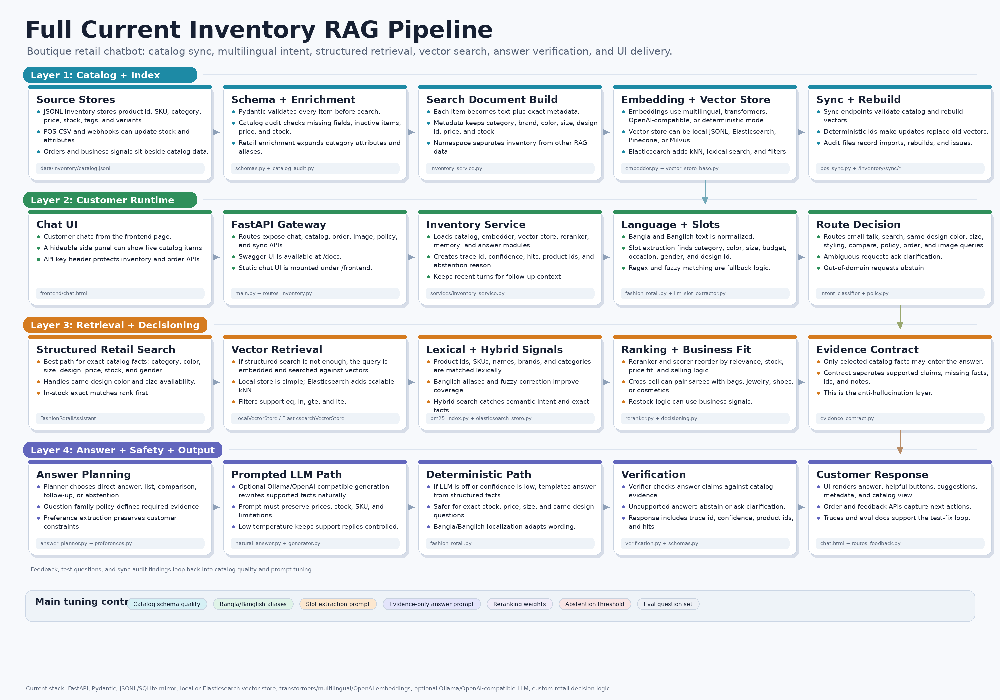
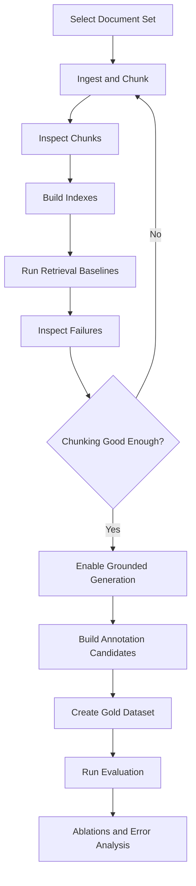

# bangla-tax-rag

Local research stack for Bangla and English tax/legal document retrieval-augmented generation.

This repository is built for practical research work, not just demos. It supports PDF ingestion, OCR-assisted parsing, structured chunking, sparse and hybrid retrieval, grounded generation with citations, FastAPI serving, Streamlit inspection, dataset building, and lightweight evaluation. The current emphasis is on transparent local baselines that can later be upgraded into a paper-grade system.

## Project Overview

`bangla-tax-rag` is designed for questions over regulatory and tax documents where:

- exact section references matter
- tax-year validity matters
- authority level matters
- unsupported answers are dangerous
- reproducibility matters more than flashy output

The repository supports two immediate use cases:

1. Local experimentation over Bangla tax circulars and acts
2. Research baselines for retrieval, evidence selection, abstention, and citation quality

The system can run without external APIs. By default it can fall back to deterministic grounded answer construction. If you run a local OpenAI-compatible model server such as Ollama, the same pipeline can use a real chat model for generation.

## Documentation Map

This repository has grown beyond one classic legal RAG README. Use this map as the main entry point for the connected docs.

### Start Here

- [READMERUN.md](READMERUN.md) - practical run guide for the boutique inventory assistant.
- [readme_exec.md](readme_exec.md) - command-level execution guide for running, testing, benchmarking, and extending the project.
- [query_flow_readme.md](query_flow_readme.md) - detailed query lifecycle: which function receives the user query, how routing/retrieval/decision/answering happens, and how data paths are used.

### Inventory Chatbot And Commerce RAG

- [README_inventory_current_architecture.md](README_inventory_current_architecture.md) - current inventory chatbot architecture and workflow.
- [readmefullbuildtheory.md](readmefullbuildtheory.md) - full build theory for the boutique inventory chatbot, including frontend, API gateway, orchestrator, domain engines, image matcher, and order flow.
- [frontend/README.md](frontend/README.md) - frontend demo guide and backend-mounted UI workflow.
- [todo_agenticreadme.md](todo_agenticreadme.md) - agentic inventory reasoning notes and roadmap-style implementation context.

### Legal/Tax RAG And Research Notes

- [readmetheory.md](readmetheory.md) - big-picture theory of the repo as legal/tax RAG plus inventory intelligence stack.
- [readme_theory.md](readme_theory.md) - retrieval theory and build notes.
- [readme_ocr_uncertainty.md](readme_ocr_uncertainty.md) - OCR-uncertainty-aware chunking and retrieval research direction.
- [README_RESEARCH.md](README_RESEARCH.md) - PlanRAG-Commerce research proposal.
- [READMEA*.md](<READMEA*.md>) - A* roadmap for turning the legal/tax RAG work into a stronger research project.
- [readme_futurework.md](readme_futurework.md) - future work, current gaps, and publication-oriented improvements.

### How To Read The Docs

If you want to run the system, start with [READMERUN.md](READMERUN.md). If you want to understand the current chatbot internals, read [query_flow_readme.md](query_flow_readme.md) and [readmefullbuildtheory.md](readmefullbuildtheory.md). If you want to explain the research direction, read [README_RESEARCH.md](README_RESEARCH.md), [readme_ocr_uncertainty.md](readme_ocr_uncertainty.md), and [READMEA*.md](<READMEA*.md>).

## What Is Implemented

- PDF ingestion with `pdfplumber`, `PyMuPDF`, and `pymupdf4llm`
- OCR-first ingestion path with `ocrmypdf` and `Tesseract` for difficult Bangla PDFs
- structured page parsing with tax-year, section, appendix, and SRO extraction
- section-aware, example-aware, table-aware, and fixed chunking
- sparse retrieval with BM25 via `rank-bm25`
- dense placeholder retrieval for local baseline comparisons
- hybrid retrieval with reciprocal rank fusion
- metadata-aware post-ranking and authority-aware evidence selection
- grounded generation with sentence-level citations
- abstention logic and lightweight answer verification
- FastAPI endpoints for ingest, build-index, query, evaluate, config, and health
- Streamlit UI for ingestion, index building, query testing, result inspection, and chunk browsing
- dataset-building tools for annotation candidates, dataset merge, and validation
- evaluation scripts and sample artifacts for smoke tests

## Research Goals

This repo is meant to support research questions such as:

- How much does chunk quality affect legal retrieval quality?
- How much better is hybrid retrieval than sparse-only on statute and circular corpora?
- When should a grounded system abstain instead of answering?
- How often do tax-year and authority-aware reranking improve final evidence quality?
- How well do citation and verification gates prevent unsupported answers?

For paper work, the project is especially useful as a strong transparent baseline. Most scoring logic is readable and easy to audit.

## End-to-End Workflow

The practical workflow is:

1. Choose a source PDF
2. Decide whether OCR is needed
3. Ingest the PDF into parsed pages and structured chunks
4. Inspect chunk quality in the JSONL file or Streamlit chunk browser
5. Build sparse and optional dense indexes
6. Run retrieval-only experiments first
7. Enable grounded generation after retrieval quality is acceptable
8. Build annotation candidates and create a gold dataset
9. Run evaluation and compare retrieval or generation settings
10. Document failures by chunking error, retrieval miss, conflict, abstention, or citation failure

For this repo, retrieval quality should be treated as the first research variable. If chunking is weak, generation will not rescue the system.

## Flow Diagrams

### Inventory RAG Pipeline

The current inventory chatbot pipeline is documented as a presentation-ready PNG:



Source generator:

- `scripts/generate_full_pipeline_png.py`

### System Workflow

```mermaid
flowchart LR
    A[Source PDF] --> B{Need OCR?}
    B -- Yes --> C[OCRmyPDF + Tesseract]
    B -- No --> D[Direct Parsing]
    C --> D
    D --> E[Parsed Pages]
    E --> F[Normalization]
    F --> G[Chunking]
    G --> H[Chunk JSONL]
    H --> I[Sparse Index]
    H --> J[Dense Placeholder Index]
    I --> K[Retrieval]
    J --> K
    K --> L[Evidence Pack]
    L --> M[Grounded Generation]
    L --> N[Retrieval-only Analysis]
    M --> O[Citations + Verification]
    O --> P[Answer or Abstain]
    P --> Q[FastAPI / Streamlit / Evaluation]
    N --> Q
```



### Research Loop



## System Pipeline

### 1. Ingestion

PDFs are parsed page by page. For difficult Bangla PDFs, OCR can be applied first to create a searchable PDF.

Outputs:

- page-level parsed objects
- extracted headings and section markers
- tax-year and reference metadata

### 2. Normalization

The system normalizes:

- Bangla digits to Arabic digits
- repeated whitespace
- likely tax-year mentions
- section and subsection references
- SRO references and appendix markers

Original text is preserved separately from normalized text.

### 3. Chunking

Pages are converted into `ChunkRecord` JSONL rows. Each chunk carries:

- `chunk_id`
- `doc_id`
- `doc_title`
- `doc_type`
- `authority_level`
- `tax_year`
- `page_no`
- `section_id`
- `subsection_id`
- `appendix_id`
- `sro_id`
- `chunk_type`
- `heading_path`
- `original_text`
- `normalized_text`
- `cross_refs`

### 4. Indexing

Sparse indexing builds BM25-ready artifacts from chunk JSONL.

Dense indexing currently produces a lightweight local baseline artifact set. It is useful for pipeline testing, but it is not yet a real embedding retriever.

### 5. Retrieval

The repo supports:

- `sparse`
- `dense`
- `hybrid`

Hybrid retrieval uses reciprocal rank fusion, then applies readable post-ranking boosts for:

- section matches
- tax-year matches
- heading overlap
- authority level
- chunk-type preferences

### 6. Evidence Selection

Top hits are filtered into a compact evidence pack. The system tries to:

- deduplicate near-duplicate chunks
- prefer supportive chunks
- keep small but useful evidence sets
- surface conflict notes when evidence disagrees

### 7. Generation

Generation is grounded in retrieved evidence only. It supports:

- OpenAI-compatible local or remote chat completion backends
- deterministic grounded fallback answers
- sentence-level citations like `[C1]`
- answer verification
- abstention when evidence is weak or unsupported

### 8. Evaluation

The evaluation layer supports small local experiments, annotation workflows, and dataset validation. It is suitable for baseline research runs and ablation preparation.

## Technologies Used

### Parsing and OCR

- `pdfplumber`
- `PyMuPDF`
- `pymupdf4llm`
- `ocrmypdf`
- `Tesseract OCR`

### Backend and Data Models

- `FastAPI`
- `Pydantic`
- `PyYAML`
- `httpx`

### Retrieval

- `rank-bm25`
- local heuristic dense baseline
- reciprocal rank fusion

### Generation

- OpenAI-compatible chat client abstraction
- local deterministic grounded fallback
- optional `DeepSeek` via `Ollama`

### Frontend

- `Streamlit`

### Evaluation and Testing

- `pytest`
- JSONL-based datasets and reports

## Current Research Status

### Strongest Current Parts

- local reproducibility
- sparse retrieval baseline
- transparent reranking logic
- grounded answer verification
- research UI for manual inspection
- OCR-assisted Bangla ingestion path

### Current Limitations

- dense retrieval is still a placeholder, not embeddings
- chunking is improved but still heuristic, especially for noisy Bangla amendment pages
- some English statute sections still contain merged notes or footnote residue
- the generation layer is strongest when retrieval has already found the right chunk
- paper-grade benchmarking still requires a larger human-annotated dataset

### What To Improve For A Paper

- replace placeholder dense retrieval with real multilingual embeddings
- improve clause-level chunk splitting for Bangla and English statutes
- build a larger gold dataset with document-level split control
- add stronger metrics for retrieval and answer faithfulness
- run controlled ablations over chunking, retrieval mode, evidence size, and abstention

## Recommended Research Workflow

### English First

Use the English Act first when you want to test:

- chunk quality
- section retrieval
- answer generation
- citation rendering

This is the cleanest path for pipeline debugging.

### Bangla Next

Use OCR-first Bangla ingestion when you want to test:

- Bangla OCR quality
- Bangla section detection
- Bangla retrieval robustness
- mixed-script legal text handling

### Sequence For Serious Experiments

1. Fix chunking on a small corpus
2. Freeze chunking
3. Compare sparse, dense, and hybrid retrieval
4. Add generation only after retrieval is acceptable
5. Build and validate a gold dataset
6. Run ablations with fixed config files
7. Manually inspect failure cases and record categories

## Repository Layout

```text
app/
  api/          FastAPI routes
  core/         settings, schemas, shared utils, logging
  ingest/       parser and chunker
  retrieval/    sparse, dense, hybrid, filters
  generation/   generator and citation handling
  eval/         metrics, dataset builder, annotation helpers
  ui/           Streamlit app
config/         runtime and experiment config
data/raw/       raw documents
data/processed/ processed chunk files and sample datasets
indexes/        sparse and dense artifacts
results/        evaluation outputs and reports
scripts/        CLI utilities
tests/          unit and smoke tests
docs/           architecture, methodology, experiments, dataset notes
```

## Setup

Create the environment and install dependencies:

```bash
python3 -m venv .venv
.venv/bin/pip install -r requirements.txt
cp .env.example .env
```

If you plan to use Bangla OCR, install system packages:

```bash
sudo apt-get update
sudo apt-get install -y ocrmypdf tesseract-ocr-ben
```

## Run The API

```bash
cd "/home/sonjoy/Bar tax/bangla-tax-rag" && .venv/bin/uvicorn app.main:app --reload
```

## Run The Streamlit UI

```bash
cd "/home/sonjoy/Bar tax/bangla-tax-rag" && .venv/bin/streamlit run app/ui/streamlit_app.py
```

Expected backend URL:

```text
http://127.0.0.1:8000
```

## Recommended Local Test Flows

### English PDF Workflow

Ingest the English Act:

```bash
cd "/home/sonjoy/Bar tax/bangla-tax-rag" && .venv/bin/python scripts/ingest_pdf.py \
  --input "/home/sonjoy/Bar tax/Income_tax_act_2023.pdf" \
  --doc-id income-tax-act-2023 \
  --doc-title "Income Tax Act 2023" \
  --doc-type statute \
  --authority-level national \
  --chunking-mode section_aware \
  --output data/processed/income-tax-act-2023.jsonl
```

Build the English sparse index:

```bash
cd "/home/sonjoy/Bar tax/bangla-tax-rag" && .venv/bin/python scripts/build_sparse_index.py \
  --input data/processed/income-tax-act-2023.jsonl \
  --output indexes/sparse-english
```

Run an English query:

```bash
cd "/home/sonjoy/Bar tax/bangla-tax-rag" && .venv/bin/python scripts/demo_query.py \
  --mode hybrid \
  --index-dir indexes/sparse-english \
  --query "What are the income tax authorities under section 4?" \
  --top-k 5
```

### Bangla PDF Workflow

OCR the Bangla circular first:

```bash
cd "/home/sonjoy/Bar tax/bangla-tax-rag" && ocrmypdf -l ben+eng --force-ocr --deskew --optimize 0 --output-type pdf \
  "/home/sonjoy/Bar tax/Income-tax_Paripatra_2025-2026-1.pdf" \
  "data/processed/income-tax-paripatra-2025-2026.ocr.pdf"
```

Ingest the OCRed Bangla PDF:

```bash
cd "/home/sonjoy/Bar tax/bangla-tax-rag" && .venv/bin/python scripts/ingest_pdf.py \
  --input data/processed/income-tax-paripatra-2025-2026.ocr.pdf \
  --doc-id income-tax-paripatra-2025-2026 \
  --doc-title "Income Tax Paripatra 2025-2026" \
  --doc-type circular \
  --authority-level national \
  --chunking-mode section_aware \
  --output data/processed/income-tax-paripatra-2025-2026.jsonl
```

Build the Bangla sparse index:

```bash
cd "/home/sonjoy/Bar tax/bangla-tax-rag" && .venv/bin/python scripts/build_sparse_index.py \
  --input data/processed/income-tax-paripatra-2025-2026.jsonl \
  --output indexes/sparse-bangla
```

Run a Bangla query:

```bash
cd "/home/sonjoy/Bar tax/bangla-tax-rag" && .venv/bin/python scripts/demo_query.py \
  --mode hybrid \
  --index-dir indexes/sparse-bangla \
  --query "ধারা ৩.১ এ কী বলা হয়েছে?" \
  --top-k 5
```

## API Examples

Health:

```bash
curl http://127.0.0.1:8000/health
```

Config:

```bash
curl http://127.0.0.1:8000/config
```

Ingest:

```bash
curl -X POST http://127.0.0.1:8000/ingest \
  -H "Content-Type: application/json" \
  -d '{
    "input_pdf_path": "/home/sonjoy/Bar tax/Income_tax_act_2023.pdf",
    "doc_id": "income-tax-act-2023",
    "doc_title": "Income Tax Act 2023",
    "doc_type": "statute",
    "authority_level": "national",
    "chunking_mode": "section_aware"
  }'
```

Build indexes:

```bash
curl -X POST http://127.0.0.1:8000/build-index \
  -H "Content-Type: application/json" \
  -d '{
    "chunk_jsonl_path": "data/processed/income-tax-act-2023.jsonl",
    "build_sparse": true,
    "build_dense": true
  }'
```

Query:

```bash
curl -X POST http://127.0.0.1:8000/query \
  -H "Content-Type: application/json" \
  -d '{
    "question_text": "What are the income tax authorities under section 4?",
    "retrieval_mode": "hybrid",
    "top_k": 5,
    "final_evidence_k": 3,
    "include_intermediate_hits": true,
    "generate_answer": true
  }'
```

Evaluate:

```bash
curl -X POST http://127.0.0.1:8000/evaluate \
  -H "Content-Type: application/json" \
  -d '{
    "dataset_path": "data/processed/sample_eval.jsonl",
    "retrieval_modes": ["sparse", "hybrid"],
    "generate_answers": true
  }'
```

## Local Model Usage

The repo supports local OpenAI-compatible generation servers.

Current development config points to:

- provider: `openai_compatible`
- model: `deepseek-r1:7b`
- base URL: `http://127.0.0.1:11434/v1`

This matches a local `Ollama` setup. If you restart the API after changing config, generation will use your local DeepSeek model when the query is routed through the LLM path.

Important note:

- some queries use deterministic grounded answer construction on purpose because it is safer and easier to verify than free-form generation

## Dataset And Annotation Workflow

Generate annotation candidates:

```bash
cd "/home/sonjoy/Bar tax/bangla-tax-rag" && .venv/bin/python scripts/build_annotation_candidates.py \
  --chunks data/processed/sample_chunks.jsonl \
  --output results/annotation_candidates.jsonl
```

Validate a dataset:

```bash
cd "/home/sonjoy/Bar tax/bangla-tax-rag" && .venv/bin/python scripts/validate_dataset.py \
  --dataset data/templates/annotation_template.jsonl \
  --chunks data/processed/sample_chunks.jsonl
```

Merge annotated files:

```bash
cd "/home/sonjoy/Bar tax/bangla-tax-rag" && .venv/bin/python scripts/merge_annotations.py \
  --inputs data/templates/annotation_template.jsonl \
  --output results/merged_dataset.jsonl
```

Related files:

- [docs/dataset.md](docs/dataset.md)
- [data/templates/annotation_template.jsonl](data/templates/annotation_template.jsonl)
- [config/ablation.yaml](config/ablation.yaml)

## Evaluation And Ablation Workflow

Run the sample evaluation:

```bash
cd "/home/sonjoy/Bar tax/bangla-tax-rag" && .venv/bin/python scripts/run_eval.py \
  --dataset data/processed/sample_eval.jsonl \
  --output-dir results/eval_sample
```

Use the ablation config as the experiment manifest:

```bash
cd "/home/sonjoy/Bar tax/bangla-tax-rag" && .venv/bin/python scripts/run_eval.py \
  --dataset data/processed/sample_eval.jsonl \
  --output-dir results/ablation
```

For paper work, record at minimum:

- document set
- chunking mode
- OCR on or off
- retrieval mode
- top-k
- final evidence size
- generation on or off
- abstention threshold
- model backend

## Suggested Research Questions

- Does OCR-first ingestion materially improve Bangla section retrieval?
- Does hybrid retrieval outperform sparse on amendment-heavy documents?
- Do authority-aware reranking and tax-year-aware reranking improve evidence precision?
- How often does grounded generation help over retrieval-only output?
- How much does abstention reduce unsupported answers?
- Which failure mode dominates: chunking, retrieval, evidence pack, or generation?

## Failure Analysis Guidance

When an answer looks wrong, inspect in this order:

1. chunk text quality
2. section and subsection labels
3. sparse top hits
4. hybrid final hits
5. citation snippets
6. abstention reason

Most bad answers in this repo come from weak chunking or wrong evidence selection, not from generation alone.

## Troubleshooting

- `ModuleNotFoundError: No module named 'app'`
  Run from the repo root. The Streamlit app bootstraps the project root, but the working directory still matters for scripts.
- `Read timed out` during ingestion
  Large PDFs and OCR can take time. Use the CLI ingestion command first for heavy documents.
- `Sparse index not found`
  Build the sparse index first, or point the query run to the correct index directory.
- `Dense index metadata not found`
  Dense retrieval is optional. Build the dense index only if you need that baseline.
- Streamlit shows old behavior after a code change
  Restart the FastAPI server and refresh Streamlit.
- Bangla chunks still look noisy
  Use OCR-first ingestion and inspect the chunk browser before running retrieval experiments.
- Answers abstain even when the text looks relevant
  Check whether the question was classified correctly and whether the final evidence hits are actually supportive.

## Additional Documentation

- [Architecture](docs/architecture.md)
- [Methodology](docs/methodology.md)
- [Experiments](docs/experiments.md)
- [Dataset](docs/dataset.md)
- [Related Work](docs/related_work.md)
- [A* Roadmap](READMEA*.md)
- [Execution Guide](readme_exec.md)
- [Future Work](readme_futurework.md)

## Research-Grade Checklist

Before calling the system research-grade for a paper, you should aim to have:

- a frozen chunking strategy
- a validated gold dataset
- a real embedding-based dense retriever
- fixed train, dev, and test splits
- clear ablation settings
- reproducible config snapshots
- systematic failure analysis
- human review of citation correctness

This repo is already a strong baseline and experimentation platform. The next step is less about adding more code and more about controlling experiments carefully and collecting better evaluation data.
