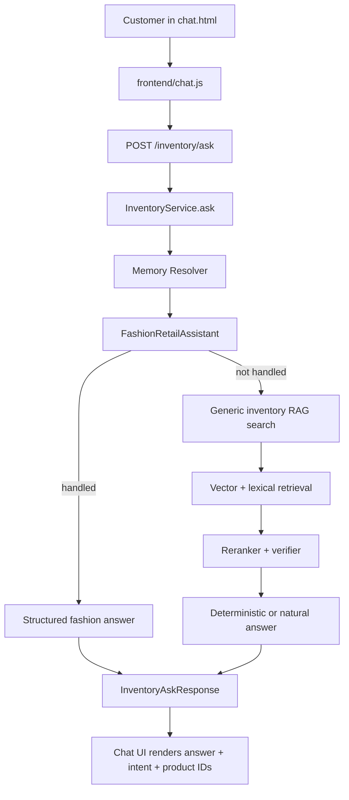

# Inventory Customer Chatbot - Current Architecture and Workflow

This README documents the current boutique inventory chatbot architecture used by `http://127.0.0.1:4850/chat.html`.

The goal is not to hard-code answers for a few questions. The goal is a reusable customer-query system that can answer from whatever structured inventory is present, as long as the catalog carries enough product attributes.

## Current Scope

The active inventory file is:

```text
data/inventory/catalog.jsonl
```

Current catalog shape:

- 47 products
- BDT pricing
- Product areas: saree, three piece, bags, jewelry, cosmetics, beauty/skincare, watches, shoes, panjabi, shirts, pants, perfumes
- Important structured fields: `category`, `stock`, `price`, `tags`, `attributes`, `metadata`, `include_in_rag`

The bot is strongest for:

- Product availability
- Size availability
- Color variants in the same design
- Same-design follow-up questions
- Budget filtering
- Matching bags/jewelry/accessories
- Bangla, Banglish, and English customer messages
- Out-of-stock truthfulness plus closest available alternatives

## High-Level Flow



## Runtime Pieces

| Layer | File | Responsibility |
| --- | --- | --- |
| Chat UI | `frontend/chat.html`, `frontend/chat.js`, `frontend/chat.css` | Customer-facing chat, sends `/inventory/ask`, keeps short conversation memory. |
| API routes | `app/api/routes_inventory.py` | Exposes `/inventory/ask`, `/inventory/search`, `/inventory/sync/rebuild`, sync/status endpoints. |
| Main service | `app/services/inventory_service.py` | Loads catalog, resolves memory, calls structured fashion layer first, falls back to generic inventory RAG. |
| Fashion layer | `app/inventory/fashion_retail.py` | Deterministic boutique logic for category/color/size/design/accessory/customer-language queries. |
| Ontology | `app/inventory/ontology.py` | Product type/family mapping for generic inventory behavior. |
| Verifier | `app/inventory/verifier.py` | Blocks unsafe recommendations when product family, budget, stock, or spec constraints are violated. |
| Vector store | `data/agentic_store/local_vectors.jsonl` by default | Local vector index after sync rebuild. Elasticsearch support exists but is optional. |
| Catalog | `data/inventory/catalog.jsonl` | Source of truth for customer answers. |

## Live Local Ports

Current local demo:

```text
Backend:  http://127.0.0.1:4849
Frontend: http://127.0.0.1:4850/chat.html
```

The current live run uses local deterministic embeddings/reranking for reliability:

```bash
APP_PORT=4849 \
UI_BACKEND_BASE_URL=http://127.0.0.1:4849 \
VECTOR_DB=local \
LOCAL_VECTOR_STORE_PATH=data/agentic_store/local_vectors.jsonl \
EMBEDDING_PROVIDER=deterministic \
EMBEDDING_MODEL_NAME=deterministic-live \
EMBEDDING_DIMENSIONS=256 \
RERANKER_PROVIDER=deterministic \
INVENTORY_NATURAL_ANSWERS_ENABLED=false \
.venv/bin/python -m uvicorn app.main:app --host 127.0.0.1 --port 4849
```

Frontend:

```bash
.venv/bin/python -m http.server 4850 --bind 127.0.0.1 --directory frontend
```

## Frontend Request Prompt

The UI sends each customer message to `/inventory/ask` with this payload shape:

```json
{
  "question": "customer message here",
  "top_k": 5,
  "assistant_mode": "support",
  "reply_style": "short",
  "answer_engine": "deterministic",
  "conversation_history": [
    {"role": "user", "content": "Lotus Jamdani red ache?"},
    {"role": "assistant", "content": "Ji, Lotus Buti Dhakai Jamdani Saree - Red available ache..."}
  ],
  "focused_product_ids": ["saree-jmd-lotus-red"],
  "last_answer_plan": {}
}
```

Important behavior:

- `conversation_history` keeps recent dialogue text.
- `focused_product_ids` lets follow-ups like `same design green color e ache?` resolve to the previous product.
- `last_answer_plan` gives the backend the previous structured product/design context.

## Backend Decision Workflow

### 1. Load catalog

`InventoryService.ask()` loads `data/inventory/catalog.jsonl`.

### 2. Resolve memory

The memory resolver checks:

- recent conversation turns
- focused product IDs from the UI
- previous answer plan
- active filters

This is why a user can ask:

```text
Lotus Jamdani red ache?
same design green color e ache?
```

The second question does not need to repeat `Lotus Jamdani`.

### 3. Try structured fashion retail layer first

`FashionRetailAssistant` extracts slots:

```text
category_key
color / color_family
size
budget_min / budget_max
fabric
work_type
occasion
style
design_id
wants_in_stock
intent
language
```

Then it classifies into one of these main intents:

| Intent | Example |
| --- | --- |
| `fashion_search` | `red lipstick ache?` |
| `fashion_size_availability` | `men er brown loafer size 42 ache?` |
| `fashion_variant_color` | `same design green color e ache?` |
| `fashion_accessory_match` | `নেভি কাতান শাড়ির সাথে কোন ব্যাগ মানাবে?` |

### 4. If structured fashion layer cannot answer, use generic RAG

Generic path:

```text
query -> embeddings/vector search -> lexical search -> merged candidates -> ontology/product type gate -> reranker -> verifier -> answer
```

This path is useful for non-fashion inventory or broader product search, but the boutique bot should mostly be handled by the structured fashion layer.

### 5. Verify before final answer

The verifier checks that the selected products really satisfy:

- requested product type/category
- budget ceiling/floor
- stock state
- required specs
- substitute/cross-sell boundaries

Example: if the user asks for a bag, the matching layer must not lead with jewelry.

## Optional Natural Answer Writer Prompt

The system has an optional natural-language writer in `InventoryService`, but the current local UI uses deterministic answers.

If enabled, the natural writer receives a strict system prompt with these rules:

```text
You are the natural-language writer for a grounded ecommerce inventory assistant.
The system has already decided what to recommend.
answer_plan is authoritative.
catalog hits are factual evidence.
Do not choose products, reorder roles, add products, remove caveats, or override answer_plan.
Do not invent products, prices, stock, brands, warranties, discounts, policies, specs, or features.
Do not expose internal IDs or the phrase answer_plan to the user.
Ask at most one follow-up question.
Return strict JSON only:
{"answer":"...", "follow_up_question":null, "abstained":false, "abstention_reason":null}
```

This is intentionally conservative. For customer inventory answering, hallucination is more damaging than a slightly plain answer.

## Catalog Data Contract

Each product should be one JSON object per line.

Recommended minimum:

```json
{
  "product_id": "saree-jmd-lotus-red",
  "sku": "SAR-JMD-LOTUS-RED",
  "name": "Lotus Buti Dhakai Jamdani Saree - Red",
  "category": "Saree",
  "brand": "House Boutique",
  "short_description": "Red Dhakai Jamdani saree with lotus buti work.",
  "price": 6800,
  "currency": "BDT",
  "stock": 3,
  "status": "Active",
  "tags": ["saree", "jamdani", "red", "wedding"],
  "attributes": {
    "category_key": "saree",
    "design_id": "lotus-buti-jamdani",
    "color": "red",
    "color_family": "red",
    "fabric": "jamdani",
    "work_type": "buti",
    "occasion": "wedding"
  },
  "metadata": {
    "source": "boutique",
    "variant_group_name": "Lotus Buti Dhakai Jamdani Saree"
  },
  "include_in_rag": true
}
```

For variant products, `design_id` is critical.

Example:

```text
saree-jmd-lotus-red   -> design_id: lotus-buti-jamdani
saree-jmd-lotus-blue  -> design_id: lotus-buti-jamdani
saree-jmd-lotus-green -> design_id: lotus-buti-jamdani
```

For matching products, compatibility metadata is critical.

Example:

```json
{
  "product_id": "bag-potli-gold-beaded",
  "category": "Bag",
  "attributes": {
    "category_key": "bag",
    "color": "gold",
    "compatible_design_ids": ["meena-border-bridal-katan"],
    "compatible_colors": ["navy", "maroon", "gold"]
  }
}
```

## Add New Products Safely

When adding inventory, do not only write product names. Use structured fields.

Good:

```json
"attributes": {
  "category_key": "shoes",
  "size": "42",
  "color": "brown",
  "color_family": "brown",
  "shoe_type": "loafer",
  "gender": "men"
}
```

Weak:

```json
"name": "Nice brown shoe"
```

The weak version may work sometimes, but it will fail on exact size/color/customer phrasing.

## Sync Workflow

After changing `catalog.jsonl`, rebuild the inventory vectors:

```bash
.venv/bin/python - <<'PY'
import json
from pathlib import Path
from urllib import request

config = json.loads(Path("frontend/config.local.json").read_text())
api_key = config.get("apiKey", "")

req = request.Request("http://127.0.0.1:4849/inventory/sync/rebuild", method="POST")
req.add_header("Content-Type", "application/json")
if api_key:
    req.add_header("X-API-Key", api_key)

with request.urlopen(req, timeout=30) as resp:
    print(resp.read().decode())
PY
```

Expected healthy result:

```text
ready: true
rebuilt_count: 47
vector_record_count: 47
issues: []
```

## Customer Test Prompts

Use these in `http://127.0.0.1:4850/chat.html`.

### Banglish

```text
Lotus Jamdani red ache?
same design green color e ache?
same design blue color e ache?
men er brown loafer size 42 ache?
red lipstick ache?
oily skin er jonno sunscreen ache?
ladies rose gold watch ache?
white panjabi L size ache?
blue floral three piece M available ache?
navy katan saree er sathe kon bag manabe?
```

### Bangla

```text
সাদা পাঞ্জাবি L সাইজ আছে?
নেভি কাতান শাড়ির সাথে কোন ব্যাগ মানাবে?
তৈলাক্ত ত্বকের জন্য সানস্ক্রিন আছে?
লাল লিপস্টিক আছে?
মেয়েদের রোজ গোল্ড ঘড়ি আছে?
ব্লু থ্রি পিস M সাইজ আছে?
কালো ব্যাগ আছে?
কোন শাড়ি ৪০০০ টাকার মধ্যে আছে?
পূজার জন্য ভালো শাড়ি দেখান
সোনালি গয়না আছে?
```

### English

```text
Do you have oily skin sunscreen under 1000?
Do you have the same saree design in another color?
Is the blue floral three piece available in M?
Suggest a bag for the navy katan saree
Do you have men's formal shirts?
Do you have men's perfume?
Show me ladies shoes in size 37
Do you have black tote bags?
Which sarees are good for wedding?
Show me products under 2000 taka
```

## Expected Answers For Key Prompts

| Prompt | Expected behavior |
| --- | --- |
| `Lotus Jamdani red ache?` | Finds red Lotus Jamdani, says stock and mentions other in-stock same-design colors. |
| `same design green color e ache?` | Uses previous focus, says green exists but is out of stock, suggests red/royal blue. |
| `men er brown loafer size 42 ache?` | Finds men's brown loafer size 42 with stock. |
| `সাদা পাঞ্জাবি L সাইজ আছে?` | Finds white panjabi size L, not M. |
| `নেভি কাতান শাড়ির সাথে কোন ব্যাগ মানাবে?` | Suggests bags only: gold potli, antique gold clutch, black tote. |
| `red lipstick ache?` | Finds red matte lipstick. |
| `blue floral three piece M available?` | Says blue M is out of stock and suggests pink M. |
| `ladies rose gold watch ache?` | Finds ladies rose gold watch as a direct product answer. |

## Regression Tests

Run focused boutique tests:

```bash
.venv/bin/python -m pytest tests/test_boutique_retail_catalog.py tests/test_fashion_retail.py -q
```

Run broader inventory tests:

```bash
.venv/bin/python -m pytest tests/test_boutique_retail_catalog.py tests/test_fashion_retail.py tests/test_inventory_intelligence.py tests/test_inventory_api.py -q
```

Last verified result:

```text
109 passed, 3 warnings
```

## Evaluation Files

Primary QA set:

```text
evaluation/boutique_inventory_multilingual_qa_set.md
```

Latest live smoke audit:

```text
results/boutique_live_smoke_2026-05-09.md
```

## Strategic Rule

Do not tune the bot around one list of questions.

The scalable design is:

```text
clean catalog structure -> slot extraction -> deterministic product/variant/accessory logic -> verified answer
```

If the product data is weak, the bot will be weak. For a real shop, the next major upgrade should be an admin-side product intake form that forces clean `category_key`, `design_id`, `color`, `size`, `stock`, `price`, and compatibility fields before products enter the catalog.

## Current Limitations

- It is not a full ERP or POS system.
- It does not understand product images yet.
- It does not infer true visual similarity unless `design_id` or compatibility metadata exists.
- It does not know delivery, discounts, return policy, supplier status, or future restock unless those fields are added to the catalog/business signals.
- Elasticsearch adapter exists, but the current local demo is running on local vector sync because Elasticsearch is not required for this UI demo.

## Production Direction

For a real medium-size boutique, the next production path should be:

1. Replace hand-edited JSONL with admin product entry/import.
2. Enforce required fields by category.
3. Add product images and visual similarity groups.
4. Add order/reservation workflow so the bot can say whether an item can be held.
5. Add policy data for delivery, exchange, alteration, and payment.
6. Use Elasticsearch or another production vector/search backend once product volume grows.
