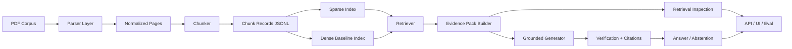
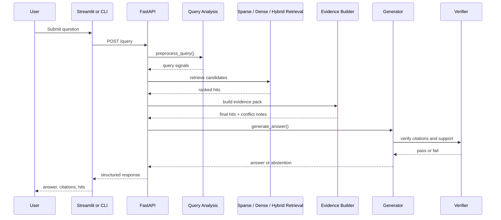

# Architecture

`bangla-tax-rag` is organized as a local research stack for tax and legal document QA.

## High-Level Flow

## Pipeline

1. Ingestion
   PDF files are parsed page by page with `pdfplumber` and `PyMuPDF`.
2. Normalization
   Bangla digits, whitespace, section markers, tax years, appendix ids, and SRO ids are normalized into structured metadata.
3. Chunking
   Parsed pages are converted into JSONL chunk records using section-aware, example-aware, table-aware, or fixed chunking.
4. Indexing
   Sparse indexing builds BM25 artifacts. Dense indexing currently stores local placeholder artifacts for a lightweight overlap-based retriever.
5. Retrieval
   Sparse, dense, and hybrid retrieval all produce `RetrievalHit` records with aligned metadata.
6. Generation
   Grounded generation uses retrieved evidence only, returns sentence-level citations, verifies support, and abstains when evidence is weak or conflicting.
7. API and UI
   FastAPI exposes the local workflow, and Streamlit provides a practical research interface.

## Query Execution Flow

## Main Modules

- `app/ingest`
  PDF parsing and chunk creation.
- `app/retrieval`
  Sparse, dense, and hybrid retrieval logic.
- `app/generation`
  Prompting, citation handling, verification, and abstention.
- `app/api`
  Thin FastAPI routes around local service helpers.
- `app/ui`
  Streamlit frontend for local experiments.

## Artifact Flow

- Raw PDF input: `data/raw/`
- Processed chunks: `data/processed/*.jsonl`
- Sparse index: `indexes/sparse/`
- Dense index: `indexes/dense/`
- Outputs and reports: `results/`
