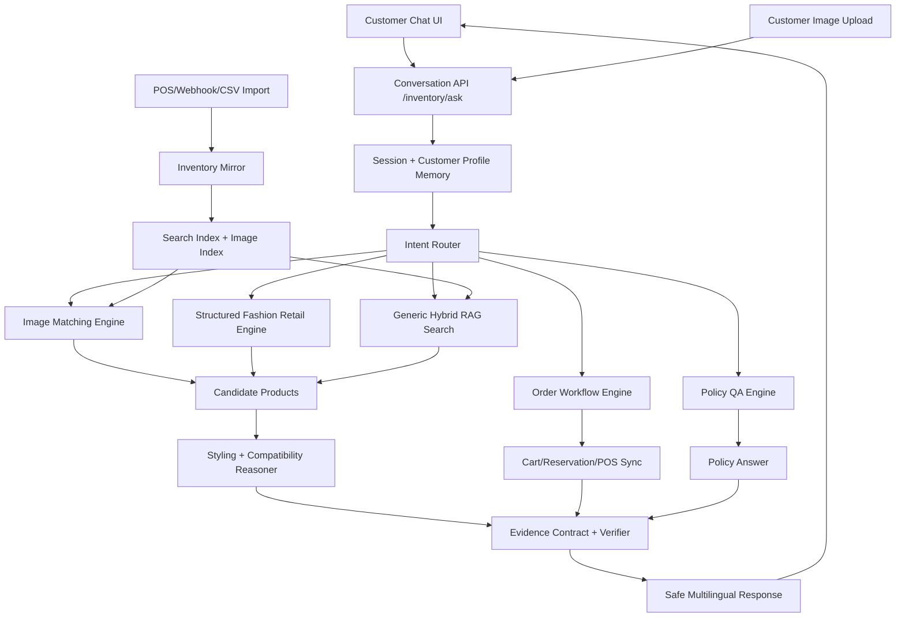

# Master Prompt: Full Boutique Inventory Chatbot System

Use this prompt to drive the next full build loop for the boutique inventory chatbot.

The intention is to build a production-grade customer-facing retail assistant for a medium-size fashion/accessories shop. The bot must answer from live inventory, understand product images and text, handle Bangla/Banglish/English conversation, give styling advice, take order intent, answer delivery/payment/refund questions from policy data, remember customer preferences safely, sync with POS data, and survive large multi-brand catalog edge cases.

## One-Shot Build Command For Codex

Paste this as one complete instruction into Codex:

```text
You are building the next production version of my boutique inventory chatbot.

Goal:
Create a customer-facing AI sales/support chatbot for a medium-size fashion, saree, cosmetics, bags, jewelry, shoes, men’s clothing, perfume, and beauty-products shop. The system must answer only from real inventory/policy/order data, support Bangla/Banglish/English, remember customer preferences safely, handle image-based product matching, provide styling advice, support order placement, and sync with POS/inventory updates.

Current codebase:
- Read README_inventory_current_architecture.md first.
- Active catalog: data/inventory/catalog.jsonl
- UI: frontend/chat.html
- Backend: app/services/inventory_service.py
- Structured fashion logic: app/inventory/fashion_retail.py
- Current QA: evaluation/boutique_inventory_multilingual_qa_set.md
- Existing tests: tests/test_boutique_retail_catalog.py, tests/test_fashion_retail.py, tests/test_inventory_intelligence.py, tests/test_inventory_api.py

Core principle:
Do not hard-code around today’s sample questions. Build generalized retail infrastructure. Any answer must be grounded in catalog, product images, inventory stock, policy data, customer profile memory, or POS/order data. If required data is missing, ask one clear follow-up or abstain.

Implementation method:
Work in a build-test-modify-test loop until the system is stable. After each major feature, add tests and run the relevant suite. Keep an audit markdown under results/ describing what changed, what passed, what failed, and what still needs production data.

Machine/runtime expectation:
You may be running on a fresh machine. Do not assume Ollama models are already pulled, Elasticsearch is already running, or local indexes already exist. Keep the same full system design, including optional Ollama/natural-answer support, but make the project self-bootstrap safely:
- First build and verify the deterministic/local mode so tests and core chatbot behavior work without any external model.
- If Ollama is installed, check whether the configured model exists. If not, document and run the required pull command, for example `ollama pull qwen3:8b`, before enabling natural answers.
- If Ollama is not installed or the pull fails, do not block the build. Keep `INVENTORY_NATURAL_ANSWERS_ENABLED=false` for local verification and clearly document the optional Ollama setup command.
- If Elasticsearch is not running, keep `VECTOR_DB=local` for verification. Keep Elasticsearch support available as an optional production backend.
- Create missing local folders/index files/sample data automatically where safe.
- Never require a pre-existing hidden local setup to pass tests.

Build all checklist sections below. Do not stop after a plan. Implement code, tests, sample data, docs, and UI wiring where needed.
```

## System Architecture To Build



## Clean-Machine Bootstrap Rules

The build must work on another machine even if that machine has only Python, the repo, and the `.venv`.

### Required Default Runtime

Default verification must use deterministic/local mode:

```bash
APP_PORT=4849 \
UI_BACKEND_BASE_URL=http://127.0.0.1:4849 \
VECTOR_DB=local \
LOCAL_VECTOR_STORE_PATH=data/agentic_store/local_vectors.jsonl \
EMBEDDING_PROVIDER=deterministic \
EMBEDDING_MODEL_NAME=deterministic-live \
EMBEDDING_DIMENSIONS=256 \
RERANKER_PROVIDER=deterministic \
INVENTORY_NATURAL_ANSWERS_ENABLED=false \
.venv/bin/python -m uvicorn app.main:app --host 127.0.0.1 --port 4849
```

This is the non-negotiable fallback path. It lets the full system boot and pass tests without Ollama, OpenAI, Elasticsearch, or downloaded embedding models.

### Optional Ollama Runtime

Keep Ollama support. Do not remove it. But make it explicit and self-checking.

Before enabling natural answers, run:

```bash
ollama list
```

If the configured model is missing, run:

```bash
ollama pull qwen3:8b
```

Then start with natural answers:

```bash
APP_PORT=4849 \
UI_BACKEND_BASE_URL=http://127.0.0.1:4849 \
VECTOR_DB=local \
LOCAL_VECTOR_STORE_PATH=data/agentic_store/local_vectors.jsonl \
EMBEDDING_PROVIDER=deterministic \
EMBEDDING_MODEL_NAME=deterministic-live \
EMBEDDING_DIMENSIONS=256 \
RERANKER_PROVIDER=deterministic \
GENERATOR_PROVIDER=openai_compatible \
GENERATOR_MODEL_NAME=qwen3:8b \
GENERATOR_BASE_URL=http://127.0.0.1:11434/v1 \
INVENTORY_NATURAL_ANSWERS_ENABLED=true \
INVENTORY_NATURAL_ANSWER_MODEL_NAME=qwen3:8b \
.venv/bin/python -m uvicorn app.main:app --host 127.0.0.1 --port 4849
```

If Ollama is unavailable, the system must still run in deterministic mode and expose the same API/UI. Natural answer writing is an enhancement, not a hard dependency.

### Optional Elasticsearch Runtime

Keep Elasticsearch support, but do not make it mandatory for local build success.

Use local vectors by default:

```bash
VECTOR_DB=local
```

Use Elasticsearch only when an ES service is actually running:

```bash
VECTOR_DB=elasticsearch \
ELASTICSEARCH_URL=http://127.0.0.1:9200 \
ELASTICSEARCH_INDEX_NAME=inventory-rag
```

If Elasticsearch is down, the build should fall back to local vector mode for tests and document that production search can be switched later.

## Feature Checklist

### 1. Catalog And POS Data Model

- [ ] Replace fragile flat JSON assumptions with a normalized retail schema.
- [ ] Keep JSONL support, but design the schema so POS/CSV/API sync can populate it.
- [ ] Required common fields:
  - `product_id`
  - `sku`
  - `name`
  - `brand`
  - `category`
  - `category_key`
  - `price`
  - `currency`
  - `stock`
  - `status`
  - `images`
  - `tags`
  - `attributes`
  - `metadata`
  - `updated_at`
- [ ] Required variant fields:
  - `parent_product_id`
  - `design_id`
  - `variant_group_name`
  - `color`
  - `color_family`
  - `size`
  - `material`
  - `work_type`
- [ ] Required retail fields:
  - `gender`
  - `occasion`
  - `style`
  - `season`
  - `fit`
  - `skin_type`
  - `fragrance_family`
  - `compatible_design_ids`
  - `compatible_colors`
  - `compatible_categories`
- [ ] Add validation that rejects or warns on missing critical fields by category.
- [ ] Add fixture data for multi-brand sarees, cosmetics, bags, jewelry, men’s clothing, shoes, watches, perfumes, and beauty products.

Example catalog item:

```json
{
  "product_id": "saree-aarong-jamdani-lotus-red",
  "sku": "AAR-SAR-JMD-001-RED",
  "name": "Lotus Buti Dhakai Jamdani Saree - Red",
  "brand": "Aarong",
  "category": "Saree",
  "category_key": "saree",
  "price": 6800,
  "currency": "BDT",
  "stock": 3,
  "status": "Active",
  "images": [
    {
      "url": "data/inventory/images/saree-aarong-jamdani-lotus-red-front.jpg",
      "view": "front"
    }
  ],
  "tags": ["saree", "jamdani", "red", "wedding", "lotus buti"],
  "attributes": {
    "parent_product_id": "saree-aarong-jamdani-lotus",
    "design_id": "lotus-buti-jamdani",
    "variant_group_name": "Lotus Buti Dhakai Jamdani Saree",
    "color": "red",
    "color_family": "red",
    "fabric": "jamdani",
    "work_type": "buti",
    "occasion": ["wedding", "eid"],
    "style": ["traditional", "premium"]
  },
  "metadata": {
    "source": "pos",
    "last_pos_sync_id": "sync-2026-05-09-001"
  },
  "include_in_rag": true
}
```

### 2. Real-Time POS Sync

- [ ] Add POS sync abstraction:
  - CSV import
  - JSON webhook import
  - manual admin upload
  - scheduled sync
- [ ] Detect stale products and stock changes.
- [ ] Rebuild only changed vectors instead of rebuilding the whole catalog every time.
- [ ] Keep audit logs for:
  - products inserted
  - products updated
  - products deleted/deactivated
  - stock changed
  - images changed
  - sync errors
- [ ] Add endpoint examples:
  - `POST /inventory/sync/import`
  - `POST /inventory/sync/webhook`
  - `GET /inventory/sync/status`
  - `POST /inventory/sync/rebuild`

Example POS webhook:

```json
{
  "source": "pos",
  "event": "stock_updated",
  "items": [
    {
      "sku": "AAR-SAR-JMD-001-RED",
      "stock": 2,
      "price": 6800,
      "status": "Active",
      "updated_at": "2026-05-09T14:30:00+06:00"
    }
  ]
}
```

### 3. Image-Based Matching

- [ ] Add image upload support in the chat UI.
- [ ] Add backend endpoint for image query:
  - `POST /inventory/image-search`
  - or extend `/inventory/ask` with image attachments.
- [ ] Store product image embeddings.
- [ ] Support visual matching for:
  - same/similar saree design
  - similar color
  - similar embroidery/work pattern
  - matching bag/jewelry/shoes
  - customer-uploaded reference image
- [ ] Combine image score with catalog filters:
  - category
  - color
  - budget
  - size
  - stock
  - brand
- [ ] Never claim “same exact item” unless SKU/design metadata proves it. Say “similar” if only image similarity matches.

Example user questions:

```text
এই ছবির মতো শাড়ি আছে?
ei picture er moto same design ache?
Can you find a similar bag for this saree?
এই জামদানির সাথে মানাবে এমন গয়না দেখান
```

Expected behavior:

```text
I found 3 visually similar sarees. The closest is Lotus Buti Dhakai Jamdani Saree - Red, BDT 6,800, 3 in stock. This is a similar design match, not confirmed as the exact same SKU.
```

### 4. Deep Bangla/Banglish Conversations

- [ ] Expand language normalization:
  - Bangla digits
  - Banglish spelling variants
  - mixed Bangla-English product terms
  - common typo handling
- [ ] Maintain conversation state:
  - last product
  - last category
  - last design_id
  - last color
  - last size
  - last budget
  - customer preferences
- [ ] Handle multi-turn clarification.
- [ ] Avoid switching context accidentally.
- [ ] Add tests for 5-turn conversations.

Example conversation:

```text
User: ekta red jamdani dekhan
Bot: Ji, Lotus Buti Dhakai Jamdani Saree - Red ache...
User: same design blue ache?
Bot: Ji, same design e royal blue ache...
User: tar sathe gold bag manabe?
Bot: Ji, Gold Beaded Potli Bag and Antique Gold Party Clutch bhalo match...
User: total koto porbe?
Bot: Saree plus Gold Beaded Potli total BDT 8,250. Stock ache.
User: order korte chai
Bot: Sure. Please confirm quantity, name, phone, delivery area, and payment method.
```

### 5. Complex Styling Advice

- [ ] Build styling rules from product metadata, not vague LLM guessing.
- [ ] Style advice must consider:
  - occasion
  - color compatibility
  - fabric/work heaviness
  - customer budget
  - customer body/fit preference only if voluntarily provided
  - available stock
  - matching accessories
- [ ] Add “why this matches” explanation.
- [ ] Add “avoid this” caveat when needed.
- [ ] Do not give personal/body-sensitive advice unless user asks and gives preference.

Example:

```text
নেভি কাতান শাড়ির সাথে বিয়ের জন্য কী কী নিলে ভালো হবে?
```

Expected:

```text
নেভি কাতানের সাথে গোল্ড টোন ভালো যাবে। Gold Beaded Potli Bag, Gold Meena Bangles Set, আর Antique Gold Party Clutch ভালো অপশন। বিয়ের জন্য এগুলো মানাবে কারণ শাড়ির মীনা/জরি কাজের সাথে গোল্ড অ্যাকসেন্ট মিলে যায়.
```

### 6. Order Placement Workflow

- [ ] Add cart/session object.
- [ ] Add order intent detection:
  - “order korte chai”
  - “book kore din”
  - “eta nibo”
  - “checkout”
  - “confirm”
- [ ] Collect required fields:
  - product/variant
  - quantity
  - customer name
  - phone
  - delivery address/area
  - payment method
- [ ] Validate stock before order.
- [ ] Reserve stock or create pending order.
- [ ] Return order summary before confirmation.
- [ ] Add endpoint examples:
  - `POST /orders/draft`
  - `POST /orders/confirm`
  - `GET /orders/{order_id}`

Example:

```text
User: eta order korte chai
Bot: Sure. I have Lotus Buti Dhakai Jamdani Saree - Red selected. Quantity 1? Please send name, phone, delivery area, and payment method.
User: Sonjoy, 017..., Dhanmondi, COD
Bot: Order summary: Lotus Buti Jamdani Red x1, BDT 6,800, delivery area Dhanmondi, payment COD. Should I confirm?
User: yes
Bot: Confirmed. Your order ID is ORD-000123.
```

### 7. Delivery, Payment, Refund, Exchange Policy QA

- [ ] Add policy data file:
  - `data/inventory/policies.json`
- [ ] Support:
  - delivery areas
  - delivery charge
  - estimated delivery time
  - COD/bKash/card
  - refund policy
  - exchange policy
  - damaged product policy
  - alteration policy if relevant
- [ ] The bot must answer policy questions only from policy data.
- [ ] If policy missing, answer honestly and ask staff/admin to add it.

Example policy:

```json
{
  "delivery": {
    "inside_dhaka": {"charge": 80, "eta": "1-2 working days"},
    "outside_dhaka": {"charge": 150, "eta": "3-5 working days"}
  },
  "payment": ["COD", "bKash", "Nagad", "card"],
  "refund": {
    "allowed": false,
    "message": "Refund is only available for damaged or wrong products after verification."
  },
  "exchange": {
    "allowed_days": 3,
    "conditions": ["unused", "tag attached", "original receipt required"]
  }
}
```

Example questions:

```text
Dhaka delivery charge koto?
bKash payment hobe?
refund pabo?
ভুল সাইজ হলে exchange করা যাবে?
```

### 8. Customer Profile Memory

- [ ] Store customer preferences only with safe fields:
  - preferred language
  - sizes
  - favorite colors
  - budget range
  - preferred categories
  - skin type if user voluntarily gives it
  - delivery area
- [ ] Do not store sensitive payment info.
- [ ] Add “forget me” / memory reset.
- [ ] Use profile to personalize search, but never override explicit current query.

Example:

```text
User: amar shoe size 42, color usually brown pochondo
Bot: Got it. I will remember shoe size 42 and brown preference for this customer profile.
User: men er loafer ache?
Bot: Ji, brown loafer size 42 ache...
User: amar preference delete kore dao
Bot: Done. I cleared saved preferences for this session/customer.
```

### 9. Large Multi-Brand Catalog Edge Cases

- [ ] Handle duplicate product names across brands.
- [ ] Handle same SKU names with different sizes/colors.
- [ ] Handle transliteration:
  - Aarong / আড়ং / Arong
  - Jamdani / জামদানি
  - Panjabi / Punjabi / পাঞ্জাবি
- [ ] Handle stock conflicts across branches.
- [ ] Handle many results with ranking:
  - exact SKU
  - exact category
  - exact size/color
  - in-stock
  - branch availability
  - price/budget
  - visual similarity
- [ ] Ask clarification when ambiguity remains.

Example:

```text
User: Aarong er red saree ache?
Bot: I found multiple Aarong red sarees. Do you want Jamdani, Katan, Muslin, or Cotton?
```

### 10. Safety And Grounding Rules

- [ ] Never invent stock.
- [ ] Never invent discounts.
- [ ] Never invent delivery/refund/payment rules.
- [ ] Never say exact visual match from image alone.
- [ ] Never recommend out-of-stock product as available.
- [ ] Always distinguish:
  - exact match
  - same design variant
  - similar visual match
  - matching accessory
  - alternative
- [ ] For missing data, ask one clear question.

## Required Test Suites

Create or expand tests for:

- [ ] `tests/test_image_matching.py`
- [ ] `tests/test_deep_bangla_banglish_conversation.py`
- [ ] `tests/test_styling_advice.py`
- [ ] `tests/test_order_workflow.py`
- [ ] `tests/test_policy_qa.py`
- [ ] `tests/test_customer_profile_memory.py`
- [ ] `tests/test_pos_sync.py`
- [ ] `tests/test_large_multibrand_catalog.py`

## QA Prompt Set

Add an evaluation markdown with these groups:

### Image Matching

```text
এই ছবির মতো লাল জামদানি আছে?
ei bag er moto same color clutch ache?
Find a similar gold accessory for this saree image.
```

### Deep Conversation

```text
ekta navy katan dekhan
same design maroon ache?
tar sathe kon bag manabe?
total price koto?
eta order korte chai
```

### Styling

```text
eid er jonno 5000 er moddhe elegant look chai
office e regular porar jonno halka saree suggest korun
navy katan er sathe gold na silver jewelry better?
```

### Order

```text
eta cart e add korun
2 ta nibo
COD hobe?
order confirm korun
amar order status ki?
```

### Policy

```text
Dhaka delivery charge koto?
Outside Dhaka delivery koto din lage?
ভুল প্রোডাক্ট গেলে কী হবে?
refund possible?
exchange er condition ki?
```

### Customer Memory

```text
amar size 42 remember kore rakho
amar budget normally 3000 er moddhe
amar oily skin
amar saved preference ki?
amar memory delete kore dao
```

### Multi-Brand Ambiguity

```text
Aarong er red saree ache?
same SKU er blue variant ache?
Jamdani and Katan er moddhe wedding er jonno konta better?
Mirpur branch e stock ache?
```

## Deliverables

At the end, produce:

- [ ] Working backend endpoints
- [ ] Updated chat UI with image upload and order flow states
- [ ] Updated catalog schema and sample data
- [ ] Policy sample data
- [ ] Customer memory module
- [ ] POS sync module
- [ ] Image index module
- [ ] Tests for every checklist section
- [ ] Evaluation QA markdown
- [ ] Result/audit markdown under `results/`
- [ ] Updated architecture README

## Final Verification Commands

Run:

```bash
.venv/bin/python -m pytest tests/test_boutique_retail_catalog.py tests/test_fashion_retail.py tests/test_inventory_intelligence.py tests/test_inventory_api.py -q
.venv/bin/python -m pytest tests/test_image_matching.py tests/test_deep_bangla_banglish_conversation.py tests/test_styling_advice.py tests/test_order_workflow.py tests/test_policy_qa.py tests/test_customer_profile_memory.py tests/test_pos_sync.py tests/test_large_multibrand_catalog.py -q
```

Then start:

Deterministic/local mode, always expected to work:

```bash
APP_PORT=4849 \
UI_BACKEND_BASE_URL=http://127.0.0.1:4849 \
VECTOR_DB=local \
LOCAL_VECTOR_STORE_PATH=data/agentic_store/local_vectors.jsonl \
EMBEDDING_PROVIDER=deterministic \
EMBEDDING_MODEL_NAME=deterministic-live \
EMBEDDING_DIMENSIONS=256 \
RERANKER_PROVIDER=deterministic \
INVENTORY_NATURAL_ANSWERS_ENABLED=false \
.venv/bin/python -m uvicorn app.main:app --host 127.0.0.1 --port 4849
```

Optional Ollama natural-answer mode, only after `ollama pull qwen3:8b` succeeds:

```bash
APP_PORT=4849 \
UI_BACKEND_BASE_URL=http://127.0.0.1:4849 \
VECTOR_DB=local \
LOCAL_VECTOR_STORE_PATH=data/agentic_store/local_vectors.jsonl \
EMBEDDING_PROVIDER=deterministic \
EMBEDDING_MODEL_NAME=deterministic-live \
EMBEDDING_DIMENSIONS=256 \
RERANKER_PROVIDER=deterministic \
GENERATOR_PROVIDER=openai_compatible \
GENERATOR_MODEL_NAME=qwen3:8b \
GENERATOR_BASE_URL=http://127.0.0.1:11434/v1 \
INVENTORY_NATURAL_ANSWERS_ENABLED=true \
INVENTORY_NATURAL_ANSWER_MODEL_NAME=qwen3:8b \
.venv/bin/python -m uvicorn app.main:app --host 127.0.0.1 --port 4849
```

And:

```bash
.venv/bin/python -m http.server 4850 --bind 127.0.0.1 --directory frontend
```

Final manual UI check:

```text
http://127.0.0.1:4850/chat.html
```

## Definition Of Done

The system is done only when:

- Customer can chat in Bangla/Banglish/English.
- Customer can upload an image and get grounded similar/exact/same-design results.
- Customer can ask styling questions and receive grounded advice.
- Customer can place a draft order and confirm it.
- Customer can ask delivery/payment/refund/exchange questions from policy data.
- Customer profile memory works and can be cleared.
- POS sync updates stock/search without manual catalog editing.
- Large multi-brand ambiguity is handled by clarification, not hallucination.
- Every answer includes only facts available in catalog, policy, order, image, memory, or POS data.
