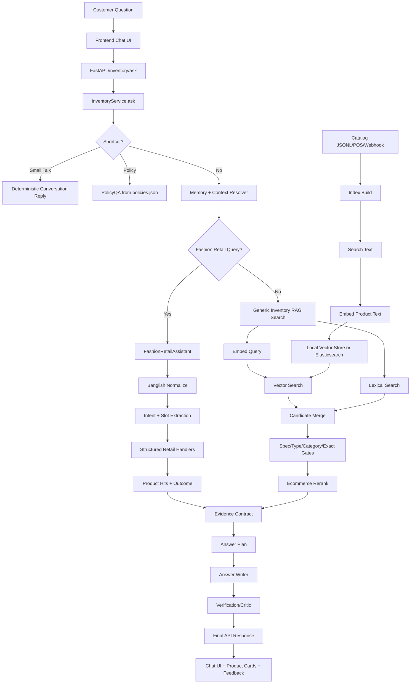

# Expert Presentation: Current Inventory RAG Pipeline

This is the presentation script and architecture map for explaining the current inventory chatbot pipeline to an LLM engineer, senior backend engineer, or technical reviewer.

The system is a catalog-grounded inventory assistant. It answers customer questions about fashion retail products using structured inventory data, retrieval, ranking, decision planning, and controlled answer generation.

## 1. One-Sentence Summary

The bot takes structured product inventory, turns it into searchable evidence, retrieves the right catalog items for a customer question, applies retail-specific decision logic, and then writes a grounded answer without inventing stock, price, size, color, policy, or product facts.

## 2. Board-Level Architecture

Use this version on a whiteboard. It is intentionally simple.

```text
[Customer]
    |
    v
[Chat UI: frontend/chat.html + chat.js]
    |
    v
[FastAPI Routes]
    |
    v
[InventoryService Orchestrator]
    |
    +--> [Small Talk]
    |
    +--> [Policy QA]
    |
    +--> [Fashion Retail Structured Brain]
    |
    +--> [Generic RAG Search]
    |
    +--> [Order / Image / Feedback APIs]
    |
    v
[Evidence + Decision Layer]
    |
    v
[Answer Writer + Verification]
    |
    v
[Customer Answer + Product Cards + Trace + Feedback]
```

Key message:

```text
The LLM is not the whole system.
The full system is: catalog structure + retrieval + filters + decisions + prompts + verification.
```

## 3. Full Arrow Flow

This is the detailed flow you can draw in lanes.

```text
LAYER 1: DATA SOURCES
catalog.jsonl
policies.json
orders_store.jsonl
sync/import/webhook data
customer profile/memory
        |
        v
LAYER 2: DATA VALIDATION + STORAGE
Pydantic schemas
InventoryItemRecord
InventorySearchFilters
InventoryAskRequest
        |
        v
LAYER 3: INDEX BUILD
_build_search_text()
_build_vector_record()
embedder.embed_text()
vector_store.upsert()
        |
        v
LAYER 4: QUERY ENTRY
frontend/chat.js
POST /inventory/ask
FastAPI route validation
        |
        v
LAYER 5: ORCHESTRATION
InventoryService.ask()
small talk shortcut
policy shortcut
memory resolution
route selection
        |
        v
LAYER 6A: STRUCTURED FASHION PATH
FashionRetailAssistant.answer()
intent + slots
category/color/size/gender/budget/occasion
variant/size/accessory/compare/styling logic
        |
        v
LAYER 6B: GENERIC RAG PATH
dense vector retrieval
lexical retrieval
candidate merging
filter gates
reranking
        |
        v
LAYER 7: EVIDENCE + DECISION
InventorySearchHit
EvidenceContract
AnswerPlan
primary / alternatives / cross-sells / abstain
        |
        v
LAYER 8: ANSWER GENERATION
deterministic template
or Ollama natural answer
or strict grounded writer prompt
        |
        v
LAYER 9: VERIFICATION + OBSERVABILITY
answer critic
answer plan verification
trace logs
feedback
        |
        v
LAYER 10: UI RESPONSE
answer text
products
intent
trace id
feedback buttons
catalog side panel
```

## 4. Mermaid Diagram For Slides

Use this in markdown viewers that support Mermaid.



## 5. Layer 1: Database And Storage Setup

This project currently uses lightweight file-backed stores, not a heavy SQL database for the main demo. That is deliberate: it keeps the prototype inspectable and easy to test.

| Store | File | What it saves | Technology |
| --- | --- | --- | --- |
| Product catalog | `data/inventory/catalog.jsonl` | Product records: name, category, price, stock, attributes, metadata | JSONL |
| Policy data | `data/inventory/policies.json` | Delivery, payment, refund, exchange policy | JSON |
| Orders | `data/orders/orders_store.jsonl` | Draft/confirmed order records | JSONL |
| Sync audit | `data/inventory/sync_audit.jsonl` | POS import/webhook/rebuild audit events | JSONL |
| Customer profiles | `data/customer_profiles/profiles_store.jsonl` | Customer preferences and profile memory when enabled | JSONL |
| Local vector index | `data/agentic_store/local_vectors.jsonl` | Product embeddings and vector metadata | JSONL |
| Optional search backend | Elasticsearch index `inventory-rag` | Dense vectors + metadata + lexical search | Elasticsearch 8.x |

Code objects:

| Schema | File | Meaning |
| --- | --- | --- |
| `InventoryItemRecord` | `app/core/schemas.py` | Product catalog row |
| `InventorySearchFilters` | `app/core/schemas.py` | Category/brand/stock/price/product filters |
| `InventorySearchHit` | `app/core/schemas.py` | Product after retrieval/ranking |
| `InventoryAnswerPlan` | `app/core/schemas.py` | Decision plan for answer writing |
| `InventoryAskRequest` | `app/core/schemas.py` | Chat request payload |

## 6. How Catalogs Are Saved

There are three catalog write paths.

```text
Manual JSONL file
    -> data/inventory/catalog.jsonl

API upsert
    -> POST /inventory/items/upsert
    -> InventoryService.upsert_items()
    -> persist catalog
    -> upsert vector records

POS sync
    -> POST /inventory/sync/import or /inventory/sync/webhook
    -> POSSyncEngine
    -> catalog update
    -> sync audit
    -> rebuild/index update
```

Main code:

| Operation | File/function |
| --- | --- |
| List products | `app/api/routes_inventory.py` -> `GET /inventory/items` |
| Read one product | `GET /inventory/items/{product_id}` |
| Upsert products | `InventoryService.upsert_items()` |
| Delete products | `InventoryService.delete_items()` |
| Rebuild RAG index | `InventoryService.sync_rebuild()` |
| POS import | `app/inventory/pos_sync.py` |

Catalog write logic:

```text
Input Product
    |
    v
Validate as InventoryItemRecord
    |
    v
Save to catalog.jsonl / mirror store
    |
    v
If include_in_rag=true:
    build search text
    embed search text
    upsert vector record
Else:
    delete vector record
```

## 7. Product Record Shape

A good product record needs structured fields. This is what makes the bot reliable.

```json
{
  "product_id": "saree_bridal_katan_maroon",
  "sku": "SR-KTN-MRN-001",
  "name": "Maroon Bridal Katan Saree",
  "category": "saree",
  "brand": "Sonjoy Boutique",
  "price": 7800,
  "currency": "BDT",
  "stock": 3,
  "status": "active",
  "tags": ["wedding", "bridal", "premium"],
  "attributes": {
    "color": "maroon",
    "color_family": "red",
    "fabric": "katan",
    "occasion": "wedding",
    "work_type": "zari",
    "gender": "women",
    "design_id": "bridal_katan_01"
  },
  "metadata": {
    "variant_group_name": "Bridal Katan Design 01"
  },
  "include_in_rag": true
}
```

Why this matters:

```text
Embeddings can find similar meaning.
Structured fields decide exact facts.
```

Examples:

| Customer asks | Required structured field |
| --- | --- |
| `size 39 ache?` | `attributes.size` or `attributes.available_sizes` |
| `same design blue ache?` | `attributes.design_id` |
| `men panjabi ache?` | `category`, `attributes.gender` |
| `5000 er moddhe` | `price` |
| `stock ache?` | `stock` |

## 8. How Catalogs Are Retrieved

There are two retrieval meanings:

1. UI catalog listing.
2. RAG/search retrieval for answering.

### 8.1 UI Catalog Listing

```text
Frontend catalog panel
    |
    v
GET /inventory/items
    |
    v
InventoryService.list_items()
    |
    v
Load catalog
    |
    v
Return all products to UI
```

Technology:

| Part | Technology |
| --- | --- |
| UI | `frontend/chat.html`, `frontend/chat.js` |
| API | FastAPI |
| Storage | JSONL catalog |
| Schema | Pydantic response models |

### 8.2 RAG/Search Retrieval

```text
Customer question
    |
    v
Intent + filters + slots
    |
    v
Vector retrieval + lexical retrieval
    |
    v
Candidate merge
    |
    v
Hard gates
    |
    v
Reranking
    |
    v
Search hits
```

Main code:

| Step | Function |
| --- | --- |
| Main ask endpoint | `InventoryService.ask()` |
| Generic search | `_search_with_trace_diagnostics()` |
| Semantic/vector search | `_semantic_search()` |
| Dense vector retrieval | `_dense_candidate_scores()` |
| Search hit creation | `_build_search_hit()` |
| Fashion-specific retrieval | `FashionRetailAssistant.answer()` |

## 9. Layer 2: API And Runtime

The backend is a FastAPI app served by uvicorn.

Current URLs:

```text
http://127.0.0.1:4849/frontend/chat.html
http://127.0.0.1:4849/docs
http://127.0.0.1:4849/inventory/ask
http://127.0.0.1:4849/inventory/items
```

Main runtime files:

| File | Role |
| --- | --- |
| `app/main.py` | Creates FastAPI app, mounts frontend, exposes `/docs`, includes routers |
| `app/api/routes_inventory.py` | Inventory APIs |
| `app/api/routes_orders.py` | Order APIs |
| `app/api/routes_feedback.py` | Feedback APIs |
| `app/core/security.py` | API key validation |
| `app/core/settings.py` | Env/config settings |

FastAPI routing:

```text
Browser
    |
    v
FastAPI app.main
    |
    +--> /frontend/*       static frontend mount
    +--> /docs             Swagger UI
    +--> /inventory/*      inventory APIs
    +--> /orders/*         order APIs
    +--> /feedback         feedback APIs
```

Technology:

- Python
- FastAPI
- Uvicorn
- Pydantic
- StaticFiles mount for frontend

## 10. Layer 3: Index Build And Sync

The index build stage makes products searchable by RAG.

```text
InventoryItemRecord
    |
    v
_build_search_text()
    |
    v
Searchable product text
    |
    v
embedder.embed_text()
    |
    v
VectorRecord
    |
    v
vector_store.upsert()
    |
    v
local_vectors.jsonl OR Elasticsearch index
```

Main functions:

| Function | What it does |
| --- | --- |
| `InventoryService.sync_rebuild()` | Rebuilds vector index from all RAG-enabled products |
| `InventoryService._build_search_text()` | Converts product record into rich searchable text |
| `InventoryService._build_vector_record()` | Creates `VectorRecord` with vector + metadata |
| `TextEmbedder.embed_text()` | Creates embedding vector |
| `VectorStore.upsert()` | Writes vector to selected backend |

Search text includes:

- product name
- SKU
- category
- brand
- short description
- full description
- status
- tags
- attributes
- metadata
- curated metadata
- alias text

## 11. Layer 4: Embedding And Vector Store

Embedding converts text to numbers. Vector search compares those numbers.

Supported embedding providers:

| Provider | Env value | Purpose |
| --- | --- | --- |
| Transformers | `EMBEDDING_PROVIDER=transformers` | Local semantic embeddings |
| OpenAI-compatible | `EMBEDDING_PROVIDER=openai` | External embedding API |
| Deterministic | `EMBEDDING_PROVIDER=deterministic` | Fast local test/dev vectors |
| Multilingual | `EMBEDDING_PROVIDER=multilingual` | Multilingual sentence-transformer path |

Vector stores:

| Store | Env value | Use case |
| --- | --- | --- |
| Local JSONL | `VECTOR_DB=local` | Small catalog, local demo |
| Elasticsearch | `VECTOR_DB=elasticsearch` | Larger catalog, metadata filters, lexical + vector search |
| Pinecone | `VECTOR_DB=pinecone` | Managed vector DB option |
| Milvus | `VECTOR_DB=milvus` | Open-source vector DB option |

Code:

| Component | File |
| --- | --- |
| Embedder abstraction | `app/retrieval/embedder.py` |
| Vector abstraction | `app/retrieval/vector_store_base.py` |
| Local vector store | `app/retrieval/local_store.py` |
| Elasticsearch adapter | `app/retrieval/elasticsearch_store.py` |

## 12. Layer 5: Query Entry

A chat request enters as `InventoryAskRequest`.

Example payload:

```json
{
  "question": "eid er jonno 5000 er moddhe elegant saree dekhan",
  "top_k": 5,
  "assistant_mode": "support",
  "reply_style": "short",
  "answer_engine": "auto",
  "conversation_history": [],
  "focused_product_ids": [],
  "active_filters": null,
  "last_answer_plan": null,
  "session_id": "browser-session"
}
```

Request flow:

```text
frontend/chat.js
    |
    v
POST /inventory/ask
    |
    v
routes_inventory.py::ask_inventory()
    |
    v
InventoryService.ask()
```

## 13. Layer 6: Orchestrator Decision Tree

This is the top-level decision tree.

```text
InventoryService.ask(question)
    |
    v
Is it small talk?
    |-- yes --> deterministic small-talk response
    |
    no
    |
    v
Is it policy?
    |-- yes --> PolicyQA from policies.json
    |
    no
    |
    v
Resolve safe memory/context
    |
    v
Can FashionRetailAssistant handle it?
    |-- yes --> structured fashion retail path
    |
    no
    |
    v
Generic RAG retrieval path
    |
    v
Answer plan + final response
```

Why this matters:

- Small talk should not trigger expensive retrieval.
- Policy should not search products.
- Fashion retail questions need exact structured logic.
- Generic RAG remains available for broader inventory questions.

## 14. Layer 7: Fashion Retail Structured Brain

This is the specialized layer for sarees, bags, cosmetics, beauty products, watches, three pieces, shoes, panjabi, perfumes, and accessories.

Main file:

```text
app/inventory/fashion_retail.py
```

Entry:

```text
FashionRetailAssistant.answer()
```

It performs:

| Step | What happens |
| --- | --- |
| Language normalization | Bangla/Banglish/English text is normalized |
| Slot extraction | category, color, fabric, size, gender, budget, occasion, design id |
| Intent classification | search, size, variant, accessory, compare, styling |
| Hard filtering | category/gender/size/stock/budget filters |
| Retail handler dispatch | exact handler for each retail intent |
| Outcome creation | product ids, answer text, confidence, reasoning steps |

Retail handlers:

| Intent | Handler |
| --- | --- |
| General product search | `_answer_fashion_search()` |
| Same design/color | `_answer_variant_color()` |
| Size availability | `_answer_size_availability()` |
| Matching accessory | `_answer_accessory_match()` |
| Compare | `_answer_fashion_compare()` |
| Styling advice | `_answer_styling_advice()` |

Decision rule:

```text
For fashion retail:
structured facts > semantic similarity > final wording
```

## 15. Layer 8: Generic RAG Retrieval

If the specialized retail path does not answer, the generic RAG pipeline runs.

```text
Question
    |
    v
Preference extraction
    |
    +--> Dense vector retrieval
    |
    +--> Lexical retrieval
    |
    v
Candidate merge
    |
    v
Spec gate
    |
    v
Product-type gate
    |
    v
Category gate
    |
    v
Exact lookup gate
    |
    v
Lexical anchor gate
    |
    v
Ecommerce reranking
    |
    v
Top-K search hits
```

Main function:

```text
InventoryService._semantic_search()
```

Retrieval components:

| Component | Function |
| --- | --- |
| Dense vector retrieval | `_dense_candidate_scores()` |
| Local lexical scoring | `_lexical_candidate_scores()` |
| External lexical query | `_external_lexical_candidate_scores()` |
| Candidate merge | `_merge_lexical_candidate_scores()` |
| Product preference extraction | `app/inventory/preferences.py` |
| Ecommerce scoring | `app/inventory/reranker.py`, `app/inventory/decisioning.py` |

## 16. Retrieval Decision Logic

The retrieval system is intentionally hybrid.

Why:

```text
Vector search understands meaning.
Lexical search protects exact words.
Metadata filters protect hard constraints.
Reranking decides best business/customer fit.
```

Example:

```text
Customer: office er jonno bag dekhan
```

Expected logic:

```text
category = bag
occasion/use = office
stock > 0
price if budget exists
rank practical bags higher than party clutches
```

Bad logic would return sarees because sarees and bags can both appear in wedding/fashion context. The system prevents that through category gates and structured retail logic.

## 17. Layer 9: Evidence Contract

The evidence contract is the boundary between retrieval and answer writing.

Main file:

```text
app/inventory/evidence_contract.py
```

It defines:

- which products are candidates
- which product is primary
- which facts are allowed
- what facts are missing
- what contradictions exist
- why products were included or rejected
- what follow-up question is safe

Concept:

```text
The answer writer cannot just say anything.
It must stay inside the evidence contract.
```

## 18. Layer 10: Answer Plan

The answer plan is the decision object.

Main file:

```text
app/inventory/planner.py
```

Core schema:

```text
InventoryAnswerPlan
```

It contains:

- detected intent
- strategy
- product type/family
- primary product id
- alternative product ids
- cross-sell product ids
- excluded product ids
- primary reason
- alternative reason
- tradeoffs
- risk notes
- next best question
- confidence breakdown
- abstention flag

Decision principle:

```text
The answer plan decides what to say.
The prompt writer decides how to say it.
```

## 19. Layer 11: Prompt And Answer Writing

There are multiple answer modes.

| Mode | What it does | Files |
| --- | --- | --- |
| Deterministic | Rule/template answer, safest and fastest | `fashion_retail.py`, `inventory_service.py` |
| Lightweight natural answer | Warm boutique wording using Ollama | `app/inventory/natural_answer.py` |
| Heavy grounded writer | Strict JSON answer from evidence package | `InventoryService._build_inventory_answer_messages()` |

Prompt-bearing files:

| Prompt | File | Purpose |
| --- | --- | --- |
| Intent classifier prompt | `app/inventory/llm_intent_classifier.py` | Intent + slots JSON |
| Candidate reasoner prompt | `app/inventory/llm_reasoner.py` | Pick best product ids from retrieved candidates |
| Natural answer prompt | `app/inventory/natural_answer.py` | Warm Bangla/Banglish/English answer |
| Heavy writer prompt | `app/services/inventory_service.py` | Strict evidence-grounded final answer |
| Answer critic prompt | `app/inventory/answer_critic.py` | Detect hallucination or ignored constraints |

Critical rule:

```text
Prompts improve wording.
They must not override retrieval, stock, price, size, gender, or policy facts.
```

## 20. Layer 12: Verification And Critic

Verification protects trust.

Two levels:

| Level | What it checks | Code |
| --- | --- | --- |
| Deterministic verification | Answer plan roles, selected products, excluded products | `InventoryService._verify_answer_plan()` |
| LLM critic | Hallucinated facts, wrong stock, ignored constraints, wrong language | `app/inventory/answer_critic.py` |

Verification checks:

- product exists in evidence
- stock not invented
- price not invented
- no excluded product recommended
- cross-sell not presented as substitute
- no-match does not randomly recommend products
- policy answer does not invent policy

## 21. Layer 13: Response And UI Rendering

Final response shape:

```text
InventoryAskResponse
    |
    +--> answer
    +--> intent
    +--> language
    +--> confidence_score
    +--> trace_id
    +--> hits
    +--> recommended_product_ids
    +--> cross_sell_product_ids
    +--> follow_up_question
    +--> answer_plan
    +--> verification
```

The UI renders:

- answer text
- product suggestions
- intent metadata
- thumbs up/down
- catalog side panel
- image upload
- cart/order controls

Main files:

```text
frontend/chat.html
frontend/chat.css
frontend/chat.js
```

## 22. Order, Image, Feedback Side Flows

These are connected workflows, not the main RAG answer loop.

```text
Order flow:
/orders/draft
/orders/update
/orders/confirm
/orders/track/{phone}
    -> app/inventory/order_workflow.py
    -> data/orders/orders_store.jsonl
```

```text
Image flow:
/inventory/image-search
    -> ImageMatcher / CLIPImageMatcher
    -> visually similar products
```

```text
Feedback flow:
thumbs up/down in UI
    -> POST /feedback
    -> data/feedback/feedback.jsonl
    -> future eval/debug cases
```

## 23. Technology Stack Summary

| Layer | Technology |
| --- | --- |
| Backend | Python, FastAPI |
| Runtime | Uvicorn |
| Schema validation | Pydantic |
| Frontend | HTML, CSS, JavaScript |
| Product DB | JSONL |
| Policy DB | JSON |
| Order DB | JSONL |
| Vector DB | Local JSONL vector store or Elasticsearch |
| Embeddings | Transformers / deterministic / multilingual / OpenAI-compatible |
| Optional LLM | Ollama, `qwen3:8b` |
| Image matching | Metadata matcher, optional CLIP |
| Tests | Pytest |
| API docs | FastAPI Swagger `/docs` |

## 24. Decision Architecture

This is the decision logic you should explain to an expert.

```text
Question arrives
    |
    v
1. Can it be answered without retrieval?
    - greeting
    - thanks
    - help
    - goodbye

2. Is it a policy question?
    - delivery
    - payment
    - refund
    - exchange

3. Is it a fashion retail question?
    - product search
    - same design/color
    - size availability
    - accessory matching
    - styling
    - comparison

4. If not, use generic inventory RAG:
    - dense retrieval
    - lexical retrieval
    - filters
    - gates
    - reranking

5. Build answer plan:
    - primary
    - alternatives
    - cross-sells
    - abstain if unsafe

6. Write answer:
    - deterministic or natural
    - same language style
    - include only evidence-backed facts

7. Verify:
    - no hallucination
    - no wrong stock/price/size
    - no random no-match recommendation
```

## 25. Example Walkthrough

Question:

```text
eid er jonno 5000 er moddhe elegant saree
```

Flow:

```text
chat.js
    -> /inventory/ask
    -> InventoryService.ask()
    -> not small talk
    -> not policy
    -> memory resolver
    -> FashionRetailAssistant.answer()
    -> normalize Banglish
    -> extract:
        category = saree
        occasion = eid
        budget_max = 5000
        style = elegant
    -> filter catalog:
        category=saree
        price<=5000
        stock>0
        occasion/style closest match
    -> rank products
    -> create FashionRetailOutcome
    -> create InventoryAnswerPlan
    -> optional natural answer
    -> optional critic
    -> final answer
```

What the bot should say:

```text
It should show in-catalog sarees under BDT 5,000 that fit Eid/elegant style.
If no exact match exists, it should say no exact match and ask whether to relax budget/style.
```

## 26. What Makes This A RAG System

It is RAG because:

```text
The answer is generated after retrieving evidence.
```

Evidence comes from:

- catalog JSONL
- policy JSON
- vector index
- structured product attributes
- order store
- conversation state

The LLM is controlled by:

- retrieved hits
- evidence contract
- answer plan
- verification
- critic

## 27. What Makes This More Than Basic RAG

Basic RAG:

```text
query -> vector search -> LLM answer
```

This system:

```text
query
-> language/intent/slot extraction
-> structured retail rules
-> vector + lexical search
-> metadata filters
-> candidate gates
-> reranking
-> evidence contract
-> answer plan
-> controlled writer prompt
-> verification
-> feedback loop
```

This matters because inventory is not just text. It has exact constraints.

## 28. Known Limitations To State Honestly

An expert will respect this if you say it clearly.

| Limitation | Meaning | Fix |
| --- | --- | --- |
| JSONL is not final production DB | Good for prototype, weak for concurrent writes | Move to PostgreSQL/POS source of truth |
| Deterministic embeddings are not semantic | Good for tests, weak for real language meaning | Use multilingual/transformer embeddings |
| LLM calls can be slow | Ollama classifier/reasoner/critic adds latency | Cache, template common intents, tune flags |
| Catalog quality decides answer quality | Missing size/design/gender fields hurt results | Better product schema and POS sync |
| Order chat flow needs polish | APIs exist, conversational collection can improve | State machine for order slots |
| Image search is optional/slow first use | CLIP can load slowly | Prewarm or use hosted image embeddings |

## 29. What To Draw On The Board

Draw three horizontal lanes.

```text
LANE A: DATA / INDEX

Catalog JSONL + Policy JSON + Orders JSONL
        -> Pydantic schemas
        -> Search text
        -> Embeddings
        -> Local Vector Store / Elasticsearch


LANE B: QUERY / RETRIEVAL

Customer Chat
        -> FastAPI
        -> InventoryService
        -> Intent + Slots
        -> Fashion Structured Path OR Generic RAG
        -> Retrieval + Filters + Rerank


LANE C: DECISION / ANSWER

Search Hits
        -> Evidence Contract
        -> Answer Plan
        -> Prompt Writer / Template
        -> Verification
        -> Final Answer + Feedback
```

Then add this beside it:

```text
Correctness comes from:
1. structured catalog
2. hard filters
3. evidence contract
4. answer plan
5. verification

Human-like tone comes from:
1. prompt writer
2. language matching
3. examples
4. follow-up question
```

## 30. Final Expert-Level Summary

The current system is a hybrid structured-RAG retail assistant. Product records are stored in JSONL and indexed into a vector store after converting structured catalog facts into searchable text. At query time, FastAPI receives the customer message and `InventoryService` routes it through small-talk, policy, fashion-retail structured reasoning, or generic inventory RAG. The retrieval layer combines dense vector search, lexical matching, metadata filters, candidate gates, and ecommerce reranking. The decision layer builds an evidence contract and answer plan so the response writer cannot freely hallucinate. Finally, deterministic templates or Ollama-backed prompts generate the answer, and verification/critic logic checks that the reply stays grounded in catalog and policy evidence.

