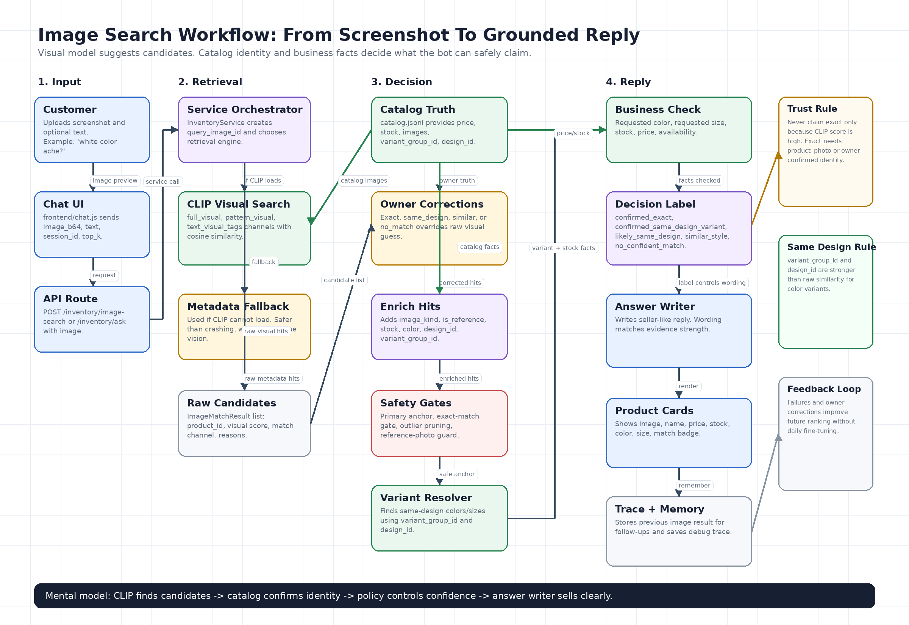

# Image Search Workflow And Theory

This document explains how the current image-search pipeline works, why each layer exists, and how to reason about failures. Read this when you want ownership of the visual product-search part of the inventory chatbot.

The blunt truth: this feature is not just "find similar images." For a shop bot, the hard problem is deciding what the bot is allowed to claim:

- "This is the exact product."
- "This is the same design in another color."
- "This is only visually similar."
- "I cannot confidently match this screenshot."

The image model is the eye. The catalog is the truth. The decision policy is the discipline that stops the bot from lying.

## Core Goal

Customer behavior:

```text
Customer sees a product on Facebook / Instagram / WhatsApp
  -> customer screenshots it
  -> customer uploads it to the chatbot
  -> bot checks the shop catalog
  -> bot replies like a trained salesperson
```

The bot should answer:

- "Ei same design ta ache?"
- "White/black/blue color e ache?"
- "M size ache?"
- "Price koto?"
- "Exact na thakle similar dekhan."
- "Eta available?"
- "Eta order korte parbo?"

## High-Level Flow

```text
User image + optional text
  -> Frontend upload
  -> FastAPI route
  -> InventoryService image-search path
  -> Query image hash
  -> Retrieval engine selection
       -> CLIP visual search if available
       -> metadata fallback if CLIP unavailable
  -> Raw visual candidates
  -> Owner corrections
  -> Catalog enrichment
  -> Primary product anchor selection
  -> Exact-match safety gate
  -> Variant/design resolver
  -> Requested color / size resolver
  -> Business fact check
  -> Decision label
  -> Customer answer + product cards
  -> Trace + memory + feedback logs
```



<p align="center">
  
</p>

Direct image file: [docs/assets/image_search_workflow.png](docs/assets/image_search_workflow.png)

The PNG is generated by [scripts/generate_image_search_flowchart.py](scripts/generate_image_search_flowchart.py). If the architecture changes, update that script and regenerate the asset.

## Files To Read First

| Layer | Main file | What to learn |
|---|---|---|
| Chat UI | [frontend/chat.html](frontend/chat.html), [frontend/chat.js](frontend/chat.js), [frontend/chat.css](frontend/chat.css) | Upload image, send text+image, render product cards |
| API routes | [app/api/routes_inventory.py](app/api/routes_inventory.py) | `/inventory/image-search`, image index, correction endpoints |
| Service orchestration | [app/services/inventory_service.py](app/services/inventory_service.py) | Chooses image path, records memory, saves trace |
| Decision policy | [app/inventory/image_matcher.py](app/inventory/image_matcher.py) | Exact/same-design/similar/no-match logic |
| Visual model | [app/inventory/clip_matcher.py](app/inventory/clip_matcher.py) | CLIP embeddings, full/pattern/text channels |
| Image preprocessing/index manifest | [app/inventory/image_index.py](app/inventory/image_index.py), [app/inventory/image_preprocessing.py](app/inventory/image_preprocessing.py) | Local image index, preprocessing metadata |
| Feedback/corrections | [app/inventory/image_feedback.py](app/inventory/image_feedback.py) | Failed searches and owner corrections |
| Catalog truth | [data/inventory/catalog.jsonl](data/inventory/catalog.jsonl) | Product facts, images, variants, stock, price |
| Evaluation | [evaluation/image_search_gold_set.jsonl](evaluation/image_search_gold_set.jsonl), [scripts/run_image_search_eval.py](scripts/run_image_search_eval.py) | Repeatable image-search behavior tests |
| Unit tests | [tests/test_image_matching.py](tests/test_image_matching.py), [tests/test_image_search_ask.py](tests/test_image_search_ask.py) | Guardrails around the matching logic |

## Layer 1: Catalog Identity

Image search becomes reliable only when the catalog has strong product identity. A visual model can say "these look close"; it cannot know stock, price, or whether two colors are officially the same shop design.

Important catalog fields:

```json
{
  "product_id": "shirt-ribbed-polo-black",
  "sku": "SRP-BLK-M",
  "name": "Ribbed Open-Collar Knit Polo - Black",
  "category": "Shirt",
  "price": 1750,
  "currency": "BDT",
  "stock": 5,
  "attributes": {
    "department": "men",
    "category_key": "shirt",
    "variant_group_id": "ribbed-open-collar-knit-polo",
    "design_id": "vertical-ribbed-open-collar-knit",
    "color": "black",
    "color_family": "black",
    "pattern_type": "vertical ribbed",
    "neckline": "open collar",
    "sleeve": "half sleeve",
    "fabric": "knit",
    "size_stock": {
      "M": 2,
      "L": 2,
      "XL": 1
    }
  },
  "images": [
    {
      "image_id": "shirt-ribbed-polo-black-primary",
      "role": "primary",
      "kind": "product_photo",
      "is_reference": false,
      "local_path": "data/inventory/images/shirt-ribbed-polo-black/primary.jpg"
    }
  ]
}
```

The critical fields are:

- `product_id`: the sellable product identity.
- `variant_group_id`: same design across colors or sizes.
- `design_id`: pattern/design identity independent of color.
- `color` and `color_family`: lets the bot answer "same design blue/white/black ache?"
- `size_stock`: lets the bot answer size availability honestly.
- `images[].kind`: controls how confidently the bot can speak.
- `images[].is_reference`: prevents demo images from becoming exact proof.

Strategic rule: if `variant_group_id` is missing, the bot cannot safely say "same design in another color." It can only say "similar."

## Layer 2: UI And Request

The customer interacts through the chat UI:

```text
frontend/chat.html
  -> file upload input
  -> image preview
  -> optional text field
  -> product card rendering
```

The browser sends:

```json
{
  "query_text": "ei same design ta white color e ache?",
  "image_b64": "data:image/jpeg;base64,...",
  "session_id": "customer-session-1",
  "top_k": 6
}
```

The important design choice is that image and text travel together. The image says "what product/design?" The text says "what does the customer want to know?"

Example:

```text
Image: black ribbed polo
Text: "white color ache?"
```

The answer should not simply return the black shirt. It should match the design, then resolve the requested color inside the same variant group.

## Layer 3: API Routes

The image-search route lives in [app/api/routes_inventory.py](app/api/routes_inventory.py).

Important endpoints:

```text
POST /inventory/image-search
POST /inventory/ask
GET  /inventory/image-index/status
POST /inventory/image-index/rebuild
GET  /inventory/image-search/failures
GET  /inventory/image-search/corrections
POST /inventory/image-search/corrections
```

Two paths can answer image questions:

- `/inventory/image-search`: direct visual search endpoint.
- `/inventory/ask`: normal chat endpoint, but if an image is included it enters the image-search answer path.

That second path matters because customers do not think in endpoints. They think in conversation.

## Layer 4: Service Orchestration

The service layer is in [app/services/inventory_service.py](app/services/inventory_service.py).

Key functions:

```text
image_search(...)
  -> public image-search API handler

_answer_with_image_search(...)
  -> normal /inventory/ask turn with uploaded image

_run_image_search_decision(...)
  -> visual retrieval + corrections + decision policy

_try_image_followup_ask(...)
  -> text-only follow-up after an image match

_record_image_search_turn(...)
  -> stores previous product/design in session memory

_save_image_search_trace(...)
  -> saves trace for observer/debug UI
```

The most important function is `_run_image_search_decision(...)`:

```text
load catalog
  -> decide retrieval engine
  -> run CLIP or metadata matcher
  -> apply owner corrections
  -> finalize decision using catalog policy
```

Current retrieval engine selection:

```text
if CLIPImageMatcher.is_available():
    precompute_catalog_embeddings(catalog)
    use CLIPImageMatcher
else:
    use metadata ImageMatcher fallback
```

This is a good design because the bot still works when the visual model cannot load. But it also means you must check the trace to know whether a result came from real CLIP vision or metadata fallback.

## Layer 5: Query Image ID

Function:

```text
query_image_id_from_b64(...)
```

File:

```text
app/inventory/image_matcher.py
```

What it does:

```text
base64 image
  -> decode bytes
  -> SHA-256 hash
  -> upload_<short_hash>
```

Why it matters:

- The same uploaded image gets a stable ID.
- Failures can be logged against that image.
- Owner corrections can map that image to the right product later.

Example:

```text
query_image_id = "upload_e3eba232b1344a69"
```

## Layer 6: Visual Retrieval Theory

The current visual model is CLIP via [app/inventory/clip_matcher.py](app/inventory/clip_matcher.py).

Technology:

- `transformers`
- `torch`
- `openai/clip-vit-base-patch32`
- image embeddings
- text embeddings
- cosine similarity

Basic theory:

```text
image
  -> neural model
  -> vector embedding

catalog image
  -> same neural model
  -> vector embedding

similarity = cosine(query_vector, catalog_vector)
```

A high cosine score means "the model sees them as visually/semantically close." It does not automatically mean "same SKU."

### Current Embedding Channels

The code uses multiple channels:

```text
full_visual
  -> normal image embedding
  -> good for object shape, color, category, general look

pattern_visual
  -> grayscale image embedding
  -> reduces color dominance
  -> better for same design in another color

text_visual_tags
  -> product name/attributes embedded as text
  -> fallback when product image is missing
```

Why this matters:

- A black shirt and white shirt may be the same design, but full CLIP can over-focus on color.
- Grayscale/pattern matching helps the model notice ribbing, embroidery, print, border, and silhouette.
- Text fallback is useful but dangerous for exact claims because it is not visual evidence.

The exact-match gate handles this danger.

## Layer 7: Catalog Embedding Cache

CLIP embeddings are expensive to compute, so the system caches catalog vectors.

Important file:

```text
data/inventory/clip_embeddings_cache.json
```

Important functions:

```text
precompute_catalog_embeddings(...)
_catalog_signature(...)
_try_load_persisted_cache(...)
_persist_cache(...)
```

How it works:

```text
catalog images + product updated_at + names
  -> catalog signature
  -> if signature unchanged, load cached vectors
  -> if changed, rebuild vectors
```

This avoids recomputing every product image on every chat turn.

Blind spot: if daily new products are added but embeddings are not rebuilt, the visual system cannot know them. Product sync must trigger reindexing or cache rebuild.

## Layer 8: Image Index Manifest

File:

```text
app/inventory/image_index.py
```

Output:

```text
data/inventory/image_index.jsonl
```

What it stores:

- `product_id`
- `image_id`
- `image_source`
- `image_role`
- `image_kind`
- `is_reference`
- `category`
- `color`
- `variant_group_id`
- `design_id`
- preprocessing metadata
- embedding status
- model metadata
- stale/missing status

This is not just for search speed. It is for observability. It tells you whether the visual catalog is ready.

Use:

```text
GET /inventory/image-index/status
POST /inventory/image-index/rebuild
```

Important distinction:

- The current image runtime uses CLIP cache and local image-index manifest.
- The repo also has Elasticsearch vector support, but image search is not something you should assume is fully Elasticsearch-backed unless the trace and index wiring prove it.

## Layer 9: Raw Candidate Retrieval

CLIP returns raw `ImageMatchResult` objects.

Shape:

```text
ImageMatchResult(
    product_id,
    name,
    score,
    match_type,
    reasons,
    price,
    stock,
    image_url,
    score_breakdown
)
```

At this stage, candidates are only visually close. They are not yet safe customer answers.

Bad mental model:

```text
top CLIP hit = answer
```

Correct mental model:

```text
top CLIP hit = candidate evidence
catalog + policy = answer
```

## Layer 10: Owner Corrections

File:

```text
app/inventory/image_feedback.py
```

Correction storage:

```text
data/feedback/image_search_corrections.jsonl
```

Failure storage:

```text
data/feedback/image_search_failures.jsonl
```

Owner correction types:

```text
exact_product
same_design
similar
no_match
```

Why corrections matter:

- Visual models are probabilistic.
- Shop owner confirmation is business truth.
- If owner says upload X is product Y, that should beat CLIP score.

This is one of the biggest practical levers for making the system better without daily model fine-tuning.

## Layer 11: Candidate Enrichment

Function:

```text
_enrich_hit(...)
```

File:

```text
app/inventory/image_matcher.py
```

What it adds from catalog:

- price
- stock
- primary image
- `variant_group_id`
- `design_id`
- color
- image kind
- reference flag
- decision label
- score breakdown

This is where a visual candidate becomes a commerce candidate.

## Layer 12: Primary Product Anchor

Function:

```text
_primary_selection_key(...)
```

The primary product is the anchor used for variant expansion.

Example:

```text
uploaded image -> black ribbed polo
primary anchor -> shirt-ribbed-polo-black
variant group -> ribbed-open-collar-knit-polo
same design variants -> grey, olive, white
```

Why this layer is dangerous:

If the wrong primary product is chosen, all downstream color and size answers become wrong. This is why primary selection gives heavy weight to visual score, then smaller bonuses for product-photo truth, decision label, and stock.

## Layer 13: Exact-Match Safety Gate

Function:

```text
_apply_exact_match_gate(...)
```

Purpose:

Prevent weak evidence from becoming an exact product claim.

It demotes `confirmed_exact` to `likely_same_design` when:

- only text channel matched
- only pattern channel matched
- another unrelated candidate is too close in score

Recent important logic:

```text
_same_visual_identity_group(...)
```

This prevents same-design sibling colors from wrongly demoting an exact match.

Example:

```text
black ribbed polo uploaded
black score = 0.91
white score = 0.89
olive score = 0.88
```

Those near runner-ups are not a problem if they share `variant_group_id` or `design_id`. They are proof that the model found the design family. The exact gate should only be suspicious when a different unrelated product is close.

This is the right strategic move. Same-design variants should help confidence, not destroy it.

## Layer 14: Variant And Design Resolution

Function:

```text
_same_design_items(...)
```

Logic:

```text
primary.variant_group_id or primary.design_id
  -> search catalog for same group/design
  -> return sibling products
```

This layer answers:

- "same design e white ache?"
- "ar ki color ache?"
- "blue color available?"

If `variant_group_id` exists, this is strong evidence. If only CLIP says two products are similar, that is weaker evidence.

Strategic rule:

```text
confirmed same design = catalog identity
likely similar design = visual similarity
```

Do not mix them.

## Layer 15: Requested Color Resolution

Functions:

```text
infer_requested_color(...)
normalize_color(...)
_color_matches(...)
```

Supported language style:

- English: `white`, `black`, `blue`
- Banglish: `shada`, `kalo`, `nil`, `sobuj`
- Bangla: `সাদা`, `কালো`, `নীল`, `সবুজ`

Flow:

```text
query text
  -> requested_color
  -> find same-design items matching that color
  -> check stock
  -> answer available / unavailable / not in catalog
```

Example:

```text
User: uploads black shirt + "blue ache?"

Bot should say:
"Same design ta peyechi, but blue color currently catalog e nei.
Available colors: black, grey, olive, white."
```

## Layer 16: Requested Size Resolution

Functions:

```text
infer_requested_size(...)
_size_availability(...)
```

Current size logic supports letter sizes:

```text
XS, S, M, L, XL, XXL, XXXL
```

It uses catalog size stock through:

```text
app.inventory.catalog_identity.product_size_stock(...)
app.inventory.catalog_identity.product_size_stock_is_authoritative(...)
```

The answer must be honest:

- If stock says M > 0: "M size ache."
- If M exists but stock is 0: "M size currently nei."
- If size data is weak: "catalog e clear na, order er age confirm korte hobe."

This is the correct design because fake confidence on size creates customer disappointment.

## Layer 17: Decision Labels

The system uses decision labels to control wording.

| Label | Meaning | Customer wording |
|---|---|---|
| `confirmed_exact` | Product photo + strong visual evidence, or owner-confirmed exact | "Yes, this looks like our product..." |
| `confirmed_same_design_variant` | Same design/variant group and requested color/variant exists | "Same design e this color available..." |
| `likely_same_design` | Looks like same design but not enough for exact | "Ei design er closest match..." |
| `similar_style` | Similar product, not confirmed same design | "Exact same confirm korte parchi na, but similar..." |
| `no_confident_match` | Not enough evidence | "Confident bhabe pachchi na..." |

This label system is the heart of trustworthy image search.

## Layer 18: Answer Writing

Function:

```text
_build_decision_answer(...)
```

File:

```text
app/inventory/image_matcher.py
```

The answer is deterministic and grounded. It uses:

- decision label
- primary product
- requested color
- requested size
- same-design variants
- available colors
- stock
- price
- reference-image warning

Example exact answer:

```text
Yes, this looks like Ribbed Open-Collar Knit Polo - Black
(BDT 1,750, 5 in stock). Available colors: black, grey, olive, white.
Other colors dekhabo?
```

Example requested color answer:

```text
Yes, same design e white option available:
Ribbed Open-Collar Knit Polo - White (5 in stock).
M size check korbo, naki onno color?
```

Example safe fallback:

```text
Exact same confirm korte parchi na, but closest similar options:
Ribbed Open-Collar Knit Polo - Grey, Ribbed Open-Collar Knit Polo - Olive.
Cheaper option, naki onno category dekhabo?
```

## Layer 19: Product Cards

The UI renders hits as product cards.

Each card should show:

- product image
- name
- price
- stock
- color
- size
- match label
- visual score

Why product cards matter:

In visual commerce, the customer must visually confirm. Text alone is not enough.

## Layer 20: Memory And Follow-Up

Function:

```text
_record_image_search_turn(...)
_try_image_followup_ask(...)
_synthetic_image_hit(...)
```

What memory stores:

- last image-search intent
- primary product ID
- product IDs returned
- variant group
- design ID
- color
- confidence

Example:

```text
User: uploads black ribbed polo
Bot: shows black plus same-design colors
User: "white ache?"
```

The second message has no image. The bot should use memory:

```text
previous primary product -> variant_group_id
  -> same design variants
  -> white product
  -> stock/size answer
```

Guardrail:

If the user asks a clearly new product question, memory should not hijack it.

Example:

```text
Previous image: shirt
New text: "red saree ache?"
```

This should become a new search, not a shirt follow-up.

## Layer 21: Trace And Debugging

Function:

```text
_save_image_search_trace(...)
```

Trace includes:

- `retrieval_engine`
- `decision_label`
- `primary_product_id`
- `requested_color`
- `available_colors`
- `same_design_variant_ids`
- `similar_product_ids`
- `retrieved_product_ids`
- `score_breakdown`
- individual hits
- final answer

This is how you prove what happened.

When debugging, do not only read the final answer. Read:

```text
image_search.retrieval_engine
image_search.hits[*].score
image_search.hits[*].decision_label
image_search.hits[*].variant_group_id
image_search.hits[*].image_kind
image_search.hits[*].is_reference
image_search.score_breakdown
```

## Example Flow 1: Same Design, Different Color

Input:

```text
Image: black ribbed polo
Text: "white color ache?"
```

Pipeline:

```text
frontend/chat.js
  -> sends image_b64 + text

routes_inventory.py
  -> POST /inventory/ask or /inventory/image-search

inventory_service.py
  -> _run_image_search_decision(...)

clip_matcher.py
  -> encode query image
  -> compare with catalog image embeddings
  -> raw hits: black, olive, grey, white ribbed polos

image_matcher.py
  -> enrich hits from catalog
  -> choose black as primary anchor
  -> exact gate checks ambiguity
  -> variant group resolver finds white sibling
  -> requested color resolver finds white
  -> stock check confirms availability
  -> decision_label = confirmed_same_design_variant

frontend/chat.js
  -> shows answer + product card
```

Expected answer:

```text
Yes, same design e white option available:
Ribbed Open-Collar Knit Polo - White (5 in stock).
M size check korbo, naki onno color?
```

## Example Flow 2: Requested Color Missing

Input:

```text
Image: white ribbed polo
Text: "blue ache?"
```

Pipeline:

```text
match design family
  -> available colors: black, grey, olive, white
  -> requested color: blue
  -> blue not in same-design group
```

Expected answer:

```text
Same design ta peyechi, but blue color currently catalog e nei.
Available colors: black, grey, olive, white.
```

## Example Flow 3: Size Follow-Up

Input:

```text
Turn 1: upload black shirt
Turn 2: "M size ache?"
```

Pipeline:

```text
conversation_state
  -> last intent = image_search
  -> last primary product = shirt-ribbed-polo-black
  -> synthetic image hit
  -> finalize_image_search(...)
  -> size_stock check
```

Expected answer:

```text
Ei design er closest match Ribbed Open-Collar Knit Polo - Black
(BDT 1,750, 5 in stock). M size ache, stock e 2 pcs.
Order korte parle bolun, ami size lock kore dichi.
```

## Example Flow 4: Reference Image Safety

If a catalog image is marked:

```json
{
  "kind": "reference_photo",
  "is_reference": true
}
```

The bot should avoid exact claims.

Correct answer style:

```text
Ei design er closest match ...
Note: the catalog photo is a demo/reference image, so exact SKU cannot be confirmed.
```

Wrong answer style:

```text
Yes, exact same product ache.
```

That would be unsafe because reference photos are not business proof.

## What CLIP Is Good At

CLIP is useful for:

- finding visually similar products
- broad category similarity
- shape/silhouette similarity
- image-to-text semantic matching
- first-pass retrieval from many catalog images

## What CLIP Is Bad At

CLIP can fail on:

- exact SKU identity
- tiny pattern differences
- same design in different colors
- black fabric where texture is hidden
- white product on white background
- screenshots with Facebook UI overlays
- multiple products in one screenshot
- jewelry/cosmetic small-object confusion
- product images from different angles

This is why the system needs:

- `variant_group_id`
- `design_id`
- `image_kind`
- exact-match gate
- owner corrections
- product cards for visual confirmation

## How To Debug Common Failures

### Failure: Pearl Necklace Appears For Shirt Screenshot

Likely cause:

- CLIP overmatched white/color/background.
- Candidate pruning was too weak.
- Category metadata is missing or wrong.

Check:

```text
image_search.hits[*].category
image_search.hits[*].score
image_search.hits[*].decision_label
```

Fix:

- add stronger category metadata
- add real product photos
- improve outlier pruning
- add owner correction if the screenshot is known

### Failure: Exact Product Is Called Only Similar

Likely cause:

- product image is marked reference
- score below exact threshold
- top candidate margin too thin
- only text or pattern channel matched

Check:

```text
primary_image_kind
primary_is_reference
matched_channels
exact_match_gate
```

Fix:

- mark real shop photos as `product_photo`
- set `is_reference = false`
- add more product/detail images
- tune exact gate only after evaluation proves it

### Failure: Same Design Color Not Found

Likely cause:

- missing `variant_group_id`
- inconsistent `design_id`
- color is not normalized
- product stock is zero

Check:

```text
variant_group_id
design_id
available_colors
requested_color
same_design_variant_ids
```

Fix:

- give all sibling variants the same `variant_group_id`
- normalize colors into `color` and `color_family`
- verify stock

### Failure: Size Answer Is Wrong

Likely cause:

- catalog has only a display string like `"M, L, XL"`
- no authoritative `size_stock`
- size stock belongs to another color variant

Check:

```text
attributes.size_stock
product_size_stock_is_authoritative(...)
requested_size
```

Fix:

- store size stock per sellable variant
- make size stock authoritative
- ensure requested color is resolved before size check

### Failure: Image Search Is Slow

Likely cause:

- CLIP model cold load
- catalog embeddings rebuilt during request
- remote images being fetched
- cache signature changed

Check:

```text
retrieval_engine
latency_ms
data/inventory/clip_embeddings_cache.json
data/inventory/image_index.jsonl
```

Fix:

- warm CLIP before demo
- run image-index rebuild before customer testing
- keep images local
- avoid remote URL fetching at query time

## What The Current System Can Reliably Claim

It can be reliable when:

- product has real local image
- `image.kind = product_photo`
- `is_reference = false`
- variant group is present
- color and size stock are structured
- visual score is strong
- trace confirms CLIP or owner correction

It should be cautious when:

- image is a demo/reference image
- product has no real photo
- score is weak
- category is ambiguous
- variant group is missing
- screenshot has multiple products

This caution is not weakness. It is how the bot earns trust.

## Development Workflow

When changing image search, do this loop:

```text
1. Add or fix catalog identity
2. Rebuild image index
3. Run image-search evaluation
4. Inspect failed traces
5. Fix policy / data / preprocessing
6. Run tests again
```

Useful commands:

```bash
.venv/bin/python scripts/run_image_search_eval.py
.venv/bin/python -m pytest tests/test_image_matching.py tests/test_image_search_ask.py
```

Optional API checks:

```bash
curl http://127.0.0.1:4837/inventory/image-index/status
```

## What To Improve Next

Priority order:

1. Real product photos
   - Without real product photos, exact visual confirmation is weak.

2. Strong catalog identity
   - Every visual product needs `variant_group_id`, `design_id`, color, size stock, and image truth level.

3. Better screenshot preprocessing
   - Crop out Facebook UI, background, text overlays, and multiple-product noise.

4. Pattern-focused model channel
   - Add stronger design embeddings later, such as DINOv2, FashionCLIP, or SigLIP.

5. Owner correction UI
   - Let the shop owner fix bad matches without touching code.

6. Production index workflow
   - New product sync should automatically preprocess images and rebuild embeddings.

## The Mental Model To Remember

```text
CLIP finds candidates.
Catalog confirms identity.
Decision policy controls confidence.
Answer writer sells clearly.
Trace tells you why.
Feedback improves tomorrow's answer.
```

If you remember only one sentence:

> The visual model can suggest; only catalog identity and business facts can confirm.
