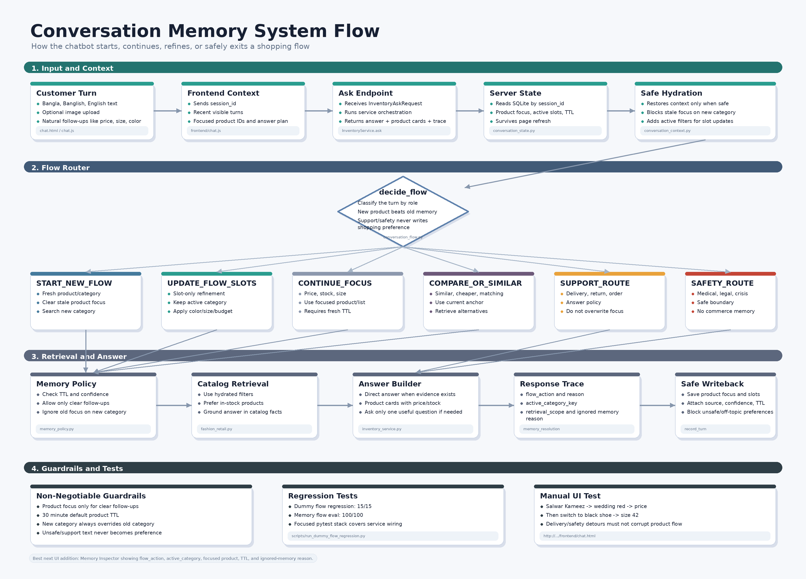
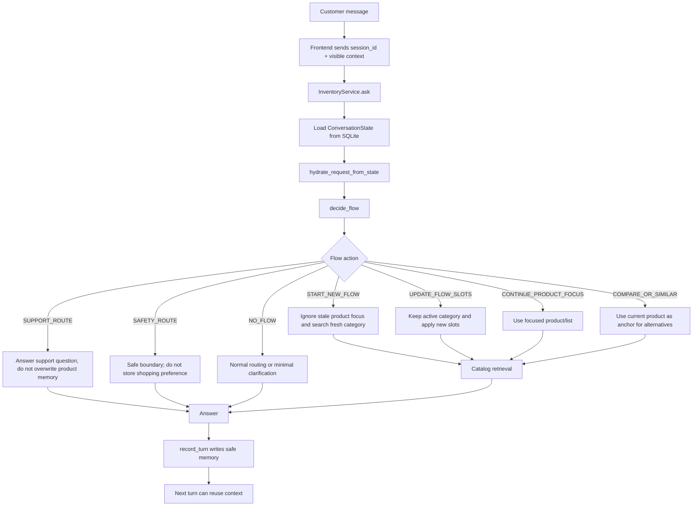

# Learn Memory: Full Conversation Flow

This file explains how the chatbot memory works now.

The goal is simple:

```text
Let the customer talk naturally across turns,
without letting old context hijack a new shopping request.
```

This is not general chatbot memory. It is commerce memory.

The bot should remember:

- the current product or product list
- the active shopping category
- slot refinements like color, budget, size, and occasion
- repeated preferences only after enough evidence

The bot should not remember:

- unsafe medical/legal/crisis content as preference
- abusive or off-topic jokes as shopping preference
- an old category when the user clearly asks for a new one
- stale product focus after TTL expiry

## Core Rule

```text
Use memory only when the new message is clearly connected to the old shopping flow.
Explicit new product/category beats memory every time.
```

Bad behavior:

```text
User: do you have Salwar Kameez?
Bot: shows Salwar Kameez
User: wedding, red
Bot: shows Formal Shoe and Jute Bag
```

Correct behavior:

```text
User: do you have Salwar Kameez?
Bot: shows Salwar Kameez
User: wedding, red
Bot: filters Salwar Kameez by wedding/red
User: price koto?
Bot: answers price for the focused Salwar Kameez
User: black shoe ache?
Bot: starts a new shoe search
```

## Main Files

| File | Role |
|---|---|
| `app/inventory/conversation_flow.py` | Decides whether a turn starts, updates, continues, or exits a shopping flow. |
| `app/inventory/conversation_context.py` | Hydrates each request from server-side memory safely. |
| `app/inventory/conversation_state.py` | Stores persistent session memory in SQLite. |
| `app/inventory/memory_policy.py` | Controls when product focus can be used or written. |
| `app/inventory/memory.py` | Resolves references like `eta`, `first one`, `etar dam`. |
| `app/services/inventory_service.py` | Wires flow, memory, retrieval, answer generation, and memory writeback. |
| `app/inventory/ontology.py` | Detects product/category words in English, Banglish, and Bangla. |
| `flow.md` | Strategic architecture spec. |
| `todomemory.md` | Checklist and implementation roadmap. |

## Runtime Flow

### PNG Overview



Source generator:

```bash
.venv/bin/python scripts/generate_memory_system_flow_png.py
```



## Flow Actions

Every incoming message is mapped to one of these actions.

| Action | Meaning | Example | What The Bot Does |
|---|---|---|---|
| `START_NEW_FLOW` | User asks for a fresh product/category. | `black shoe ache?` | Clears old product focus and searches shoes. |
| `UPDATE_FLOW_SLOTS` | User adds filters to the active category. | `wedding, red`, `under 3000` | Keeps active category, adds slots. |
| `CONTINUE_PRODUCT_FOCUS` | User asks fact about current product/list. | `price koto?`, `M size ache?` | Uses focused product/list. |
| `COMPARE_OR_SIMILAR` | User asks alternatives or matching items. | `similar dekhao`, `cheaper ache?` | Uses current product as anchor. |
| `SUPPORT_ROUTE` | User asks order/delivery/return support. | `delivery charge koto?` | Answers support, preserves shopping memory. |
| `SAFETY_ROUTE` | User asks medical/legal/crisis/unsafe topic. | `rash er medicine?` | Gives safe response, no commerce memory write. |
| `NO_FLOW` | No useful flow signal. | `okay`, `hmm` | Normal/minimal response. |

## Memory Scopes

The system does not use one giant memory bucket. It separates memory by risk.

### 1. Product Focus Memory

Purpose:

```text
Resolve follow-ups like "etar price?", "M size ache?", "same design ache?"
```

Stored fields:

```json
{
  "last_primary_product_id": "salwar-red-wedding",
  "last_shown_product_ids": ["salwar-red-wedding", "salwar-blue-casual"],
  "product_focus_source": "text_search",
  "product_focus_updated_at": "2026-05-30T10:00:00Z",
  "product_focus_expires_at": "2026-05-30T10:30:00Z",
  "product_focus_confidence": 0.92,
  "product_focus_ttl_seconds": 1800,
  "product_focus_write_reason": "fashion_retail:fashion_search",
  "product_focus_last_used_at": "2026-05-30T10:03:00Z",
  "product_focus_use_count": 1
}
```

Rules:

- Use only for clear follow-ups.
- Default TTL is 30 minutes.
- Extended TTL can be 60 minutes for active comparison/order flows.
- Do not use if the user names a new product/category.
- Do not write low-confidence/no-match results as focus.

### 2. Active Flow Slots

Purpose:

```text
Keep the current shopping flow coherent.
```

Example:

```json
{
  "category_key": "salwar_kameez",
  "color": "red",
  "occasion": "wedding",
  "budget_max": 3000
}
```

Rules:

- Current category is the strongest flow slot.
- Slot-only messages update the current category.
- A new category replaces the old category immediately.
- Old category-specific slots must not leak into the new category.

### 3. Preference Memory

Purpose:

```text
Softly improve ranking after repeated behavior.
```

Examples:

- user repeatedly asks for black products
- user repeatedly asks under BDT 3000
- user repeatedly asks wedding products

Rules:

- Do not create long-term preferences from one mention.
- Promote only after repeated signals.
- Use as ranking boost, not hard filter.
- Never store unsafe/off-topic/medical/legal text as preference.

## Request Hydration

The frontend sends short-lived context:

```json
{
  "session_id": "session-123",
  "conversation_history": ["last few turns"],
  "focused_product_ids": ["p1", "p2"],
  "last_answer_plan": {}
}
```

But the backend does not trust browser memory alone.

`hydrate_request_from_state(...)` reads SQLite state and repairs missing context when safe:

- restores recent context summary
- restores focused product IDs for clear follow-ups
- restores active filters for slot-only updates
- ignores expired product focus
- blocks old memory when the message is a fresh product request

## Flow Decision Examples

### Example 1: Category Refinement

```text
User: do you have Salwar Kameez?
Flow: START_NEW_FLOW
Memory write: category_key=salwar_kameez, last_shown_product_ids=[...]

User: wedding, red
Flow: UPDATE_FLOW_SLOTS
Retrieval scope: active_category_plus_slots
Expected search: Salwar Kameez + red + wedding
```

### Example 2: Product Fact Follow-Up

```text
User: do you have red saree?
Bot: shows Red Jamdani Saree

User: price koto?
Flow: CONTINUE_PRODUCT_FOCUS
Expected answer: price of Red Jamdani Saree
```

### Example 3: New Category Beats Old Memory

```text
Previous focus: Salwar Kameez

User: black shoe ache?
Flow: START_NEW_FLOW
Expected search: shoes
Forbidden behavior: showing Salwar Kameez again
```

### Example 4: Support Detour

```text
User: red saree dekhao
Bot: shows sarees

User: delivery charge koto?
Flow: SUPPORT_ROUTE
Expected answer: delivery policy
Memory effect: preserve saree focus, but do not overwrite it

User: etar price koto?
Flow: CONTINUE_PRODUCT_FOCUS
Expected answer: price of previous saree
```

### Example 5: Safety Detour

```text
User: rash er jonno medicine ki khabo?
Flow: SAFETY_ROUTE
Expected answer: safe medical boundary
Memory effect: do not store rash/medicine as shopping preference
```

## Write Policy

Memory is written only after the system has a safe answer.

Safe to write:

- product search with product cards
- image search with confident product cards
- category flow slots like color, budget, occasion
- order/cart state when customer is actively ordering

Unsafe to write:

- medical/legal/crisis/political topics
- abusive/off-topic jokes
- low-confidence image matches
- no-match/abstention as product focus
- one-off vague preferences

## Response Trace Fields

The API response can expose memory trace through `memory_resolution`.

Important fields:

```json
{
  "flow_action": "UPDATE_FLOW_SLOTS",
  "flow_reason": "slot-only update continues active shopping flow",
  "flow_confidence": 0.92,
  "active_category_key": "salwar_kameez",
  "retrieval_scope": "active_category_plus_slots",
  "memory_source": "server_conversation_memory",
  "memory_age_seconds": 120,
  "memory_confidence": 0.9,
  "memory_ttl_seconds": 1800,
  "ignored_memory_reason": null
}
```

This trace is how we debug flow mistakes.

## Correctness Checklist

Use this checklist when the bot gives a bad answer:

- Did the message name a new product/category?
  - It should be `START_NEW_FLOW`.
- Was the message only color/occasion/budget/size?
  - It should be `UPDATE_FLOW_SLOTS` if an active category exists.
- Was the message `price`, `stock`, `M size`, `etar dam`?
  - It should be `CONTINUE_PRODUCT_FOCUS` if focus is fresh.
- Was it delivery/order/return?
  - It should be `SUPPORT_ROUTE`.
- Was it medical/legal/crisis?
  - It should be `SAFETY_ROUTE`.
- Did old memory override a new category?
  - That is a bug.
- Did support/safety text become preference?
  - That is a bug.
- Did product focus continue after TTL expiry?
  - That is a bug.

## Testing

Run the focused flow stack:

```bash
.venv/bin/python -m pytest \
  tests/test_conversation_flow.py \
  tests/test_dummy_flow_regression.py \
  tests/test_conversation_state.py \
  tests/test_conversation_context.py \
  tests/test_inventory_api.py \
  tests/test_fashion_retail.py
```

Run the dummy flow regression:

```bash
.venv/bin/python scripts/run_dummy_flow_regression.py
```

Expected output:

```text
15/15 passed
```

Run the 100-case memory flow eval:

```bash
.venv/bin/python scripts/run_memory_flow_eval.py
```

Expected output:

```text
100/100 passed
```

## Manual Chat Test

Use this flow in the UI:

```text
do you have Salwar Kameez?
wedding, red
price koto?
black shoe ache?
size 42 ache?
delivery charge koto?
etar price koto?
rash er medicine ki khabo?
```

Expected behavior:

| Turn | Expected Flow |
|---|---|
| `do you have Salwar Kameez?` | Start Salwar Kameez flow |
| `wedding, red` | Refine Salwar Kameez, not shoes/bags |
| `price koto?` | Price of focused Salwar Kameez |
| `black shoe ache?` | Start new shoe flow |
| `size 42 ache?` | Continue shoe flow |
| `delivery charge koto?` | Support route |
| `etar price koto?` | Return to current product focus if still fresh |
| `rash er medicine ki khabo?` | Safety route, no product upsell |

## Current Design Strength

The strong part is not that the bot remembers everything.

The strong part is that it refuses to use memory when memory would be dangerous.

That is the industry-standard direction:

```text
small scoped memory
+ explicit flow routing
+ TTL
+ write guards
+ traceability
+ regression tests
```

## Next Improvements

Highest-value next additions:

- Add a UI Memory Inspector showing `flow_action`, `active_category_key`, focused product, TTL, and ignored-memory reason.
- Add user controls: `Start new search`, `Forget this product`, `Keep comparing`.
- Add order-flow state separate from shopping-flow state.
- Add image-search memory tests: upload image, ask price, ask other color, then switch category.
- Add per-turn latency logs for memory hydration and retrieval.
