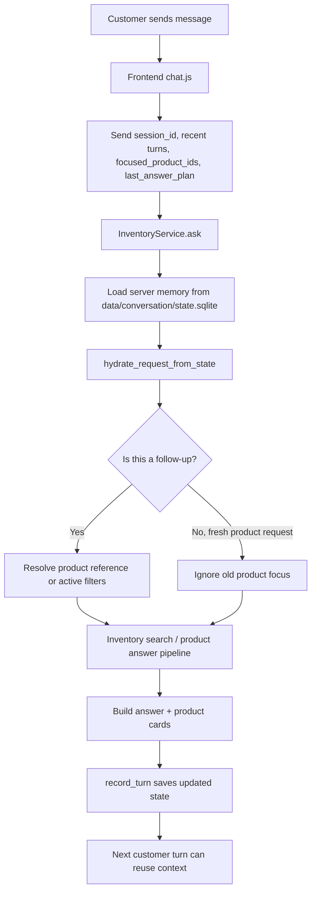
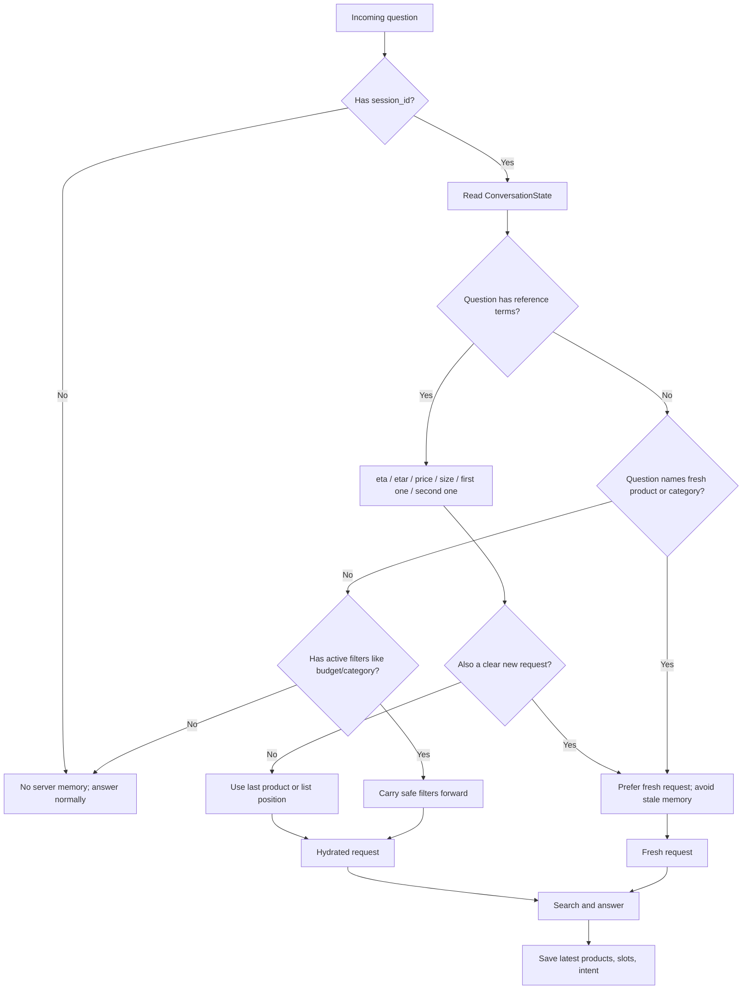
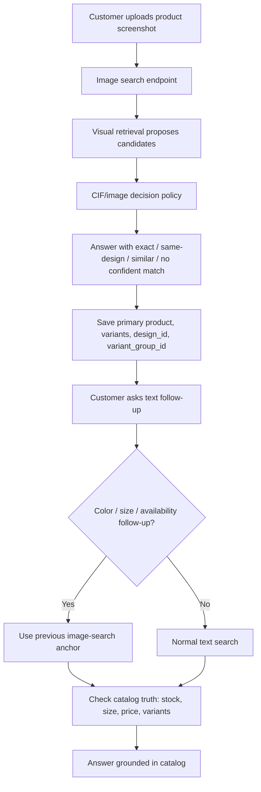

# Learning Memory: How Conversation Context Works

## Goal

The memory system exists so the customer can talk naturally:

```text
Customer: do you have Golden Satin Georgette Abaya-style Gown?
Bot: shows product and facts

Customer: etar dam koto?
Bot: answers price for the same product

Customer: M size ache?
Bot: checks size for the same product, not a new random search

Customer: er cheye kom dam er similar ache?
Bot: searches cheaper/similar options using the previous product as anchor
```

This is not general chatbot memory. It is commerce memory:

```text
remember product focus + preferences + last answer structure
then use that memory only when the next question is clearly a follow-up
```

## First Principle

The bot should remember enough to sell smoothly, but not so much that old context corrupts a new request.

Bad memory:

```text
User: red saree dekhao
Bot: shows red sarees
User: black panjabi dekhao
Bot: keeps talking about the red saree
```

Good memory:

```text
User: red saree dekhao
Bot: shows red sarees
User: etar dam koto?
Bot: uses saree memory
User: black panjabi dekhao
Bot: treats this as a fresh request
```

## The Architecture

### High-Level Flow



```text
Frontend chat.js
  sends:
    session_id
    last 8 conversation turns
    focused_product_ids
    last_answer_plan
        |
        v
InventoryService.ask()
        |
        v
hydrate_request_from_state()
  reads server memory from:
    data/conversation/state.sqlite
        |
        v
InventoryMemoryResolver
  decides:
    use old product?
    use old filters?
    ignore memory because this is a new request?
        |
        v
Normal product/search/answer pipeline
        |
        v
ConversationStateStore.record_turn()
  saves:
    last shown products
    last primary product
    last intent
    active slots
    budget/color/occasion/category counts
```

### Memory Decision Flow



## The Two Memory Layers

### 1. Browser Memory

File:

```text
frontend/chat.js
```

The browser keeps short-term memory inside the page:

```js
state.conversation
state.focusedProductIds
state.lastAnswerPlan
state.sessionId
```

Every text request sends:

```json
{
  "session_id": "session-abc123",
  "conversation_history": "last 8 turns",
  "focused_product_ids": ["product-1", "product-2"],
  "last_answer_plan": "previous answer structure"
}
```

This helps fast follow-ups while the page is open.

Weakness:

```text
If the browser refreshes or the frontend forgets context, browser memory can disappear.
```

### 2. Server Memory

Files:

```text
app/inventory/conversation_state.py
app/inventory/conversation_context.py
```

The backend persists state by `session_id` in:

```text
data/conversation/state.sqlite
```

It stores:

```text
last_shown_product_ids
last_primary_product_id
last_intent
last_question
active_slots
turn_count
consecutive_failures
color_counts
occasion_counts
budget_observations
category_counts
```

This makes memory survive a refresh and lets the backend repair missing frontend context.

## The Key Function

File:

```text
app/inventory/conversation_context.py
```

Main function:

```python
hydrate_request_from_state(request, state, ontology)
```

It does three important jobs:

1. Adds a hidden recent-context turn:

```text
[Recent chat context: focused product=p-red; shown products=p-red, p-blue; active preferences=budget_max=3000]
```

2. Restores focus for true follow-ups:

```text
etar dam koto?
M size ache?
second one er details dao
same design blue ache?
```

3. Refuses to force old memory onto a new explicit request:

```text
black panjabi dekhao
red saree chai
kids sandal size 38 ache?
```

That is the guardrail. Memory should help only when the customer is continuing the same thought.

## Follow-Up Detection

Follow-up terms include:

```text
eta, etar, eita, ota, tar
price, dam, koto
size, M size, XL
stock, available, ache
same design, other color, onno color
similar, cheaper, kom dam
first one, second one, third one
এটা, এটার, দাম, কত, সাইজ, আছে, একই ডিজাইন
```

New request terms include:

```text
show me, find, recommend, suggest
dekhao, lagbe, chai
do you have
দেখাও, লাগবে, চাই
```

The important rule:

```text
If the message names a fresh product/category, treat it as a new request.
If the message uses reference language, use memory.
```

## Product Reference Resolution

Files:

```text
app/inventory/memory.py
app/inventory/coreference_resolver.py
```

The resolver maps customer language to product IDs:

| Customer says | Memory behavior |
|---|---|
| `etar dam koto?` | Use primary product from previous answer |
| `first one` | Use previous primary product |
| `second one` | Use first alternative product |
| `third one` | Use third shown product |
| `matching bag?` | Use previous cross-sell products if present |
| `cheaper similar` | Use alternatives or similar products |
| `black panjabi dekhao` | Ignore old product focus because this is a new request |

## State Save After Every Turn

File:

```text
app/inventory/conversation_state.py
```

Function:

```python
ConversationStateStore.record_turn(...)
```

After each successful answer, the service saves:

```text
question
intent
slots
shown product IDs
primary product ID
confidence
whether it abstained
clarification status
```

If a new turn has no products, the store preserves the last products. This matters because a polite boundary detour should not destroy shopping context.

Example:

```text
User: show me saree
Bot: shows products
User: amar mon kharap
Bot: responds gently
User: first one er price?
Bot: should still remember the saree list
```

## Image Search Memory

Image search also records the focused product.

Files:

```text
app/services/inventory_service.py
app/inventory/conversation_state.py
```

Flow:

```text
Customer uploads image
  -> image matcher returns product / variants / similar products
  -> service records image_search state
  -> follow-up text can reuse that anchor
```

Example:

```text
User: uploads black shirt image
Bot: shows closest shirt
User: white ache?
Bot: checks same variant group or remembered product context
User: M size ache?
Bot: checks size on remembered product context
```

### Image Follow-Up Flow



## UI Test Flow

Open:

```text
http://marshalmind.codemarshal.com:4850/frontend/chat.html
```

Use the new drawer sections:

```text
Test Examples
  -> Live 5k Catalog Examples
  -> Memory Flow Test
```

Recommended test:

```text
1. Tap "1. Focus product"
2. Send it
3. Tap "2. Price follow-up"
4. Send it
5. Tap "3. Size follow-up"
6. Send it
7. Tap "4. Cheaper similar"
8. Send it
9. Tap "5. Second option"
10. Send it
```

What you should see:

```text
The bot should keep talking about the same product/list unless you clearly ask for a new category.
```

Then test the guardrail:

```text
black panjabi dekhao
etar dam koto?
red saree dekhao
etar dam koto?
```

Expected:

```text
First "etar" uses panjabi.
Second "etar" uses saree.
Old panjabi memory should not override the new saree request.
```

## API Test Flow

Use the same `session_id` for every turn.

```bash
API_KEY="your-api-key"
BASE="http://127.0.0.1:4850"
SID="memory-test-001"

curl -s -X POST "$BASE/inventory/ask" \
  -H "X-API-Key: $API_KEY" \
  -H "Content-Type: application/json" \
  -d "{
    \"session_id\": \"$SID\",
    \"question\": \"Panjabi ache?\",
    \"top_k\": 5
  }"

curl -s -X POST "$BASE/inventory/ask" \
  -H "X-API-Key: $API_KEY" \
  -H "Content-Type: application/json" \
  -d "{
    \"session_id\": \"$SID\",
    \"question\": \"etar dam koto?\",
    \"top_k\": 5
  }"
```

If memory is working, the second answer should resolve `etar` to the prior product focus.

## Debugging The SQLite State

Check a session:

```bash
sqlite3 data/conversation/state.sqlite \
  "select session_id, updated_at, payload from conversation_state where session_id='memory-test-001';"
```

Pretty print:

```bash
sqlite3 data/conversation/state.sqlite \
  "select payload from conversation_state where session_id='memory-test-001';" \
  | .venv/bin/python -m json.tool
```

Clear a bad session:

```bash
sqlite3 data/conversation/state.sqlite \
  "delete from conversation_state where session_id='memory-test-001';"
```

## Tests

Run the focused memory tests:

```bash
.venv/bin/python -m pytest \
  tests/test_conversation_context.py \
  tests/test_conversation_state.py \
  tests/test_coreference_resolver.py \
  tests/test_inventory_intelligence.py
```

What they cover:

```text
server state hydration
new request vs follow-up separation
first/second/third reference resolution
preserving product focus through detours
active slot carryover
Bangla/Banglish reference terms
```

## What This Improves In The Bot

1. Natural follow-up conversation

```text
The user does not need to repeat product names every turn.
```

2. Better sales flow

```text
Price, size, color, stock, and cheaper alternative questions stay anchored.
```

3. Better recovery after UI refresh

```text
Server state can restore context even if frontend context is weak.
```

4. Safer behavior

```text
Memory is ignored when the user clearly starts a new product/category request.
```

## Current Weak Spots

1. Product names that look like comparisons can still confuse intent routing.

Example:

```text
White Cotton & Georgette Woven Set
```

The phrase `Cotton & Georgette` can look like a fabric comparison. The UI examples avoid ambiguous names, but the service should eventually prioritize exact title lookup before comparison logic.

2. Size memory is only as good as the catalog data.

If the catalog lacks size-level stock, the bot can remember the product but still cannot truthfully confirm a size.

3. Same-design memory depends on identity fields.

For strong answers to:

```text
same design blue ache?
```

the catalog needs:

```text
variant_group_id
design_id
color
color_family
```

4. Browser and server memory can disagree.

The backend now repairs missing browser context, but the cleanest system is still:

```text
frontend sends current focus
backend persists session state
backend resolves conflicts conservatively
```

## Best Next Improvement

Build a visible memory inspector for development:

```text
/frontend/memory.html?session_id=...
```

It should show:

```text
last primary product
last shown product IDs
active slots
last intent
budget observations
color/category counts
memory resolution used in the last answer
```

That would make memory bugs obvious in seconds instead of guessing from chat text.
