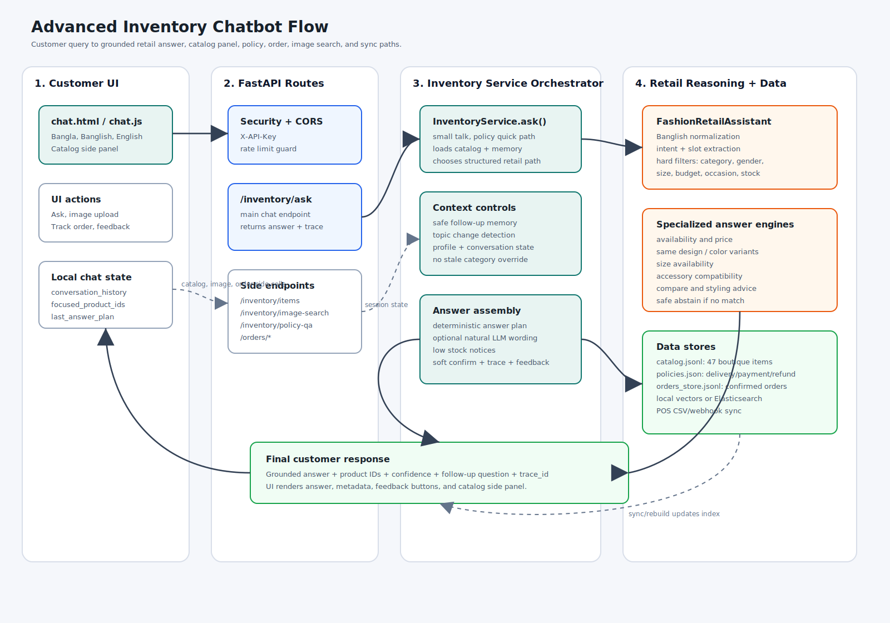
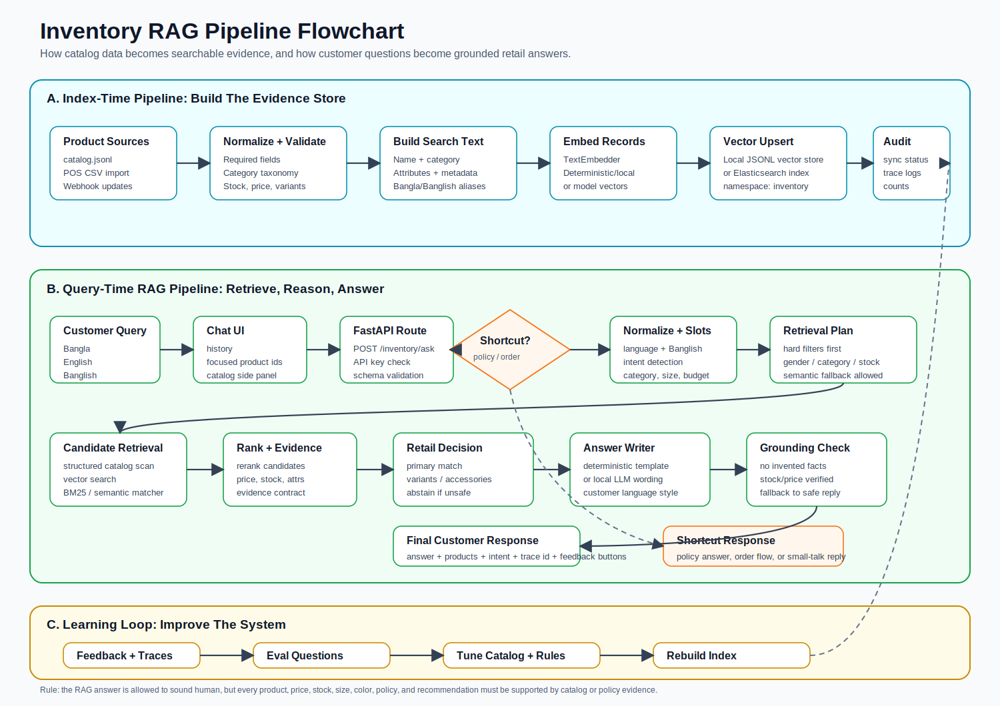

# Advanced Inventory Chatbot Presentation

## Slide 1: Project Summary

We are building an advanced inventory chatbot for a boutique retail business.

The bot helps customers ask natural questions about products, availability, size, color, price, styling, delivery, payment, refund, exchange, and order flow.

It is designed for a mixed catalog such as:

- Sarees
- Bags
- Cosmetics
- Beauty products
- Watches
- Three pieces
- Shoes
- Men's panjabi, shirt, pant, perfume
- Accessories and similar boutique products

The main goal is not just "chat". The goal is a catalog-grounded sales assistant that can answer from real inventory data.

---

## Slide 2: Why This Bot Matters

Customers do not search like database users.

They ask questions like:

- `amar biye er jonno elegant saree dekhan`
- `same design ta blue color e ache?`
- `size 39 heel available?`
- `eid er jonno 5000 er moddhe kichu ache?`
- `Dhaka delivery charge koto?`
- `COD hobe?`

A normal keyword search struggles with these questions because it does not understand intent, occasion, budget, size, variant, or language mix.

This bot is being built to understand those retail situations and answer safely from catalog evidence.

---

## Slide 3: What The Bot Can Do Now

Current capabilities:

- Answer Bangla, English, and Banglish customer questions.
- Search the boutique inventory by category, color, size, budget, occasion, fabric, gender, and stock.
- Show available products with price and stock.
- Answer same-design different-color questions.
- Answer size availability questions.
- Recommend matching accessories.
- Compare product options.
- Give basic styling suggestions using catalog products.
- Answer delivery, payment, refund, and exchange policy questions.
- Support order draft, update, confirmation, and tracking APIs.
- Show the catalog in a hideable side panel in the chat UI.
- Store feedback for future improvement.
- Use local vector search now, with Elasticsearch support available.

---

## Slide 4: Example Questions It Can Handle

| Question type | Example |
| --- | --- |
| Product search | `red lipstick ache? price koto?` |
| Budget search | `5000 er moddhe elegant saree dekhan` |
| Occasion search | `biye te porar moto premium saree ache?` |
| Office use | `office er jonno bag dekhan` |
| Size check | `black heel size 39 available?` |
| Same design variant | `same design ta onno color e ache?` |
| Men's section | `men panjabi white color ache?` |
| Beauty/skincare | `oily skin er jonno sunscreen ache?` |
| Styling | `maroon saree er sathe kon bag match korbe?` |
| Compare | `jamdani vs katan konta wedding er jonno better?` |
| Policy | `wrong size hole exchange hobe?` |
| Delivery/payment | `Dhaka delivery koto? COD available?` |

---

## Slide 5: What The Bot Should Not Do

This is important for credibility.

The bot should not:

- Invent products that are not in the catalog.
- Invent stock, price, size, color, discount, or delivery promise.
- Recommend random products when no match exists.
- Treat a women's query and men's query as the same thing.
- Use old chat context when the customer clearly asks a new product question.

The current system has guardrails for these failure cases.

---

## Slide 6: Live UI

Current local demo:

```text
http://127.0.0.1:4850/chat.html
```

Main backend:

```text
http://127.0.0.1:4849
```

Main customer chat endpoint:

```text
POST /inventory/ask
```

Catalog endpoint:

```text
GET /inventory/items
```

The UI includes:

- Chat window
- Hideable catalog side panel
- Product cards
- Feedback buttons
- Image upload area
- Order/cart support hooks

---

## Slide 7: High-Level System Architecture



At a high level, the customer talks to the frontend. The frontend calls FastAPI. FastAPI sends the question to the inventory service. The inventory service uses catalog data, policy data, memory, retail rules, retrieval, and answer verification before returning a response.

---

## Slide 8: RAG Pipeline Flow



RAG means Retrieval-Augmented Generation.

In this project, that means the bot does not answer from the model's memory alone. It first retrieves relevant catalog or policy evidence, then writes an answer based on that evidence.

---

## Slide 9: RAG Pipeline In Simple Words

The RAG pipeline has two big phases.

Index-time phase:

1. Product data comes from `catalog.jsonl`, POS import, or webhook update.
2. The system validates product fields.
3. It normalizes category, size, color, stock, price, and metadata.
4. It creates searchable text for every product.
5. It creates embeddings for semantic search.
6. It stores vectors in local vector storage or Elasticsearch.

Query-time phase:

1. Customer asks a question.
2. The system detects language and intent.
3. It extracts slots like category, color, size, budget, gender, occasion, and design id.
4. It searches structured catalog fields and vector index.
5. It reranks matching products.
6. It builds an evidence contract.
7. It writes a customer-friendly answer.
8. It verifies that the answer does not invent unsupported facts.

---

## Slide 10: Why RAG Is Needed Here

Without RAG:

- The bot may hallucinate products.
- It may answer from outdated knowledge.
- It may say a product is available when stock is zero.
- It may invent delivery or refund rules.

With RAG:

- The bot answers from current catalog data.
- Product, price, stock, and size claims are grounded.
- Policy answers come from the policy file.
- Failed answers can be traced and improved.

This is the core reason the system is safer than a plain chatbot.

---

## Slide 11: Main Technology Used

| Layer | Technology |
| --- | --- |
| Backend API | Python, FastAPI |
| Frontend | HTML, CSS, JavaScript |
| Catalog storage | JSONL files |
| Order storage | JSONL files |
| Policy storage | JSON |
| Vector search | Local vector store, optional Elasticsearch |
| Elasticsearch support | Elasticsearch 8.x dense vector index |
| Embeddings | Deterministic/local embedding now, model embeddings configurable |
| Natural language answer | Deterministic templates, optional Ollama/local LLM wording |
| Image matching | Metadata image matcher, optional CLIP matcher |
| Testing | Pytest |
| Runtime server | Uvicorn |

---

## Slide 12: Important Code Modules

| File | What it does |
| --- | --- |
| `frontend/chat.html` | Chat UI page |
| `frontend/chat.js` | Sends chat, catalog, feedback, image, and order requests |
| `app/api/routes_inventory.py` | Inventory API routes |
| `app/api/routes_orders.py` | Order API routes |
| `app/services/inventory_service.py` | Main orchestration layer |
| `app/inventory/fashion_retail.py` | Retail intent and product reasoning |
| `app/inventory/banglish_normalizer.py` | Bangla/Banglish normalization |
| `app/inventory/policy_qa.py` | Delivery, payment, refund, exchange answers |
| `app/inventory/order_workflow.py` | Cart and order lifecycle |
| `app/inventory/pos_sync.py` | POS import and webhook sync |
| `app/retrieval/elasticsearch_store.py` | Elasticsearch vector adapter |
| `data/inventory/catalog.jsonl` | Current product catalog |

---

## Slide 13: Current Data Flow

```text
Customer question
  -> Chat UI
  -> FastAPI /inventory/ask
  -> InventoryService
  -> Banglish normalization
  -> Intent and slot extraction
  -> Structured product filters
  -> Vector or semantic retrieval
  -> Reranking and evidence contract
  -> Retail decision layer
  -> Grounded answer writer
  -> Final answer in UI
  -> Feedback and trace logs
```

This flow is why the bot can handle natural customer questions while still staying connected to inventory data.

---

## Slide 14: Current Catalog Grounding

The bot works best when product records contain structured fields.

Important fields:

- `product_id`
- `name`
- `category`
- `price`
- `stock`
- `attributes.color`
- `attributes.color_family`
- `attributes.size`
- `attributes.available_sizes`
- `attributes.gender`
- `attributes.fabric`
- `attributes.occasion`
- `attributes.design_id`
- `metadata.variant_group_name`

The stronger the catalog structure, the smarter and safer the bot becomes.

---

## Slide 15: Current Strengths

The strongest parts of the current system:

- Works for boutique and fashion inventory, not just one saree dataset.
- Understands Bangla, English, and Banglish style queries.
- Handles customer-like questions, not only exact keyword search.
- Has structured filters for size, gender, category, and budget.
- Has same-design color variant logic.
- Has policy answers for delivery/payment/refund/exchange.
- Has a visible catalog panel for debugging and customer support.
- Has test coverage for important retail cases.
- Has Elasticsearch support ready when we want a stronger search backend.

---

## Slide 16: Current Limitations

Current honest limitations:

- It is not yet a fully human salesperson.
- Response style can still be improved.
- Local LLM or Ollama-based wording can be slow.
- Image matching may be slow on first use if CLIP loads model assets.
- Conversational order placement works at API level, but the chat flow needs more polish.
- The frontend currently uses a local demo API key, which is not production-safe.
- Very large multi-brand catalogs need stronger taxonomy, aliases, deduplication, and POS sync rules.

This is not a weakness of the idea. It is the difference between a working prototype and a production retail assistant.

---

## Slide 17: What Has Been Improved Recently

Recent improvements:

- Added Elasticsearch vector store support.
- Added advanced fashion retail reasoning.
- Added Bangla/Banglish query support.
- Added boutique retail sample catalog.
- Added regression tests for customer-like questions.
- Fixed old-context errors where a previous saree query affected a new bag query.
- Added hard gender filtering for men's and women's products.
- Fixed unrelated product recommendations on no-match answers.
- Added hideable catalog side panel in the UI.
- Added architecture and RAG pipeline documentation with diagrams.

---

## Slide 18: Strategic Next Steps

Recommended next work:

1. Improve answer style so replies feel warmer, shorter, and more human.
2. Add production-safe authentication instead of a static frontend API key.
3. Connect real POS or inventory software for live stock updates.
4. Improve chat-native order placement across multiple turns.
5. Add owner dashboard for failed questions and bad feedback.
6. Add larger evaluation set for Bangla, English, Banglish, image search, order, policy, and edge cases.
7. Add stronger taxonomy management for large multi-brand catalogs.

---

## Slide 19: Business Value

This bot can reduce repetitive customer support work:

- Product availability questions
- Size and color questions
- Price questions
- Occasion-based suggestions
- Policy questions
- Order tracking and order collection

It also improves sales conversion because customers can ask naturally instead of manually browsing the full catalog.

The long-term value is a 24/7 shop assistant connected to real inventory.

---

## Slide 20: Final Positioning

This project is an advanced inventory RAG chatbot for boutique retail.

It combines:

- Structured inventory data
- Retail-specific reasoning
- Bangla/Banglish support
- Vector retrieval
- Policy QA
- Order workflow
- Feedback and trace logging

The current system is capable of answering many real customer inventory questions today. The next phase is production hardening: better response style, real POS sync, stronger auth, improved order conversation, and broader evaluation.

