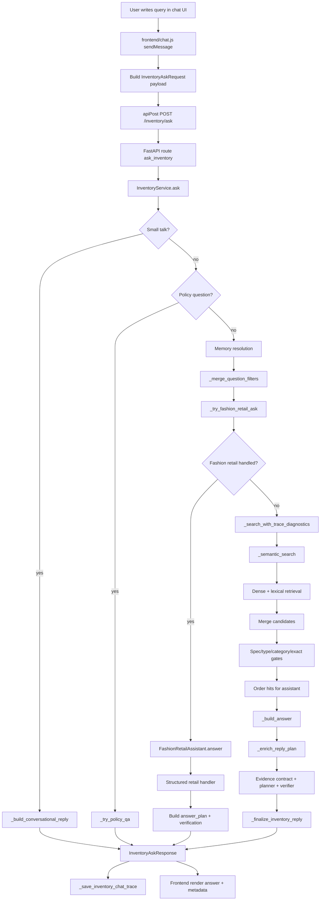
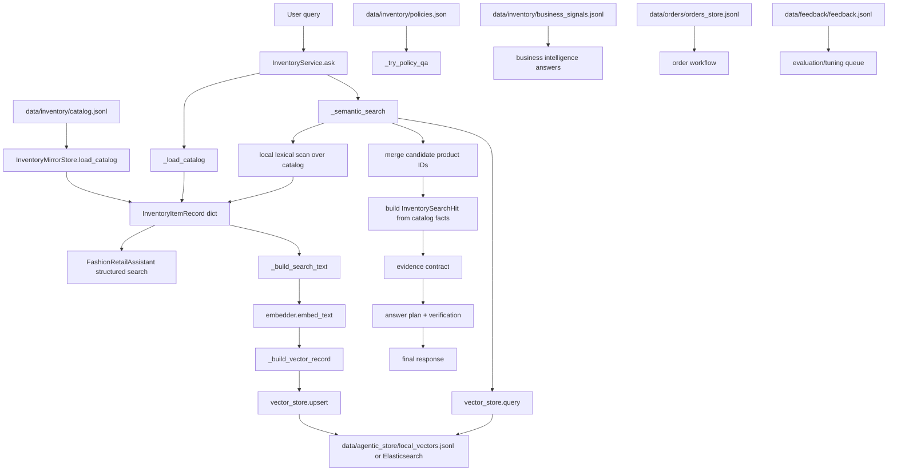

# Query Flow README

This README explains what happens when a user writes a query in the inventory chatbot.

The goal is to make the system traceable:

```text
User query -> frontend -> API -> service router -> retrieval/retail logic -> answer plan -> verification -> final UI answer
```

Use this document when you want to understand, debug, or explain how the bot generates an answer.

## Quick File Links

Use these links while reading so you can jump from explanation to code quickly.

| Area | File |
| --- | --- |
| Chat UI logic | [frontend/chat.js](</home/sonjoy/Bar tax/bangla-tax-rag/frontend/chat.js>) |
| Chat UI page | [frontend/chat.html](</home/sonjoy/Bar tax/bangla-tax-rag/frontend/chat.html>) |
| Chat UI styles | [frontend/chat.css](</home/sonjoy/Bar tax/bangla-tax-rag/frontend/chat.css>) |
| App entrypoint | [app/main.py](</home/sonjoy/Bar tax/bangla-tax-rag/app/main.py>) |
| Inventory API routes | [app/api/routes_inventory.py](</home/sonjoy/Bar tax/bangla-tax-rag/app/api/routes_inventory.py>) |
| Orders API routes | [app/api/routes_orders.py](</home/sonjoy/Bar tax/bangla-tax-rag/app/api/routes_orders.py>) |
| Main inventory service | [app/services/inventory_service.py](</home/sonjoy/Bar tax/bangla-tax-rag/app/services/inventory_service.py>) |
| Fashion retail logic | [app/inventory/fashion_retail.py](</home/sonjoy/Bar tax/bangla-tax-rag/app/inventory/fashion_retail.py>) |
| Memory resolver | [app/inventory/memory.py](</home/sonjoy/Bar tax/bangla-tax-rag/app/inventory/memory.py>) |
| Conversation state | [app/inventory/conversation_state.py](</home/sonjoy/Bar tax/bangla-tax-rag/app/inventory/conversation_state.py>) |
| Coreference resolver | [app/inventory/coreference_resolver.py](</home/sonjoy/Bar tax/bangla-tax-rag/app/inventory/coreference_resolver.py>) |
| Intent planner | [app/inventory/intent_planner.py](</home/sonjoy/Bar tax/bangla-tax-rag/app/inventory/intent_planner.py>) |
| LLM intent classifier | [app/inventory/llm_intent_classifier.py](</home/sonjoy/Bar tax/bangla-tax-rag/app/inventory/llm_intent_classifier.py>) |
| LLM slot extractor | [app/inventory/llm_slot_extractor.py](</home/sonjoy/Bar tax/bangla-tax-rag/app/inventory/llm_slot_extractor.py>) |
| LLM reasoner | [app/inventory/llm_reasoner.py](</home/sonjoy/Bar tax/bangla-tax-rag/app/inventory/llm_reasoner.py>) |
| Preference extraction | [app/inventory/preferences.py](</home/sonjoy/Bar tax/bangla-tax-rag/app/inventory/preferences.py>) |
| Product ontology | [app/inventory/ontology.py](</home/sonjoy/Bar tax/bangla-tax-rag/app/inventory/ontology.py>) |
| Reranker | [app/inventory/reranker.py](</home/sonjoy/Bar tax/bangla-tax-rag/app/inventory/reranker.py>) |
| Decisioning | [app/inventory/decisioning.py](</home/sonjoy/Bar tax/bangla-tax-rag/app/inventory/decisioning.py>) |
| Evidence contract | [app/inventory/evidence_contract.py](</home/sonjoy/Bar tax/bangla-tax-rag/app/inventory/evidence_contract.py>) |
| Answer planner | [app/inventory/planner.py](</home/sonjoy/Bar tax/bangla-tax-rag/app/inventory/planner.py>) |
| Answer verifier | [app/inventory/verifier.py](</home/sonjoy/Bar tax/bangla-tax-rag/app/inventory/verifier.py>) |
| Natural answer writer | [app/inventory/natural_answer.py](</home/sonjoy/Bar tax/bangla-tax-rag/app/inventory/natural_answer.py>) |
| Answer critic | [app/inventory/answer_critic.py](</home/sonjoy/Bar tax/bangla-tax-rag/app/inventory/answer_critic.py>) |
| Inventory storage layer | [app/inventory/storage.py](</home/sonjoy/Bar tax/bangla-tax-rag/app/inventory/storage.py>) |
| Embedder | [app/retrieval/embedder.py](</home/sonjoy/Bar tax/bangla-tax-rag/app/retrieval/embedder.py>) |
| Vector store interface | [app/retrieval/vector_store_base.py](</home/sonjoy/Bar tax/bangla-tax-rag/app/retrieval/vector_store_base.py>) |
| Elasticsearch store | [app/retrieval/elasticsearch_store.py](</home/sonjoy/Bar tax/bangla-tax-rag/app/retrieval/elasticsearch_store.py>) |
| Config | [config/config.dev.yaml](</home/sonjoy/Bar tax/bangla-tax-rag/config/config.dev.yaml>) |
| Catalog data | [data/inventory/catalog.jsonl](</home/sonjoy/Bar tax/bangla-tax-rag/data/inventory/catalog.jsonl>) |
| Business signals | [data/inventory/business_signals.jsonl](</home/sonjoy/Bar tax/bangla-tax-rag/data/inventory/business_signals.jsonl>) |
| Policy data | [data/inventory/policies.json](</home/sonjoy/Bar tax/bangla-tax-rag/data/inventory/policies.json>) |
| Orders data | [data/orders/orders_store.jsonl](</home/sonjoy/Bar tax/bangla-tax-rag/data/orders/orders_store.jsonl>) |
| Feedback data | [data/feedback/feedback.jsonl](</home/sonjoy/Bar tax/bangla-tax-rag/data/feedback/feedback.jsonl>) |
| Learning roadmap | [learning.md](</home/sonjoy/Bar tax/bangla-tax-rag/learning.md>) |
| Theory pipeline | [theorypipeline.md](</home/sonjoy/Bar tax/bangla-tax-rag/theorypipeline.md>) |

## Ownership Phases Covered Here

This README completes the learning material for Phase A to Phase D.

Phase E is intentionally not included here because you asked to keep the change workflow out of this document.

| Phase | Goal | Where this README covers it |
| --- | --- | --- |
| Phase A: Learn The Product Surface | Know what the bot claims to do, what customers can ask, and what inputs exist | Product surface map, supported question types, frontend payload, catalog inputs |
| Phase B: Learn The Runtime Path | Trace one question through backend routing and understand where decisions happen | Full arrow diagram, layer-by-layer runtime flow, function task map |
| Phase C: Learn The Data Path | Understand how catalog data is stored, indexed, and searched | Data paths and storage, catalog write path, vector store path, generic RAG search |
| Phase D: Learn The Safety Path | Understand why answers do not come from model memory and where facts are enforced | Evidence contract, answer plan, verification, final answer selection, debug map |

## Phase A: Product Surface

Phase A answers:

```text
What does this bot claim to do?
What can a customer ask?
What inputs does the system receive?
```

### What The Bot Claims To Do

This inventory chatbot is designed to answer customer and owner questions from current shop data.

It can handle:

- product availability
- price questions
- stock questions
- size availability
- color variants
- same-design different-color questions
- category search
- budget search
- occasion-based suggestions
- accessory matching
- styling suggestions
- product comparison
- delivery/payment/refund/exchange policy questions
- order/cart-related flows
- feedback capture
- image search when image matcher support is available

It should not answer from model memory.

The correct product truth comes from:

```text
data/inventory/catalog.jsonl
data/inventory/policies.json
data/orders/orders_store.jsonl
data/inventory/business_signals.jsonl
```

### What Customers Can Ask

Examples:

```text
do you have White Pearl Earrings?
eid er jonno 5000 er moddhe elegant saree ache?
ei same design ta blue color e ache?
amar office er jonno bag dekhan
jamdani vs katan konta nibo?
oily skin er jonno sunscreen ache?
নেভি কাতান শাড়ির সাথে কোন ব্যাগ মানাবে?
delivery charge koto?
eta order korte chai
```

The bot supports Bangla, Banglish, and English, but the quality depends on catalog structure and slot extraction.

### What Inputs Exist

Main frontend input:

```text
customer text query
```

Additional runtime inputs:

| Input | Purpose |
| --- | --- |
| `conversation_history` | Recent user/assistant turns |
| `focused_product_ids` | Last products shown to the user |
| `last_answer_plan` | Previous primary/alternative/cross-sell plan |
| `session_id` | Links order/cart/profile state |
| `filters` | Optional structured filters |
| `top_k` | Number of retrieval candidates |
| `assistant_mode` | Support or sales style behavior |
| `reply_style` | Short or detailed reply |
| `answer_engine` | Deterministic or natural answer path |
| `image_b64` | Image-search input when used |

## Phase B: Runtime Path

Phase B answers:

```text
Where does a query go after the user presses send?
Where does routing happen?
Where are product facts enforced before the answer returns?
```

The runtime path starts in the browser and ends in a typed `InventoryAskResponse`.

High-level runtime:

```text
frontend/chat.js
  -> POST /inventory/ask
  -> routes_inventory.py: ask_inventory()
  -> InventoryService.ask()
  -> small talk or policy shortcut
  -> memory resolver
  -> fashion retail structured path
  -> generic RAG fallback if needed
  -> answer plan
  -> evidence contract
  -> verification
  -> final response
  -> frontend render
```

Main routing decisions happen in:

```text
app/services/inventory_service.py
InventoryService.ask()
```

Important routing branches:

| Branch | Function | When it wins |
| --- | --- | --- |
| Small talk | `_build_conversational_reply()` | greeting, thanks, help |
| Policy QA | `_try_policy_qa()` | delivery/payment/refund/exchange |
| Fashion retail | `_try_fashion_retail_ask()` | boutique product logic |
| Generic RAG | `_search_with_trace_diagnostics()` and `_semantic_search()` | broad inventory retrieval or fallback |
| Safe no-match | `_build_no_match_or_abstain_reply()` | weak or unsafe evidence |
| Final writer | `_finalize_inventory_reply()` | deterministic/natural/fallback answer selection |

Product facts are enforced mostly in:

```text
FashionRetailAssistant.answer()
_semantic_search()
InventoryEvidenceContractBuilder.build()
_verify_answer_plan()
_finalize_inventory_reply()
```

## Phase C: Data Path

Phase C answers:

```text
How does catalog data become searchable?
Where do embeddings and vector stores matter?
When are structured filters better than semantic search?
```

Index-time data path:

```text
data/inventory/catalog.jsonl
  -> InventoryMirrorStore.load_catalog()
  -> InventoryItemRecord
  -> _build_search_text()
  -> embedder.embed_text()
  -> _build_vector_record()
  -> vector_store.upsert()
  -> local_vectors.jsonl or Elasticsearch
```

Runtime search path:

```text
user query
  -> structured slot extraction
  -> direct catalog filtering when exact facts matter
  -> dense vector search when semantic meaning matters
  -> lexical search when exact text matters
  -> candidate merge
  -> gates and reranking
  -> catalog-backed search hits
```

Structured filters beat semantic search when the question asks for hard facts:

| User need | Better approach | Why |
| --- | --- | --- |
| `size 42 ache?` | Structured filter | Size must be exact |
| `same design blue ache?` | `design_id` + color filter | Same-design logic is catalog metadata |
| `5000 er moddhe` | Price filter | Budget must be numeric |
| `in stock ache?` | Stock/status filter | Availability must be exact |
| `White Pearl Earrings` | Lexical search | Exact product name matters |
| `elegant Eid saree` | Semantic + structured search | Meaning and category both matter |

Embeddings help when the user uses fuzzy language.

Structured fields protect correctness when the user asks exact inventory facts.

## Phase D: Safety Path

Phase D answers:

```text
Why does the bot not simply answer from model memory?
How does it prevent fake product, price, stock, or policy claims?
```

The safety path is:

```text
retrieved products
  -> answer plan
  -> evidence contract
  -> planner enrichment
  -> verification
  -> final answer check
  -> response or abstention
```

Main safety components:

| Component | File/function | Job |
| --- | --- | --- |
| Answer plan | `_build_inventory_answer_plan()` | Defines primary, alternatives, cross-sells, excluded products |
| Evidence contract | `InventoryEvidenceContractBuilder.build()` | Defines facts the answer is allowed to claim |
| Planner | `InventoryAnswerPlanner.enrich_plan()` | Adds reasons, tradeoffs, caveats, next question |
| Verifier | `_verify_answer_plan()` | Checks selected products satisfy constraints |
| Final verifier | `_with_final_answer_verification()` | Checks final wording against evidence |
| Critic | `critique_answer()` | Optional LLM review for natural answers |

Why the model is not the source of truth:

```text
stock changes
price changes
sizes change
colors go out of stock
policy changes
orders change
```

So the answer must be grounded in:

```text
catalog evidence
policy evidence
order evidence
business signal evidence when relevant
```

If evidence is weak or contradictory, the safe behavior is:

```text
clarify
offer grounded alternatives
or abstain
```

## Example Query

We will use this example:

```text
eid er jonno 5000 er moddhe elegant saree ache?
```

Meaning:

```text
Do you have an elegant saree for Eid within BDT 5000?
```

The bot must understand:

- language: Banglish
- category: saree
- occasion: Eid
- budget maximum: BDT 5000
- style: elegant
- stock requirement: available/in stock

## Full Arrow Diagram



## Same Flow As Simple Arrows

```text
User types query
  -> frontend/chat.js: sendMessage()
  -> frontend/chat.js: apiPost("/inventory/ask", payload)
  -> app/api/routes_inventory.py: ask_inventory()
  -> app/services/inventory_service.py: InventoryService.ask()
  -> small talk check
  -> policy check
  -> memory resolution
  -> fashion retail structured path
  -> generic RAG retrieval path if fashion path cannot answer
  -> answer plan
  -> evidence contract
  -> verification
  -> final InventoryAskResponse
  -> frontend/chat.js renders the answer
```

## Layer 1: Frontend Query Capture

Main file:

```text
frontend/chat.js
```

Main function:

```text
sendMessage(rawText)
```

What happens:

1. User writes a message in `chat.html`.
2. `sendMessage(rawText)` trims the text.
3. It adds the user message to the chat UI.
4. It creates a temporary assistant message with `...`.
5. It builds the backend request payload.
6. It sends the payload to `/inventory/ask`.

Payload shape:

```json
{
  "question": "eid er jonno 5000 er moddhe elegant saree ache?",
  "top_k": 5,
  "assistant_mode": "support",
  "reply_style": "short",
  "answer_engine": "deterministic",
  "conversation_history": [],
  "focused_product_ids": [],
  "last_answer_plan": null
}
```

Important frontend state:

| Field | Purpose |
| --- | --- |
| `conversation_history` | Gives backend recent turns for context |
| `focused_product_ids` | Helps answer follow-ups like `same design ta blue e ache?` |
| `last_answer_plan` | Carries previous structured product/design context |
| `sessionId` | Used for order/cart/profile/memory features |
| `apiKey` | Sent as `X-API-Key` |

Request function:

```text
apiPost("/inventory/ask", payload)
```

Headers:

```text
Content-Type: application/json
X-API-Key: configured API key
```

## Layer 2: API Route

Main file:

```text
app/api/routes_inventory.py
```

Main route:

```text
@router.post("/ask", response_model=InventoryAskResponse)
async def ask_inventory(request: InventoryAskRequest) -> InventoryAskResponse:
    return get_inventory_service().ask(request)
```

What happens:

1. FastAPI receives `POST /inventory/ask`.
2. Pydantic validates the request as `InventoryAskRequest`.
3. The route calls `get_inventory_service().ask(request)`.
4. The returned object is validated as `InventoryAskResponse`.

This route does not decide the answer. It only validates, delegates, and converts errors into HTTP responses.

## Layer 3: Main Service Router

Main file:

```text
app/services/inventory_service.py
```

Main function:

```text
InventoryService.ask(request)
```

This is the core runtime router.

It creates:

```text
trace_id
started_at timestamp
memory_resolution placeholder
```

Then it tries answer paths in this order:

```text
1. small talk
2. policy QA
3. memory-aware fashion retail path
4. generic inventory RAG path
5. final answer verification
6. trace save
```

## Layer 4: Small Talk Shortcut

Function:

```text
_build_conversational_reply()
```

Used for:

- hello
- thanks
- help
- goodbye
- simple identity/support messages

What happens:

If the query is simple conversation, the system does not waste time on retrieval.

Example:

```text
hello
```

It returns a deterministic reply like:

```text
Hello. I can help with inventory, availability, pricing, and restocking questions.
```

Output:

```text
InventoryAskResponse
```

## Layer 5: Policy QA Shortcut

Function:

```text
_try_policy_qa()
```

Used for:

- delivery
- payment
- refund
- exchange
- return policy

What happens:

If the question is a policy question, the system answers from policy data instead of catalog retrieval.

Example:

```text
delivery charge koto?
```

Output:

```text
InventoryAskResponse with answer_engine="deterministic"
```

## Layer 6: Memory Resolution

Main call:

```text
self.memory_resolver.resolve(...)
```

Inputs:

- current question
- request filters
- focused product ids
- active filters
- last answer plan

Why it exists:

Customers ask follow-ups.

Example:

```text
User: Lotus Jamdani red ache?
Bot: Ji, ache...
User: same design blue color e ache?
```

The second query does not say `Lotus Jamdani`, but the bot should understand that `same design` refers to the last shown product.

Memory resolution produces:

```text
resolved filters
memory_resolution metadata
possible focused product context
```

Then the service calls:

```text
_merge_question_filters()
```

This combines memory-derived filters with explicit constraints from the current query.

## Layer 7: Fashion Retail Structured Path

Main service function:

```text
_try_fashion_retail_ask()
```

Main retail class:

```text
app/inventory/fashion_retail.py
FashionRetailAssistant.answer()
```

This is the first serious product-answer path.

Why it runs before generic RAG:

Fashion retail questions often need exact structured logic.

Examples:

- same design in another color
- size availability
- saree with matching bag
- office bag suggestion
- Jamdani vs Katan comparison
- oily skin sunscreen

For these, vector similarity alone is not enough.

### What `_try_fashion_retail_ask()` Does

It loads:

```text
catalog = self._load_catalog()
```

It prepares:

```text
last_primary_product_id
conversation_history
profile context
conversation state
focused product ids
```

Then it may run the optional intent planner:

```text
app/inventory/intent_planner.py
```

The planner can decide:

```text
answer now
ask clarification first
use conversation/profile state
```

Then the service calls:

```text
self.fashion_retail_assistant.answer(...)
```

### What `FashionRetailAssistant.answer()` Does

Main file:

```text
app/inventory/fashion_retail.py
```

Important functions:

| Function | Responsibility |
| --- | --- |
| `answer()` | Main fashion retail entrypoint |
| `_classify_intent()` | Decides query type |
| `_answer_variant_color()` | Same design, different color |
| `_answer_size_availability()` | Exact size/stock answer |
| `_answer_accessory_match()` | Matching bag/jewelry/shoes |
| `_answer_styling_advice()` | Outfit/styling suggestion |
| `_answer_fashion_compare()` | Compare fashion products/fabrics |

For our example:

```text
eid er jonno 5000 er moddhe elegant saree ache?
```

The fashion layer tries to extract:

```json
{
  "language": "banglish",
  "category_key": "saree",
  "occasion": "eid",
  "budget_max": 5000,
  "style": "elegant",
  "wants_in_stock": true
}
```

Then it searches the catalog using structured fields:

```text
category
price
stock
occasion
style/tags/attributes
```

Output from this layer:

```text
FashionRetailOutcome
```

The outcome contains:

- answer text
- product ids
- cross-sell product ids
- intent
- slots
- confidence
- reasoning steps
- follow-up question
- abstention state

### If Fashion Retail Handles The Query

The service converts the outcome into:

```text
InventorySearchHit list
InventoryAnswerPlan
InventoryAnswerVerification
InventoryAskResponse
```

It may optionally call:

```text
app/inventory/llm_reasoner.py: reason_over_candidates()
```

Only for broad `fashion_search` cases where there are multiple candidate products.

It may optionally call:

```text
app/inventory/natural_answer.py: generate_ollama_answer()
app/inventory/answer_critic.py: critique_answer()
```

But hard correctness still comes from catalog and structured logic.

## Layer 8: Generic Inventory RAG Path

If the fashion retail structured path returns `None`, the service falls back to generic RAG.

Main function:

```text
_search_with_trace_diagnostics()
```

This creates an `InventorySearchRequest`:

```text
query_text = request.question
top_k = request.top_k
filters = effective_filters
```

Then it calls:

```text
_semantic_search()
```

## Layer 9: Retrieval

Main function:

```text
_semantic_search()
```

This is the generic retrieval engine.

It does several jobs:

```text
query terms
subject phrase
detail request detection
exact lookup decision
preference extraction
dense retrieval
lexical retrieval
candidate merge
filter gates
reranking
```

### Dense Retrieval

Function:

```text
_dense_candidate_scores()
```

What it does:

1. Embeds the user query.
2. Searches vector records.
3. Returns product ids with vector similarity scores.

Embedding/index-time support comes from:

```text
app/retrieval/embedder.py
app/retrieval/vector_store_base.py
app/retrieval/local_store.py
app/retrieval/elasticsearch_store.py
```

Current demo uses local vector store unless config switches to Elasticsearch.

### Lexical Retrieval

Functions:

```text
_lexical_candidate_scores()
_external_lexical_candidate_scores()
```

What it does:

Finds exact text matches for:

- product name
- SKU
- category
- brand
- exact words in the query

This protects queries like:

```text
do you have White Pearl Earrings?
```

Semantic vectors may be fuzzy, but product names need exact matching.

### Candidate Merge

The retrieval layer merges:

```text
vector_scores + lexical_candidates
```

into:

```text
merged_candidate_ids
```

Then it builds `InventorySearchHit` objects.

Each hit contains:

- product id
- name
- category
- price
- stock
- attributes
- metadata
- score

## Layer 10: Retrieval Gates

Inside `_semantic_search()`, candidates pass through several gates.

These gates are important because retrieval can easily find semantically related but commercially wrong products.

| Gate | What it prevents |
| --- | --- |
| spec gate | wrong size, color, or exact spec |
| product-type gate | recommending jewelry when user asked for bag |
| category gate | wrong explicit category |
| exact-lookup gate | weak exact product-name match |
| lexical-anchor gate | vector-only match when exact text matters |

Example:

If the user asks:

```text
office er jonno bag dekhan
```

The system should not lead with:

```text
gold earrings
```

Even if earrings are semantically related to fashion.

## Layer 11: Hit Ordering

Function:

```text
_order_hits_for_assistant()
```

What happens:

The service sorts hits so the answer layer sees the strongest candidates first.

Signals can include:

- retrieval score
- stock
- product type fit
- price fit
- metadata fit
- assistant mode
- low stock rules

Output:

```text
ordered_hits
```

## Layer 12: No-Match Or Abstain Guard

Function:

```text
_build_no_match_or_abstain_reply()
```

What happens:

Before writing a confident answer, the service checks whether it actually has enough evidence.

If not, it returns a safe response.

Example:

```text
I do not have a reliable catalog fit for that request.
```

This matters because a fluent but wrong answer is worse than a clear no-match.

## Layer 13: Base Answer Generation

Function:

```text
_build_answer()
```

This chooses the deterministic answer style.

Modes:

```text
support
sales
```

For support mode:

```text
_build_support_answer()
```

For sales mode:

```text
_build_sales_answer()
```

Then it calls:

```text
_enrich_reply_plan()
```

At this point, the system has:

```text
base answer text
recommended product ids
follow-up question
basic answer plan
```

But the answer is not finished yet.

## Layer 14: Answer Plan

Function:

```text
_build_inventory_answer_plan()
```

The answer plan defines product roles:

```json
{
  "intent": "fashion_search",
  "primary_product_id": "saree-example",
  "alternative_product_ids": ["saree-alternative"],
  "cross_sell_product_ids": ["bag-compatible"],
  "excluded_product_ids": [],
  "abstain": false
}
```

This is critical.

The answer writer should not freely choose products. It should follow the plan.

## Layer 15: Evidence Contract

Main builder:

```text
app/inventory/evidence_contract.py
InventoryEvidenceContractBuilder.build()
```

Called inside:

```text
_enrich_answer_plan()
```

What it does:

It converts retrieved products into allowed facts.

Allowed facts can include:

- product name
- price
- stock
- category
- color
- size
- fabric
- occasion
- policy facts
- business signals, if relevant

The answer can say:

```text
This saree is BDT 4,800 and 2 pieces are in stock.
```

Only if those facts exist in catalog evidence.

The evidence contract prevents:

- fake price
- fake stock
- fake size
- fake color
- unsupported delivery/refund promises

## Layer 16: Planner Enrichment

Main planner:

```text
app/inventory/planner.py
InventoryAnswerPlanner.enrich_plan()
```

Called by:

```text
_enrich_answer_plan()
```

What it adds:

- primary reason
- alternative reason
- cross-sell reason
- risk notes
- tradeoffs
- next best question
- confidence breakdown
- reasoning steps

This is where the system turns raw hits into a structured business decision.

## Layer 17: Verification

Function:

```text
_verify_answer_plan()
```

Uses:

```text
app/inventory/verifier.py
InventoryFinalAnswerVerifier.verify_product_fit()
```

What it checks:

- primary product exists in retrieved evidence
- alternatives are logically related
- cross-sells are present in evidence
- used products are not also excluded
- selected product satisfies hard constraints
- stock/category/spec constraints are respected

If verification requires abstention, the service builds a safer reply:

```text
_build_hard_constraint_abstain_reply()
```

This is a key anti-hallucination layer.

## Layer 18: Final Answer Selection

Function:

```text
_finalize_inventory_reply()
```

Inputs:

- question
- requested answer engine
- confidence score
- selected hits
- base reply
- conversation history
- abstention reason
- memory resolution

It decides:

```text
deterministic final answer
or
natural LLM answer
or
safe fallback
```

### Deterministic Path

If the selected answer engine is not `natural`, it verifies the base reply:

```text
_with_final_answer_verification()
```

If safe:

```text
return deterministic answer
```

If unsafe:

```text
return safe abstention/fallback
```

### Natural Answer Path

If the answer engine is `natural`, it may call:

```text
_synthesize_inventory_reply()
_build_inventory_answer_messages()
_run_inventory_answer_model()
```

The LLM writes warmer language, but it must follow:

- answer plan
- evidence package
- allowed products
- stock/price facts
- abstention rules

Then the final text is verified again.

## Layer 19: Trace Save

Function:

```text
_save_inventory_chat_trace()
```

What it records:

- trace id
- execution path
- request timing
- retrieved hits
- reranked hits
- fallback reason
- retrieval stage counts
- answer plan
- final response metadata

Why it matters:

When the bot gives a bad answer, traces let you identify the failure layer:

```text
bad catalog
bad memory
bad slot extraction
bad retrieval
bad ranking
bad evidence plan
bad answer wording
bad verification
```

## Layer 20: Response Object

Final response type:

```text
InventoryAskResponse
```

Important fields:

| Field | Meaning |
| --- | --- |
| `answer` | Final customer-facing reply |
| `answer_engine` | `deterministic` or `natural` |
| `confidence_score` | Service confidence |
| `trace_id` | Debug trace id |
| `abstained` | Whether system refused/abstained |
| `abstention_reason` | Why it abstained |
| `total_hits` | How many catalog hits supported search |
| `hits` | Product evidence shown to caller |
| `recommended_product_ids` | Main recommended products |
| `cross_sell_product_ids` | Add-on products |
| `follow_up_question` | Suggested next customer question |
| `answer_plan` | Structured decision plan |
| `verification` | Safety verification result |
| `memory_resolution` | How context was resolved |

## Layer 21: Frontend Rendering

Main file:

```text
frontend/chat.js
```

After `apiPost("/inventory/ask", payload)` returns:

```text
response.answer
```

is placed into the assistant message bubble.

Then:

```text
renderMeta(thinking, response)
```

adds small metadata:

```text
intent
language
recommended product ids
```

The frontend also updates:

```text
state.conversation
state.lastAnswerPlan
state.focusedProductIds
```

That state is sent with the next query, which enables follow-up behavior.

## Concrete Walkthrough For The Example

User query:

```text
eid er jonno 5000 er moddhe elegant saree ache?
```

### Step 1: UI Sends Payload

```text
frontend/chat.js: sendMessage()
```

Payload:

```json
{
  "question": "eid er jonno 5000 er moddhe elegant saree ache?",
  "top_k": 5,
  "assistant_mode": "support",
  "reply_style": "short",
  "answer_engine": "deterministic"
}
```

### Step 2: API Delegates To Service

```text
app/api/routes_inventory.py: ask_inventory()
  -> get_inventory_service().ask(request)
```

### Step 3: Service Checks Shortcuts

```text
InventoryService.ask()
  -> _build_conversational_reply()
  -> _try_policy_qa()
```

This query is not small talk and not policy, so it continues.

### Step 4: Memory And Filters

```text
memory_resolver.resolve()
_merge_question_filters()
```

The system checks whether the current question depends on previous products. For this query, it is mostly standalone.

### Step 5: Fashion Retail Path

```text
_try_fashion_retail_ask()
  -> FashionRetailAssistant.answer()
```

The retail layer detects:

```text
intent: fashion_search
language: banglish
category: saree
occasion: eid
budget_max: 5000
style/elegance cue
```

It searches catalog products with structured logic first.

### Step 6: Outcome Becomes Answer Plan

If matching products exist:

```text
FashionRetailOutcome
  -> response_hits
  -> InventoryAnswerPlan
  -> InventoryAnswerVerification
```

The plan names the primary product and alternatives.

### Step 7: Final Reply

The service returns:

```text
InventoryAskResponse
```

The frontend renders:

```text
answer text
intent metadata
recommended product ids
feedback buttons
```

## Generic RAG Walkthrough

If the structured fashion layer cannot answer, the path changes:

```text
InventoryService.ask()
  -> _search_with_trace_diagnostics()
  -> _semantic_search()
  -> _dense_candidate_scores()
  -> _lexical_candidate_scores()
  -> _external_lexical_candidate_scores()
  -> candidate merge
  -> gates
  -> ordered hits
  -> _build_answer()
  -> _enrich_reply_plan()
  -> evidence contract
  -> verifier
  -> _finalize_inventory_reply()
  -> InventoryAskResponse
```

This path is useful for broader inventory queries, exact product names, and fallback behavior.

## How The Result Is Generated

The final answer is not generated in one place.

It is assembled through several decisions:

```text
1. Which path should answer?
2. Which products are valid evidence?
3. Which product is primary?
4. Which alternatives are safe?
5. Which facts are allowed?
6. Should the system abstain?
7. Should the reply be deterministic or natural?
8. Did final verification pass?
```

Only after those decisions does the user see the text.

That is the main design principle of this codebase:

```text
The LLM may help wording, but the catalog and evidence layers control truth.
```

## Detailed Function Task And Logic Map

This section maps the important functions to their real jobs.

The goal is to understand:

```text
function -> input -> logic -> output -> why it matters
```

## Frontend Functions

Main file:

```text
frontend/chat.js
```

| Function | Input | Logic | Output |
| --- | --- | --- | --- |
| `init()` | Page load | Loads local/runtime config, binds events, initializes voice, checks backend health, loads catalog panel | Ready chat UI |
| `loadLocalConfig()` | `frontend/config.local.json` | Reads API base URL and API key if local config exists | Updates `state.apiBaseUrl`, `state.apiKey` |
| `loadRuntimeConfig()` | `/frontend/runtime-config.json` | Reads FastAPI-served runtime config when frontend and API share one origin | Updates API base URL for public/same-port deployment |
| `bindEvents()` | DOM buttons/forms | Connects submit, chips, image upload, catalog buttons, cart/order controls | UI actions become JS function calls |
| `handleSubmit()` | Current input/image state | Chooses text chat or image search path | Calls `sendMessage()` or image search API |
| `sendMessage(rawText)` | User text | Builds request payload, sends `/inventory/ask`, renders answer, updates conversation context | Visible assistant answer |
| `apiPost(path, payload)` | API path + JSON body | Sends fetch request with JSON and `X-API-Key` | Parsed JSON response or error |
| `apiGet(path)` | API path | Fetches catalog/status data with API key | Parsed JSON response |
| `buildHeaders()` | Current API key | Builds request headers | `{Content-Type, X-API-Key}` |
| `renderMeta(node, response)` | Backend response | Extracts intent, language, product IDs from answer plan | Small metadata line under answer |
| `addFeedbackRow(...)` | Question, answer, intent, context | Adds thumbs up/down feedback buttons | Feedback can be saved later |

### `sendMessage(rawText)` In Detail

This is where the customer query starts.

Input:

```text
rawText = "eid er jonno 5000 er moddhe elegant saree ache?"
```

Important logic:

```text
1. trim text
2. stop if empty or busy
3. show user message in UI
4. show temporary assistant message
5. build InventoryAskRequest payload
6. call apiPost("/inventory/ask", payload)
7. replace temporary message with response.answer
8. render answer metadata
9. save conversation history
10. save last_answer_plan
11. save focused_product_ids for follow-up questions
```

Payload fields and why they matter:

| Payload field | Why it exists |
| --- | --- |
| `question` | The current user query |
| `top_k` | Maximum retrieval candidates to return |
| `assistant_mode` | Controls support vs sales answer behavior |
| `reply_style` | Controls short vs detailed reply style |
| `answer_engine` | Requests deterministic or natural answer path |
| `conversation_history` | Lets backend understand recent context |
| `focused_product_ids` | Lets backend resolve `same design`, `eta`, `first one` |
| `last_answer_plan` | Carries previous primary/alternative/cross-sell structure |

Output:

```text
The UI displays response.answer and stores response.answer_plan for the next turn.
```

## API Route Functions

Main file:

```text
app/api/routes_inventory.py
```

| Function | Route | Task | Logic |
| --- | --- | --- | --- |
| `ask_inventory(request)` | `POST /inventory/ask` | Main chat endpoint | Validates `InventoryAskRequest`, calls `get_inventory_service().ask(request)` |
| `ask_inventory_stream(request)` | `POST /inventory/ask/stream` | Streaming version of chat | Wraps service response as server-sent events |
| `search_inventory(request)` | `POST /inventory/search` | Retrieval-only endpoint | Calls `InventoryService.search()` without full chat finalization |
| `list_inventory_items()` | `GET /inventory/items` | Catalog panel data | Returns current catalog items |
| `get_inventory_status()` | `GET /inventory/status` | Health/status for inventory layer | Returns item count, vector count, storage backend |
| `image_search(request)` | `POST /inventory/image-search` | Image-based product matching | Uses CLIP matcher if available, otherwise image/text matcher |

### `ask_inventory(request)` In Detail

Input:

```text
InventoryAskRequest
```

Logic:

```text
try:
    return get_inventory_service().ask(request)
except ValueError:
    return 422
except Exception:
    return 500
```

Output:

```text
InventoryAskResponse
```

Important point:

```text
The API route does not decide the answer. It delegates answer logic to InventoryService.ask().
```

## Main Service Functions

Main file:

```text
app/services/inventory_service.py
```

| Function | Task | Core logic | Output |
| --- | --- | --- | --- |
| `InventoryService.ask()` | Main runtime orchestrator | Chooses small talk, policy, fashion retail, or generic RAG path | `InventoryAskResponse` |
| `_build_conversational_reply()` | Small talk shortcut | Detects greetings/thanks/help/identity messages | Deterministic reply or `None` |
| `_try_policy_qa()` | Policy shortcut | Detects delivery/payment/refund/exchange questions | Policy answer or `None` |
| `_merge_question_filters()` | Filter preparation | Merges explicit request filters, memory filters, low-stock rules | Effective search filters |
| `_try_fashion_retail_ask()` | Structured boutique path | Runs memory/profile/planner/fashion retail logic | `InventoryAskResponse` or `None` |
| `_search_with_trace_diagnostics()` | Generic search wrapper | Runs browse/search and collects retrieval counts | Search response + diagnostics |
| `_semantic_search()` | Generic RAG retrieval | Dense retrieval, lexical retrieval, merge, gates, rerank | `InventorySearchHit` list |
| `_order_hits_for_assistant()` | Candidate ordering | Sorts hits for answer layer | Ordered hits |
| `_build_no_match_or_abstain_reply()` | Safety guard | Checks whether evidence is too weak | Safe no-match reply or `None` |
| `_build_answer()` | Deterministic base answer | Builds support/sales answer from ordered hits | `InventoryReply` |
| `_enrich_reply_plan()` | Adds intent, preferences, evidence, verification | Calls classifier, preference extractor, evidence builder, planner, verifier | Enriched `InventoryReply` |
| `_finalize_inventory_reply()` | Final answer selection | Chooses deterministic, natural, fallback, or abstain | Final reply + engine metadata |
| `_save_inventory_chat_trace()` | Debug trace writer | Saves path, hits, plan, verification, timing | Trace artifact |

### `InventoryService.ask()` In Detail

Input:

```text
InventoryAskRequest
```

Decision order:

```text
1. Create trace_id
2. Try small talk reply
3. Try policy QA reply
4. Resolve memory and filters
5. Try fashion retail structured answer
6. If not handled, run generic RAG search
7. Order retrieved hits
8. Check no-match/abstain guard
9. Build deterministic base answer
10. Finalize deterministic or natural answer
11. Save trace
12. Return InventoryAskResponse
```

Pseudo-code:

```python
def ask(request):
    trace_id = uuid4()

    conversational = _build_conversational_reply(request.question)
    if conversational:
        return response_from_conversation()

    policy = _try_policy_qa(request.question)
    if policy:
        return response_from_policy()

    resolved_memory = memory_resolver.resolve(...)
    effective_filters = _merge_question_filters(...)

    fashion_response = _try_fashion_retail_ask(...)
    if fashion_response:
        return fashion_response

    search_response = _search_with_trace_diagnostics(...)
    ordered_hits = _order_hits_for_assistant(...)

    guarded = _build_no_match_or_abstain_reply(...)
    if guarded:
        reply = guarded_reply
    else:
        reply = _build_answer(...)

    final_reply = _finalize_inventory_reply(...)
    _save_inventory_chat_trace(...)
    return InventoryAskResponse(...)
```

Why this matters:

```text
This function is the runtime traffic controller. Most debugging starts here.
```

## Memory And Context Functions

Main files:

```text
app/inventory/memory.py
app/inventory/conversation_state.py
app/inventory/coreference_resolver.py
app/inventory/identity_store.py
```

| Function/Class | Task | Logic |
| --- | --- | --- |
| `InventoryMemoryResolver.resolve()` | Resolve current query against previous context | Uses focused product IDs, active filters, previous answer plan |
| `get_state_store().get(session_id)` | Load structured conversation state | Retrieves last shown products, failure count, customer preferences |
| `resolve_coreference()` | Resolve words like `eta`, `same design`, `first one` | Maps vague reference to previous product ID |
| `_build_profile_context_turn()` | Convert saved customer profile into context | Adds budget, favorite colors, saved sizes, categories to conversation |

Example:

```text
User: Lotus Jamdani red ache?
Bot shows: saree-jmd-lotus-red
User: same design blue e ache?
```

Logic:

```text
focused_product_ids -> last primary product -> design_id -> find other color variant
```

Output:

```text
Memory-aware filters and focused product context
```

## Fashion Retail Functions

Main file:

```text
app/inventory/fashion_retail.py
```

| Function | Task | Logic |
| --- | --- | --- |
| `FashionRetailAssistant.answer()` | Main structured retail entrypoint | Extracts slots, classifies intent, routes to exact handler |
| `_classify_intent()` | Identify retail intent | Looks for search, size, variant, accessory, compare, styling signals |
| `_answer_variant_color()` | Same design, different color | Uses focused product/design ID and searches variant group |
| `_answer_size_availability()` | Exact size answer | Checks requested size against product attributes and stock |
| `_answer_accessory_match()` | Match accessory with outfit | Uses compatible categories, colors, design metadata |
| `_answer_styling_advice()` | Styling recommendation | Picks catalog-backed outfit/accessory suggestions |
| `_answer_fashion_compare()` | Compare products/fabrics | Compares price, stock, occasion, fabric, style fit |

### `FashionRetailAssistant.answer()` In Detail

Input:

```text
question
catalog
filters
focused_product_ids
last_primary_product_id
top_k
conversation_history
```

Logic:

```text
1. normalize Bangla/Banglish/English text
2. extract slots: category, color, size, fabric, budget, occasion, gender
3. classify intent
4. route to specific retail handler
5. filter catalog by structured facts
6. build customer-facing answer
7. return FashionRetailOutcome
```

Output:

```text
FashionRetailOutcome
```

Typical outcome fields:

```text
answer
intent
slots
product_ids
cross_sell_product_ids
confidence
reasoning_steps
follow_up_question
abstained
abstention_reason
```

Why this path exists:

```text
Fashion questions often require exact business logic. A same-design color query should use design_id, not only semantic similarity.
```

## Generic Retrieval Functions

Main file:

```text
app/services/inventory_service.py
```

Related files:

```text
app/retrieval/embedder.py
app/retrieval/vector_store_base.py
app/retrieval/local_store.py
app/retrieval/elasticsearch_store.py
app/inventory/preferences.py
app/inventory/ontology.py
```

| Function | Task | Logic |
| --- | --- | --- |
| `_semantic_search()` | Main generic retrieval | Combines dense retrieval, lexical retrieval, filters, gates, scoring |
| `_dense_candidate_scores()` | Semantic candidate search | Embeds query and searches vector store |
| `_lexical_candidate_scores()` | Local keyword search | Scores catalog products by exact query terms |
| `_external_lexical_candidate_scores()` | External keyword search | Uses Elasticsearch lexical search if configured |
| `_merge_lexical_candidate_scores()` | Merge lexical pools | Keeps strongest local/external lexical score |
| `_build_search_hit()` | Convert catalog item to hit | Copies price, stock, attributes, metadata into response shape |
| `_order_hits_for_assistant()` | Final hit ordering | Sorts candidates before answer generation |

### `_semantic_search()` In Detail

Input:

```text
query_text
top_k
filters
catalog
```

Logic:

```text
1. Extract query terms
2. Extract subject phrase
3. Detect detail request
4. Decide if exact lookup is required
5. Extract preference profile
6. Build vector filters from requirements
7. Run dense retrieval
8. Run local lexical retrieval
9. Run optional external lexical retrieval
10. Merge candidate IDs
11. Build InventorySearchHit objects
12. Apply spec gate
13. Apply product-type gate
14. Apply category gate
15. Apply exact-lookup gate
16. Apply lexical-anchor gate
17. Score and return top hits
```

Output:

```text
list[InventorySearchHit]
retrieval_stage_counts
InventorySearchTraceDiagnostics
```

### Dense Retrieval Logic

Function:

```text
_dense_candidate_scores()
```

What happens:

```text
query text -> embedding vector -> vector store query -> product IDs with similarity scores
```

Used for:

```text
fuzzy meaning
semantic similarity
broad product discovery
```

Example:

```text
"classy office bag"
```

can match:

```text
"Everyday Black Tote Bag"
```

even if the exact words differ.

### Lexical Retrieval Logic

Functions:

```text
_lexical_candidate_scores()
_external_lexical_candidate_scores()
```

What happens:

```text
query terms -> exact product/category/SKU/name matching -> product IDs with keyword scores
```

Used for:

```text
exact product names
SKUs
brand names
specific phrases
```

Example:

```text
"White Pearl Earrings"
```

should match exact name evidence, not only vector similarity.

## Retrieval Gate Logic

Inside `_semantic_search()`, candidate products are filtered by gates.

| Gate | Trigger | Logic | Failure example |
| --- | --- | --- | --- |
| spec gate | User asks exact specs | Keep products satisfying exact requested specs | User asks size 42, product has only size 40 |
| product-type gate | Product type detected | Prefer close product family matches | User asks bag, candidate is earring |
| category gate | Explicit category detected | Keep same category if available | User asks saree, candidate is clutch |
| exact-lookup gate | Exact product lookup needed | Require enough exact term coverage | User asks White Pearl Earrings, candidate only matches Pearl |
| lexical-anchor gate | Exact text is important | Prefer strong keyword evidence over weak vector-only hits | User asks specific named product, vector returns similar style |

These gates are why the system is safer than plain vector search.

## Catalog And Vector Index Functions

Main file:

```text
app/services/inventory_service.py
```

Retrieval files:

```text
app/retrieval/embedder.py
app/retrieval/vector_store_base.py
app/retrieval/elasticsearch_store.py
```

| Function | Task | Logic |
| --- | --- | --- |
| `_load_catalog()` | Read catalog source of truth | Loads `data/inventory/catalog.jsonl` or mirror backend |
| `_build_search_text()` | Create searchable product text | Combines name, SKU, category, tags, descriptions, attributes, metadata |
| `_build_vector_record()` | Create vector-store record | Builds `VectorRecord` with product ID, text, vector, metadata |
| vector store `upsert()` | Save product vectors | Stores searchable product records |
| vector store `query()` | Retrieve similar products | Searches by vector and metadata filters |
| Elasticsearch `lexical_query()` | Exact text search | Searches name, SKU, product ID, category, text |

Important:

```text
Catalog facts are the source of truth.
Vector records are search helpers.
The answer should never invent facts that are absent from catalog/policy/order evidence.
```

## Answer Planning Functions

Main file:

```text
app/services/inventory_service.py
```

Planning files:

```text
app/inventory/evidence_contract.py
app/inventory/planner.py
app/inventory/verifier.py
```

| Function | Task | Logic |
| --- | --- | --- |
| `_build_inventory_answer_plan()` | Create basic answer plan | Assigns primary, alternative, cross-sell, excluded IDs |
| `_enrich_reply_plan()` | Enrich base reply | Adds intent, preferences, evidence contract, planner output, verification |
| `_enrich_answer_plan()` | Build evidence-aware plan | Calls evidence builder and planner |
| `InventoryEvidenceContractBuilder.build()` | Define allowed facts | Converts hits into claim-safe evidence |
| `InventoryAnswerPlanner.enrich_plan()` | Add business reasoning | Adds reasons, tradeoffs, risks, next question |
| `_verify_answer_plan()` | Verify selected products | Checks products are present, coherent, and satisfy constraints |
| `InventoryFinalAnswerVerifier.verify_product_fit()` | Hard constraint verification | Checks product family, budget, stock, specs |

### Answer Plan Logic

The answer plan answers:

```text
Which product are we allowed to lead with?
Which products are alternatives?
Which products are cross-sells only?
Which products were rejected?
Should the system abstain?
```

Example answer plan:

```json
{
  "intent": "fashion_search",
  "primary_product_id": "saree-soft-silk-eid",
  "alternative_product_ids": ["saree-cotton-elegant-blue"],
  "cross_sell_product_ids": ["bag-potli-gold-beaded"],
  "excluded_product_ids": [],
  "abstain": false
}
```

Why it matters:

```text
The answer writer should not pick products freely. It should follow the answer plan.
```

## Evidence Contract Logic

Main file:

```text
app/inventory/evidence_contract.py
```

Main function:

```text
InventoryEvidenceContractBuilder.build()
```

Input:

```text
question
answer_plan
hits
preferences
business_signals
next_best_question
```

Logic:

```text
1. Read selected hits
2. Extract allowed product facts
3. Mark missing facts
4. Mark contradictions or risk notes
5. Attach follow-up rules
6. Preserve rejected candidate context
```

Allowed facts include:

```text
name
price
stock
category
brand
color
size
fabric
occasion
design_id
metadata-backed compatibility
```

The evidence contract prevents unsupported claims like:

```text
fake discount
fake free delivery
fake stock
fake color
fake size
fake material
```

## Final Answer Functions

Main file:

```text
app/services/inventory_service.py
```

Natural answer files:

```text
app/inventory/natural_answer.py
app/inventory/answer_critic.py
```

| Function | Task | Logic |
| --- | --- | --- |
| `_build_answer()` | Build deterministic base answer | Chooses support or sales answer builder |
| `_build_support_answer()` | Support-style reply | Availability, facts, safe alternatives |
| `_build_sales_answer()` | Sales-style reply | More recommendation-oriented product lead |
| `_finalize_inventory_reply()` | Choose final writer path | Deterministic, natural, fallback, or abstain |
| `_synthesize_inventory_reply()` | Run natural writer path | Builds prompt, calls model, parses output |
| `_build_inventory_answer_messages()` | Build strict writer prompt | Packages answer plan, evidence, rules, history |
| `_run_inventory_answer_model()` | Call chat model | Sends prompt to configured model endpoint |
| `_parse_inventory_answer_model_output()` | Parse model output | Converts model JSON/text into `InventoryNaturalAnswer` |
| `_with_final_answer_verification()` | Final verification pass | Checks final wording against selected evidence |
| `generate_ollama_answer()` | Lightweight natural writer | Produces warmer boutique tone from product snippets |
| `critique_answer()` | LLM critic | Checks natural answer for major hallucination/constraint mistakes |

### `_finalize_inventory_reply()` In Detail

Input:

```text
question
requested_answer_engine
confidence_score
hits
base_reply
conversation_history
abstention_reason
memory_resolution
```

Logic:

```text
1. Resolve abstention state
2. Decide answer engine
3. If deterministic, verify base reply
4. If verification passes, return deterministic answer
5. If verification fails, return safe fallback
6. If natural, synthesize model reply from evidence
7. Verify natural reply
8. If natural reply fails, fall back to deterministic
```

Output:

```text
final InventoryReply
answer_engine
abstained flag
abstention reason
fallback reason
```

Strategic point:

```text
The final writer is not trusted blindly. Even natural answers go through verification.
```

## Trace And Debug Functions

Main function:

```text
_save_inventory_chat_trace()
```

What it records:

```text
trace_id
execution_path
retrieved hits
reranked hits
selected products
answer plan
verification result
retrieval stage counts
fallback reason
timing
```

Why it matters:

```text
A trace turns a bad answer from a mystery into a layer-specific bug.
```

Use trace data to answer:

```text
Did retrieval miss the product?
Did retrieval find it but ranking bury it?
Did the plan choose the wrong primary?
Did verification catch the issue?
Did final wording drift from evidence?
```

## Function-Level Debug Map

Use this when something breaks.

| Symptom | First function to inspect | Likely layer |
| --- | --- | --- |
| Button sends nothing | `sendMessage()` | Frontend |
| API returns 401/403 | `buildHeaders()` and API key config | Auth/config |
| API returns 422 | `InventoryAskRequest` schema | Request validation |
| Hello gives product answer | `_build_conversational_reply()` | Routing |
| Delivery question searches catalog | `_try_policy_qa()` | Policy routing |
| Follow-up loses context | `InventoryMemoryResolver.resolve()` | Memory |
| Same-design color fails | `_answer_variant_color()` | Fashion retail/design ID |
| Size answer is wrong | `_answer_size_availability()` | Fashion retail/size data |
| Bag query returns jewelry | `_classify_intent()`, product-type gate | Intent/retrieval gating |
| Exact product name not found | `_lexical_candidate_scores()` | Lexical retrieval |
| Semantically similar product missing | `_dense_candidate_scores()` | Vector retrieval |
| Wrong product chosen from good candidates | `_order_hits_for_assistant()` or planner | Ranking/decisioning |
| Bot says unsupported price/stock | `InventoryEvidenceContractBuilder.build()` | Evidence |
| Bot recommends constraint-breaking item | `_verify_answer_plan()` | Verification |
| Natural answer sounds wrong | `generate_ollama_answer()` or `critique_answer()` | Natural writer |
| UI does not preserve follow-up context | `state.lastAnswerPlan`, `state.focusedProductIds` | Frontend state |

## Data Paths And Storage

The runtime query path depends on several stored data paths.

The most important distinction:

```text
Catalog/policy/order data = source of truth
Vector/search index = search helper
Answer plan/evidence contract = controlled interpretation
```

The bot should never treat embeddings or LLM output as product truth.

## Storage Overview

| Data type | Current file/path | What it stores | Who reads it |
| --- | --- | --- | --- |
| Product catalog | `data/inventory/catalog.jsonl` | Product facts: name, price, stock, category, color, size, design ID | Catalog panel, fashion layer, RAG retrieval, answer evidence |
| Business signals | `data/inventory/business_signals.jsonl` | Sales, demand, margin, return rate, supplier lead time | Operational/business intelligence answers |
| Local vector index | `data/agentic_store/local_vectors.jsonl` | Searchable vectors and metadata for RAG retrieval | Vector store query path |
| Policies | `data/inventory/policies.json` | Delivery, payment, refund, exchange rules | Policy QA path |
| Orders | `data/orders/orders_store.jsonl` | Draft/confirmed/cancelled order records | Order workflow/API |
| Feedback | `data/feedback/feedback.jsonl` | Thumbs up/down and feedback context | Evaluation and future tuning |
| Customer profiles | `data/customer_profiles/profiles_store.jsonl` | Customer preferences, phone/profile memory | Identity/profile context |
| Conversation state | local state store files/db depending implementation | Last shown products and recent state | Follow-up/coreference resolution |
| Traces | `results/traces/` | Query execution path, hits, plan, verification | Debugging and audit |

## Config Paths

Main config file:

```text
config/config.dev.yaml
```

Important config values:

```yaml
paths:
  inventory_catalog_path: data/inventory/catalog.jsonl
  inventory_business_signal_path: data/inventory/business_signals.jsonl
  inventory_sqlite_path: data/inventory/inventory_mirror.sqlite3

inventory_chat:
  storage_backend: jsonl

embeddings:
  provider: transformers
  model_name: BAAI/bge-m3

vector_store:
  provider: local
  metric: cosine
  local_store_path: data/agentic_store/local_vectors.jsonl
  elasticsearch_url: http://localhost:9200
  elasticsearch_index_name: inventory-rag
```

Important current point:

```text
The code supports JSONL or SQLite mirror storage.
The current config uses JSONL storage.

The code supports local, Pinecone, Milvus, and Elasticsearch vector stores.
The current config uses local vector store.
```

## Product Catalog Storage

Main file:

```text
data/inventory/catalog.jsonl
```

Format:

```text
one product = one JSON object = one line
```

Example product:

```json
{
  "product_id": "saree-jmd-lotus-red",
  "sku": "SAR-JMD-LOTUS-RED",
  "name": "Lotus Buti Dhakai Jamdani Saree - Red",
  "category": "Saree",
  "brand": "Sonjoy Boutique",
  "price": 6800.0,
  "currency": "BDT",
  "stock": 3,
  "status": "Active",
  "tags": ["ladies", "women", "saree", "jamdani", "red", "wedding", "party", "same-design"],
  "attributes": {
    "section": "ladies",
    "gender": "women",
    "category_key": "saree",
    "color": "red",
    "color_family": "red",
    "fabric": "jamdani",
    "occasion": "wedding, party, eid",
    "design_id": "lotus-buti-jamdani"
  },
  "metadata": {
    "source": "boutique-clean-catalog",
    "catalog_version": "boutique-2026-05-09"
  },
  "include_in_rag": true,
  "updated_at": "2026-05-09T09:00:00Z"
}
```

Fields that matter most:

| Field | Why it matters |
| --- | --- |
| `product_id` | Stable ID for catalog, vector index, orders, answer plan |
| `sku` | Exact product lookup and operational identity |
| `name` | Human product name and lexical search |
| `category` | Product category filtering |
| `price` | Hard fact for budget and answer |
| `stock` | Hard fact for availability |
| `status` | Active/out-of-stock visibility |
| `tags` | Search and style hints |
| `attributes.color` | Color filtering and same-design variants |
| `attributes.size` / `available_sizes` | Size availability |
| `attributes.fabric` | Saree/fashion comparison |
| `attributes.occasion` | Eid, wedding, office, party matching |
| `attributes.design_id` | Same-design different-color logic |
| `include_in_rag` | Controls whether the product goes into vector search |

## Mirror Store Layer

Main file:

```text
app/inventory/storage.py
```

Main abstraction:

```text
InventoryMirrorStore
```

Implementations:

| Store | Class | Storage |
| --- | --- | --- |
| JSONL | `JsonlInventoryMirrorStore` | `catalog.jsonl`, `business_signals.jsonl` |
| SQLite | `SqliteInventoryMirrorStore` | `inventory_mirror.sqlite3` |

Main functions:

| Function | Task |
| --- | --- |
| `load_catalog()` | Reads all products into `dict[product_id, InventoryItemRecord]` |
| `persist_catalog(items)` | Writes all catalog products back to storage |
| `load_business_signals()` | Reads business signal records |
| `persist_business_signals(signals)` | Writes business signals |
| `describe()` | Returns backend/path information |

Current flow:

```text
InventoryService._load_catalog()
  -> self.mirror_store.load_catalog()
  -> JsonlInventoryMirrorStore.load_catalog()
  -> data/inventory/catalog.jsonl
  -> InventoryItemRecord objects
```

Why mirror store exists:

```text
It hides whether inventory is stored in JSONL or SQLite.
The service can read/write catalog data through one interface.
```

## Catalog Write Path

Catalog updates enter through API endpoints such as:

```text
POST /inventory/items/upsert
POST /inventory/items/delete
POST /inventory/sync/rebuild
```

Main functions:

```text
InventoryService.upsert_items()
InventoryService.delete_items()
InventoryService.sync_rebuild()
```

### Upsert Path

```text
POST /inventory/items/upsert
  -> routes_inventory.py: upsert_inventory_items()
  -> InventoryService.upsert_items()
  -> _load_catalog()
  -> update catalog dict
  -> _persist_catalog()
  -> if include_in_rag: _build_vector_record()
  -> vector_store.upsert()
  -> return InventoryUpsertResponse
```

Logic:

```text
1. Load current catalog
2. Replace or add each incoming product by product_id
3. Save catalog back to mirror store
4. If item.include_in_rag is true, build vector record
5. Upsert vector record into vector store
6. If item.include_in_rag is false, delete vector record
```

Why this matters:

```text
Catalog update and vector update happen together.
That keeps the search index aligned with product truth.
```

### Delete Path

```text
POST /inventory/items/delete
  -> routes_inventory.py: delete_inventory_items()
  -> InventoryService.delete_items()
  -> remove products from catalog
  -> persist catalog
  -> vector_store.delete(product_ids)
```

Logic:

```text
If a product is removed from catalog, its vector record is also removed.
```

### Full Rebuild Path

```text
POST /inventory/sync/rebuild
  -> routes_inventory.py: rebuild_inventory_sync()
  -> InventoryService.sync_rebuild()
  -> _load_catalog()
  -> keep only include_in_rag=true products
  -> _build_vector_record(item) for each product
  -> delete stale vector IDs
  -> vector_store.upsert(records)
```

When to use:

```text
Use sync rebuild when catalog and vector index may be out of sync.
```

## How Product Data Becomes Searchable

The index-time path:

```text
InventoryItemRecord
  -> _build_curated_vector_metadata()
  -> _build_search_text()
  -> embedder.embed_text(search_text)
  -> _build_vector_record()
  -> vector_store.upsert()
  -> local_vectors.jsonl or Elasticsearch index
```

Main functions:

```text
_build_curated_vector_metadata()
_build_search_text()
_build_vector_record()
```

### `_build_search_text()`

Input:

```text
InventoryItemRecord
```

It combines:

```text
name
sku
category
brand
short_description
full_description
status
tags
attributes
metadata
curated metadata
alias text
```

Example conceptual search text:

```text
Lotus Buti Dhakai Jamdani Saree - Red
SAR-JMD-LOTUS-RED
Saree
Sonjoy Boutique
Red Dhakai Jamdani saree with lotus buti work for wedding and party wear.
ladies women saree jamdani red wedding party same-design
color red fabric jamdani occasion wedding party eid design_id lotus-buti-jamdani
```

Why it matters:

```text
The embedder does not see the raw JSON directly.
It sees this flattened searchable text.
Better search text means better semantic retrieval.
```

### `_build_vector_record()`

Input:

```text
InventoryItemRecord
```

Creates:

```text
VectorRecord(
  record_id = product_id,
  vector = embedding(search_text),
  metadata = product fields + curated metadata,
  text = search_text,
  namespace = inventory
)
```

Important metadata:

```text
product_id
sku
name
category
category_key
brand
status
stock
price
currency
include_in_rag
updated_at
color/fabric/size/design fields when curated
```

Why it matters:

```text
VectorRecord connects semantic search with real product identity.
The vector finds candidates.
The metadata lets filters and answer evidence stay grounded.
```

## Vector Store Data Path

Interface:

```text
app/retrieval/vector_store_base.py
```

Main models:

```text
VectorRecord
VectorSearchMatch
VectorSearchResult
VectorStoreStats
```

Main interface:

```text
VectorStore.upsert(records)
VectorStore.query(query_vector, top_k, filters, namespace)
VectorStore.delete(record_ids)
VectorStore.describe(namespace)
```

Provider selection:

```text
build_vector_store()
  -> config/settings
  -> provider local/pinecone/milvus/elasticsearch
```

Current provider:

```text
local
```

Current local vector path:

```text
data/agentic_store/local_vectors.jsonl
```

Elasticsearch support:

```text
app/retrieval/elasticsearch_store.py
```

Elasticsearch can store:

```text
text
metadata
dense_vector
keyword fields
numeric fields
```

and support:

```text
semantic kNN search
lexical exact search
metadata filters
```

## Search Read Path

When a user asks a product question, the search path reads from two places:

```text
catalog store
vector/search index
```

Simple search read diagram:

```text
User query
  -> InventoryService.ask()
  -> _load_catalog()
  -> _try_fashion_retail_ask()
      -> direct catalog filtering by attributes
  -> if not handled:
      -> _semantic_search()
      -> vector_store.query()
      -> local lexical scoring over catalog
      -> optional Elasticsearch lexical query
      -> merge candidates
      -> verify candidate IDs against catalog
      -> build InventorySearchHit from catalog facts
```

Important:

```text
Even when vector search finds a product ID, final hit details come back from catalog.
That keeps the answer grounded in current product records.
```

## Structured Fashion Search

Structured search happens mostly in:

```text
app/inventory/fashion_retail.py
```

Data source:

```text
catalog dict loaded from data/inventory/catalog.jsonl
```

It searches by fields like:

```text
category_key
section
gender
color
color_family
fabric
size
available_sizes
occasion
style
design_id
compatible_design_ids
price
stock
status
```

Example:

```text
same design ta blue color e ache?
```

Data logic:

```text
1. Find previous/focused product
2. Read its attributes.design_id
3. Find catalog products with same design_id
4. Filter color_family = blue or color contains blue
5. Check stock/status
6. Answer whether blue variant is available
```

This is not vector search. This is exact business logic over structured catalog fields.

## Generic RAG Search

Generic search happens in:

```text
InventoryService._semantic_search()
```

It combines:

```text
dense vector search
local lexical search
optional external lexical search
structured gates
reranking
```

### Dense Search Read

```text
query_text
  -> embedder.embed_text(query_text)
  -> vector_store.query(query_vector, top_k, filters)
  -> VectorSearchResult.matches
  -> product IDs and scores
```

Purpose:

```text
Find products with similar meaning.
```

### Lexical Search Read

```text
query_text
  -> extract query terms
  -> scan catalog fields/search text
  -> score exact matches
  -> product IDs and lexical scores
```

Purpose:

```text
Find exact names, SKU, category, product phrases.
```

### External Lexical Search Read

If vector store supports `lexical_query()`:

```text
query_text
  -> vector_store.lexical_query()
  -> Elasticsearch exact/phrase/multi-match results
```

Purpose:

```text
Improve exact text search for larger catalogs.
```

### Candidate Merge

```text
dense product IDs
+ lexical product IDs
+ external lexical product IDs
  -> merged_candidate_ids
  -> catalog[product_id]
  -> InventorySearchHit
```

Why catalog lookup happens again:

```text
The vector store may know the product ID and metadata,
but catalog remains the latest source of truth for price, stock, and attributes.
```

## Business Signal Data Path

Business signals are stored separately from product facts.

Main file:

```text
data/inventory/business_signals.jsonl
```

Main functions:

```text
_load_business_signals()
_persist_business_signals()
list_business_signals()
upsert_business_signals()
delete_business_signals()
```

Stored facts:

```text
units_sold
revenue
order_count
return_rate
gross_margin_rate
inventory_on_hand
supplier_lead_time_days
supplier_risk_score
demand_score
customer_segments
```

Why separate:

```text
Catalog facts answer customer product questions.
Business signals answer owner/operator questions.
```

Example customer question:

```text
do you have red saree?
```

Uses:

```text
catalog
```

Example owner question:

```text
which item should I restock?
```

Uses:

```text
catalog + business_signals
```

Important current caveat:

```text
The business signal file may contain older/demo product IDs.
For business intelligence to work correctly, product_id values must match catalog product_id values.
```

## Policy Data Path

Policy file:

```text
data/inventory/policies.json
```

Read path:

```text
User policy question
  -> InventoryService.ask()
  -> _try_policy_qa()
  -> app/inventory/policy_qa.py
  -> policies.json
  -> deterministic policy answer
```

Used for:

```text
delivery
payment
refund
exchange
return
```

Why it is separate:

```text
Policy is not a product.
It should not be mixed into product embeddings unless intentionally indexed as policy evidence.
```

## Order Data Path

Order file:

```text
data/orders/orders_store.jsonl
```

Main files:

```text
app/api/routes_orders.py
app/inventory/order_workflow.py
```

Typical path:

```text
User asks to order
  -> frontend detects order state
  -> backend order route
  -> order workflow
  -> orders_store.jsonl
```

Stored data:

```text
order id
session id
product ids
quantities
customer contact/shipping fields
order status
timestamps
```

Why separate:

```text
Orders are transactional state.
They should not be part of product retrieval evidence.
```

## Feedback Data Path

Feedback file:

```text
data/feedback/feedback.jsonl
```

Typical path:

```text
User clicks thumbs up/down
  -> frontend addFeedbackRow()
  -> POST /feedback
  -> app/api/routes_feedback.py
  -> feedback.jsonl
```

Stored data can include:

```text
question
answer
intent
trace id
rating
context
timestamp
```

Why it matters:

```text
Feedback can become evaluation cases.
It does not automatically tune the model yet.
It is raw material for future tests, prompt examples, and catalog/routing fixes.
```

## Trace Data Path

Trace directory:

```text
results/traces/
```

Written by:

```text
_save_inventory_chat_trace()
```

Trace data connects:

```text
question
retrieval candidates
rejected candidates
answer plan
verification
fallback reason
final response
```

Why it matters:

```text
Traces explain how the answer happened.
Feedback says whether the answer was good.
Together they tell you what to fix.
```

## Data Path Summary Diagram



## Data Debugging Checklist

When search or answers fail, check data in this order:

```text
1. Does the product exist in data/inventory/catalog.jsonl?
2. Is product_id stable and unique?
3. Is include_in_rag true?
4. Are category, price, stock, and status correct?
5. Are attributes like color, size, fabric, occasion, design_id present?
6. Was /inventory/sync/rebuild run after catalog changes?
7. Does /inventory/status show matching catalog count and vector count?
8. Does vector store contain the product ID?
9. Does lexical search have enough exact words in name/tags/description?
10. Does structured fashion logic have the fields it needs?
11. Are business_signals product IDs matching catalog product IDs?
12. Is policy data separate and available for delivery/payment/refund questions?
```

## Debugging A Bad Answer

When the bot gives a bad answer, do not start by editing the prompt.

Follow this debug ladder:

```text
1. Did frontend send correct question/history/focused ids?
2. Did API validate the request correctly?
3. Did memory resolve the right previous product?
4. Did fashion retail classify intent correctly?
5. Did slots extract category/color/size/budget correctly?
6. Did retrieval find the right products?
7. Did gates reject wrong products?
8. Did answer_plan choose the right primary product?
9. Did evidence_contract allow only real facts?
10. Did verifier catch hard constraint issues?
11. Did final writer change or hallucinate anything?
```

This is how you avoid guessing.

## Important Files In Order

Read these in this order when tracing a query:

```text
frontend/chat.js
app/api/routes_inventory.py
app/services/inventory_service.py
app/inventory/fashion_retail.py
app/inventory/evidence_contract.py
app/inventory/planner.py
app/inventory/verifier.py
app/inventory/natural_answer.py
app/inventory/answer_critic.py
data/inventory/catalog.jsonl
```

## Short Explanation For Presentation

```text
When a customer asks a question, the frontend sends the query plus recent conversation state to FastAPI.
The inventory service first checks simple conversation and policy shortcuts.
Then it resolves memory and tries the structured fashion retail layer for exact boutique logic like size, color, design, budget, and accessory matching.
If that layer cannot answer, the system falls back to generic RAG retrieval using vector and lexical search.
Retrieved products are filtered, ranked, converted into an evidence contract, planned into primary/alternative/cross-sell roles, verified, and only then written as a customer-facing answer.
The UI renders the answer and saves context for the next turn.
```

## Core Takeaway

The user query does not go straight to an LLM.

It travels through:

```text
frontend state
API validation
service routing
memory
retail logic
retrieval
ranking
evidence contract
answer plan
verification
final writer
UI rendering
```

That is why the system can answer inventory questions with current catalog facts instead of relying only on model memory.
