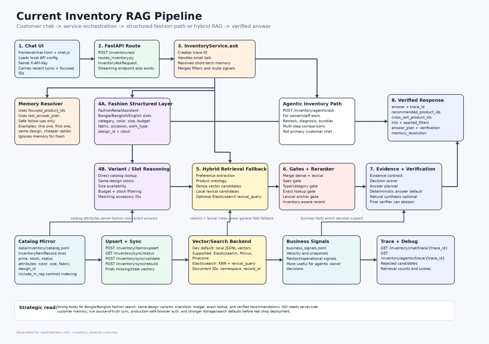

# README Theory

This file explains what the project has become so far, not just what it started as.

The short version:

- it started as a Bangla legal/tax RAG system
- it now also contains a structured agentic legal reasoning runtime
- it now also contains a much larger inventory intelligence stack with deterministic reasoning, evidence contracts, and verification

If you read the repo as if it is only a PDF-to-RAG project, you will misunderstand half the codebase.

## 1. Big Picture

The repo currently has **three major execution paths**:

```text
Client
-> FastAPI app (`app/main.py`)
-> API routes (`app/api/*`)
-> one of three paths:

   A. Classic legal/tax RAG
      -> ingest PDF
      -> build sparse/dense indexes
      -> retrieve evidence
      -> generate cited answer

   B. Agentic legal reasoning
      -> ingest legal document into structured graph + chunks
      -> run planner/retrieve/reason/verify/compose loop
      -> return traceable reasoning answer

   C. Inventory intelligence
      -> route inventory question
      -> retrieve catalog/business evidence
      -> build evidence contract
      -> score deterministically
      -> verify claims
      -> answer or abstain
```

That is the correct mental model for the project today.

## 2. Architectural Truth

This repo is not organized around one single pure architecture. It has evolved in layers:

```text
Layer 1: classic legal/tax RAG
-> `app/ingest`
-> `app/retrieval`
-> `app/generation`

Layer 2: structured legal reasoning
-> `app/ingestion`
-> `app/reasoning`
-> `app/services/runtime_service.py`

Layer 3: inventory decision engine
-> `app/inventory`
-> `app/services/inventory_service.py`
-> `tests/test_inventory_*`
```

This is why some folder names look close but are not the same:

- `app/ingest` is the older, simpler ingestion path used by `/ingest`
- `app/ingestion` is the newer, richer structured legal ingestion path used by the agentic runtime

If you mix those up, the codebase will feel inconsistent when it is actually serving different generations of the system.

## 3. Request Flow Map

### 3.1 Overall Request Routing

```text
HTTP request
-> `app/main.py`
-> mounted routers:
   -> `routes_health.py`
   -> `routes_ingest.py`
   -> `routes_query.py`
   -> `routes_eval.py`
   -> `routes_agentic.py`
   -> `routes_inventory.py`
-> route-specific service/pipeline
-> Pydantic response from `app/core/schemas.py`
```

### 3.2 Classic Legal/Tax RAG Flow

```text
PDF
-> `/ingest`
-> `app.ingest.parser`
-> `app.ingest.chunker`
-> chunk JSONL
-> `/build-index`
-> sparse index + dense index

Question
-> `/query`
-> `preprocess_query(...)`
-> sparse / dense / hybrid retrieval
-> support filtering
-> `app/generation/generator.py`
-> `app/generation/citations.py`
-> cited final answer
```

### 3.3 Agentic Legal Reasoning Flow

```text
Legal source file
-> `/agentic/ingest`
-> runtime ingest
-> `app/ingestion/chunker.py`
-> retrieval child chunks + reasoning parent chunks
-> BM25 + vector records + document graph

Agentic question
-> `/agentic/query`
-> `app/reasoning/agent_graph.py`
-> router
-> planner
-> retrieve
-> reason
-> verify
-> compose
-> answer + trace
```

### 3.4 Inventory Intelligence Flow

```text
Inventory question
-> `/inventory/route` or `/inventory/ask` or `/inventory/agentic/ask`
-> `app/services/inventory_service.py`
-> intent classification
-> preference extraction
-> multi-stage retrieval
-> evidence contract build
-> deterministic scoring
-> plan enrichment
-> final answer verification
-> answer / stream / abstain
```

For complex inventory questions, the internal logic now looks closer to this:

```text
question
-> classify
-> decompose
-> retrieve candidates
-> rerank/filter
-> normalize facts
-> build evidence contract
-> score decisions
-> explain decision
-> verify claims
-> return answer
```

## 4. Folder-By-Folder Explanation

## `app/api`

This is the HTTP boundary.

- `routes_ingest.py`: simple legal/tax ingestion and index building
- `routes_query.py`: classic legal/tax retrieval and answer generation
- `routes_eval.py`: dataset-level evaluation entrypoint
- `routes_agentic.py`: structured legal runtime status, ingest, query, evaluation, traces
- `routes_inventory.py`: inventory catalog, search, routing, ask, agentic ask, business signals, sync, traces

These files should stay thin. Their job is transport, validation, and error handling, not business logic.

## `app/core`

This is the shared contract layer.

- `schemas.py`: biggest shared Pydantic contract file for both the legal/tax and inventory systems
- `settings.py`: environment-driven configuration
- `utils.py`: normalization, query cleanup, helper utilities

If you want to understand the input/output shape of the repo, start here.

## `app/ingest`

This is the older ingestion path used by the classic `/ingest` endpoint.

The mental model:

```text
raw PDF
-> parse text
-> chunk pages
-> write JSONL
-> later build sparse/dense indexes
```

This path is simpler and more document-centric than the newer agentic ingestion path.

## `app/ingestion`

This is the structured legal-document pipeline used for the agentic runtime.

Important idea:

```text
legal document
-> linked document structure
-> retrieval child chunks
-> reasoning parent chunks
-> better support for graph expansion and multi-step reasoning
```

`app/ingestion/chunker.py` is central here. It creates:

- retrieval-sized chunks for search
- larger reasoning chunks for synthesis
- anchor/context style chunk variants

This is much closer to a law-aware retrieval architecture than the older page chunker.

## `app/retrieval`

This is the retrieval engine layer.

It contains:

- sparse retrieval
- dense retrieval
- hybrid retrieval
- reranking
- BM25 indexing
- vector store abstractions
- graph expansion
- query transformation

There are effectively two retrieval styles in the repo:

```text
Classic path
-> sparse + dense + simple fusion

Structured path
-> BM25 + vector retrieval + query plan + reranking + graph expansion
```

`app/retrieval/hybrid.py` powers the classic hybrid legal/tax retrieval path.

`app/retrieval/hybrid_retriever.py` is the richer structured retriever used by the agentic legal runtime.

## `app/generation`

This is the grounded answer layer for the classic legal/tax flow.

- `generator.py`: prompt construction, abstention checks, model calling, answer parsing
- `citations.py`: marker creation and citation rendering

Mental model:

```text
retrieved hits
-> citation markers
-> grounded prompt
-> JSON-like answer structure
-> inline citation rendering
```

This layer is evidence-first. It is not supposed to hallucinate beyond the retrieved support.

## `app/reasoning`

This is the orchestration layer for the agentic legal runtime.

`agent_graph.py` shows the cleanest state machine in the repo:

```text
router
-> planner
-> retrieve
-> reason
-> verify
-> compose
```

It can run through LangGraph when available, or a Python fallback loop otherwise.

That is important: the project is designed to degrade gracefully instead of depending fully on one framework.

## `app/inventory`

This is now a full subsystem, not a side feature.

Key responsibilities are split here:

- `intent.py`: question-family classification
- `preferences.py`: budget, product type, style, and other preference extraction
- `ontology.py`: product type/family/category relationships
- `policy.py`: the frozen contract for supported families, default execution paths, abstain triggers, and canonical evals
- `reranker.py`: inventory-aware ranking features
- `evidence_contract.py`: normalized product facts and allowed-claim package
- `decisioning.py`: deterministic scoring for recommendation, comparison, restock
- `planner.py`: converts scored evidence into an explicit answer plan
- `verifier.py`: checks final text against allowed claims and evidence
- `storage.py`: mirrored inventory storage abstraction
- `memory.py`: conversation memory resolution

The inventory stack is the most advanced reasoning surface in the repo right now.

## `app/services`

This is the orchestration boundary between routes and domain logic.

Important files:

- `inventory_service.py`: main inventory orchestrator and the largest operational brain in the repo
- `runtime_service.py`: structured legal agentic runtime
- `query_service.py`: legal/tax query service boundary
- `ingest_service.py`: service-level ingestion logic
- `evaluation_service.py`: evaluation support

If you want to know where the real workflow decisions happen, this folder matters more than the route layer.

## `app/domain`

This holds shared legal domain models and taxonomy concepts.

It helps keep the structured legal reasoning side from collapsing into raw dictionaries.

## `app/eval`

Evaluation and metrics logic live here.

This part exists, but the inventory roadmap still shows evaluation depth as an unfinished area.

## `tests`

The tests tell you where the repo is strongest today.

Broadly:

- legal/tax retrieval and generation tests validate the classic stack
- agentic tests validate the structured runtime
- `test_inventory_api.py` and `test_inventory_intelligence.py` validate the newer inventory reasoning path

The inventory tests are especially important because that subsystem now depends on routing, evidence normalization, scoring, planning, and verification all staying aligned.

## 5. The Most Important Runtime Boundaries

These are the files that define the project more than any others.

### `app/main.py`

This is the app assembly point. It tells you which systems are officially exposed and supported.

### `app/core/schemas.py`

This is the shared contract backbone.

Why it matters:

```text
Weak schemas
-> hidden coupling
-> route/service drift
-> impossible debugging

Strong schemas
-> traceable execution
-> predictable responses
-> safer refactors
```

### `app/services/inventory_service.py`

This is the most strategically important file today.

It is doing more than CRUD or search. It is coordinating:

- routing
- retrieval
- reranking
- business-signal integration
- plan building
- evidence contracts
- verification
- streaming answers

If this file becomes muddy, the entire inventory system becomes impossible to reason about.

### `app/reasoning/agent_graph.py`

This is the cleanest expression of the newer agentic architecture on the legal side.

It shows the intended pattern for bounded reasoning loops.

## 6. Inventory Architecture, In Plain English

The inventory subsystem is where most of the project evolution has happened.

The correct mental model is:

```text
inventory chat is not "search and then let the LLM talk"

it is:
question understanding
-> retrieval
-> fact normalization
-> deterministic decisioning
-> explanation
-> verification
```

That is a much stronger architecture.

The important internal pipeline is roughly:

```text
User asks inventory question
-> classify intent
-> detect preferences and constraints
-> search catalog/business evidence
-> build `InventoryEvidenceContract`
-> score candidates with `InventoryDecisionScorer`
-> enrich answer with `InventoryAnswerPlanner`
-> verify final wording with `InventoryFinalAnswerVerifier`
-> return answer or abstain
```

This is why recent work in the repo focused on:

- evidence contracts
- bounded multi-step planning
- deterministic ranking
- verification rules

That is the right direction. Otherwise the system would sound smart while making unstable decisions.

### 6.1 Current Inventory Pipeline Deep Dive

This is the current inventory pipeline as implemented now. The critical point: this is no longer a plain vector-search chatbot. It is a hybrid retail reasoning pipeline with a fast structured fashion layer, a broader inventory RAG fallback, sync checks, traces, and final-answer guardrails.

#### 6.1.1 Arrow Flow Diagram



The same flow in text form:

```text
Customer / staff chat
-> `frontend/chat.html`
-> `frontend/chat.js`
-> local config loads API base URL + API key
-> `POST /inventory/ask`
-> FastAPI route: `app/api/routes_inventory.py`
-> service: `app/services/inventory_service.py`
-> small-talk guard
-> short-term memory resolver
-> question filters + slot extraction
-> fashion structured layer
   -> category / color / size / budget / fabric / design / stock lookup
   -> same-design and variant reasoning
   -> Bangla / Banglish / English reply shaping
   -> deterministic answer + answer plan
-> if fashion layer cannot safely answer:
   -> general inventory RAG
   -> preference extraction
   -> dense vector retrieval
   -> local lexical retrieval
   -> optional Elasticsearch lexical retrieval
   -> merge candidates
   -> spec/type/category/exact-match gates
   -> inventory-aware reranking
   -> evidence contract
   -> deterministic decisioning
   -> support/sales answer planning
   -> optional natural answer synthesis
   -> final answer verification
-> response:
   -> answer
   -> product IDs
   -> hits
   -> answer plan
   -> verification
   -> memory resolution
   -> trace ID
-> frontend stores recent turns + focused products for follow-up questions
```

#### 6.1.2 Data Input Layer

The inventory data currently comes from catalog mirror records, not from live Shopify/POS/ERP APIs.

Main files:

- `data/inventory/catalog.jsonl`: active mirrored catalog used by the inventory service
- `data/inventory/saree_shop_catalog.jsonl`: saree/fashion sample catalog created for the retail use case
- `data/inventory/saree_shop_inventory_db.json`: DB-style source sample for saree shop inventory
- `data/inventory/business_signals.jsonl`: optional business facts such as velocity, restock signals, snapshots, or operational metadata

The item contract is `InventoryItemRecord` in `app/core/schemas.py`. The important product fields are:

- `product_id`: stable internal product ID
- `sku`: sellable stock keeping unit
- `name`: customer-readable product name
- `category`, `brand`, `tags`
- `price`, `currency`, `stock`, `status`
- `attributes`: structured product facts such as color, size, fabric, design ID, work type, dimensions, specs
- `metadata`: extra source/system facts
- `include_in_rag`: controls whether this product should be indexed for retrieval
- `updated_at`: used for sync and stale-data checks

Strategic warning: for fashion retail, `attributes` are not optional decoration. They are the difference between answering "same design in another color?" correctly and guessing from product names. The catalog should carry structured fields such as `category_key`, `color`, `color_family`, `size`, `fabric`, `design_id`, `occasion`, `work_type`, and `stock`.

#### 6.1.3 Storage And Index Layer

The mirror storage is selected from config:

```text
config/config.dev.yaml
-> inventory_chat.storage_backend: jsonl
-> paths.inventory_catalog_path: data/inventory/catalog.jsonl
-> paths.inventory_business_signal_path: data/inventory/business_signals.jsonl
```

The vector backend is also selected from config:

```text
vector_store.provider: local
vector_store.local_store_path: data/agentic_store/local_vectors.jsonl
```

The code supports multiple vector stores:

```text
`VectorStoreProvider.LOCAL`
`VectorStoreProvider.PINECONE`
`VectorStoreProvider.MILVUS`
`VectorStoreProvider.ELASTICSEARCH`
```

For Elasticsearch, `app/retrieval/elasticsearch_store.py` provides:

- deterministic document IDs: `namespace::record_id`
- vector KNN search over the `vector` field
- lexical search over `sku`, `product_id`, `name`, `brand`, `category`, and `text`
- top-level metadata fields copied out for filtering
- `$eq`, `$in`, `$gte`, and `$lte` filter support
- record ID listing for sync checks

Current dev reality: the repo can use Elasticsearch, but the checked dev config still points to the local vector store unless `VECTOR_DB=elasticsearch` or the YAML provider is changed. Elasticsearch is an available backend, not automatically the active backend in every run.

#### 6.1.4 Catalog Upsert And Sync Flow

The upsert path is:

```text
Source product records
-> `POST /inventory/items/upsert`
-> validate into `InventoryItemRecord`
-> persist catalog mirror
-> build vector record for every `include_in_rag=true` item
-> upsert vectors into current vector backend
-> delete vectors for products no longer RAG-enabled
```

The sync paths are:

```text
`GET /inventory/sync/status`
-> compare catalog IDs against vector IDs
-> report missing vectors, stale vectors, invalid catalog rows

`POST /inventory/sync/validate`
-> compare external source IDs/items against mirrored catalog + vectors
-> report missing, extra, stale, invalid, and vector drift

`POST /inventory/sync/rebuild`
-> rebuild vector records from the current catalog
-> remove stale vector records
-> return final sync health
```

This matters because the chatbot is only as truthful as the mirror. A clean sync means catalog rows and vector records agree; it does not prove the original shop database is fresh unless `/sync/validate` is given source-of-truth product IDs/items.

#### 6.1.5 Chat UI Flow

The smooth chat page is:

```text
`frontend/chat.html`
-> `frontend/chat.css`
-> `frontend/chat.js`
```

The browser flow is:

```text
page load
-> fetch `frontend/config.local.json`
-> set `apiBaseUrl`
-> set local API key for development
-> call `/health`
-> user sends message
-> build `/inventory/ask` payload
-> render answer and metadata
-> store recent conversation turns
-> store focused product IDs
-> store last answer plan
```

The chat page sends:

- `question`
- `top_k`
- `assistant_mode`
- `reply_style`
- `answer_engine`
- recent `conversation_history`
- `focused_product_ids`
- `last_answer_plan`

This is why follow-ups can work:

```text
"Lotus Buti Jamdani same design ta blue color e ache?"
-> response focuses Lotus Buti products

"ei same design ta green e ache?"
-> frontend sends focused product IDs + previous answer plan
-> backend resolves "ei same design" against prior context
```

Limit: this memory is short-term browser/session memory. It is not persistent customer memory. Refreshing the page or opening another browser context can lose the thread unless a server-side session layer is added.

#### 6.1.6 `/inventory/ask` Runtime Flow

The main non-agentic inventory answer path is:

```text
`POST /inventory/ask`
-> `InventoryService.ask(...)`
-> create trace ID
-> small-talk / greeting / helper response check
-> memory resolution
-> question-derived filter merge
-> fashion structured answer attempt
-> general inventory retrieval fallback
-> answer construction
-> final verification
-> trace save
-> response
```

The first important branch is conversational handling. Greetings, thanks, help questions, and simple chat do not go through retrieval. This prevents the system from wasting catalog search on "hi" or "thank you".

The second branch is memory. `InventoryMemoryResolver` uses only safe references:

```text
"it"
"this one"
"the first one"
"same design"
"alternative"
"cheaper one"
```

It avoids applying old context when the new question clearly asks for a fresh product/category search. This is a necessary guardrail; otherwise the bot would drag old products into unrelated questions.

#### 6.1.7 Fashion Retail Structured Layer

The fashion layer lives in `app/inventory/fashion_retail.py`.

This layer was added because saree/accessories questions are often structured retail questions, not fuzzy knowledge questions. Examples:

```text
"same design ta blue color e ache?"
"amar size M available?"
"৪০০০ টাকার মধ্যে office er jonno halka saree ache?"
"matching blouse ache?"
"ei jamdani tar green color stock e ache?"
```

The fashion assistant extracts slots:

- category: saree, blouse, panjabi, kurti, salwar kameez, dupatta, shawl, bag, jewelry, accessories
- color and color family
- size
- budget minimum/maximum
- fabric
- work type
- occasion
- style
- design ID
- stock intent
- language: Bangla, Banglish, or English

Then it ranks structured catalog rows directly. For variant questions, it looks for same-design relationships using product context and design metadata. This is the right architecture for fashion retail because "same design, different color" is a database-style constraint, not a pure semantic similarity problem.

The fashion layer returns:

- deterministic customer-facing answer
- intent such as `fashion_search`, `fashion_variant_color`, or `fashion_size_availability`
- product IDs
- cross-sell IDs when relevant
- structured slots in the answer plan
- abstention when the catalog does not support the answer

This layer should stay generalized. It must not be designed only to pass one small QA set. The scalable target is: any fashion/accessory product with clean attributes should be answerable through the same slot-and-variant logic.

#### 6.1.8 General Inventory Retrieval Flow

If the fashion layer cannot answer, the service falls back to the general inventory RAG path.

The retrieval logic is:

```text
question
-> preference extraction
-> dense vector retrieval
-> local lexical candidate scoring
-> optional external Elasticsearch lexical scoring
-> merge dense + lexical candidates
-> spec gate
-> product type gate
-> category gate
-> exact lookup gate
-> lexical anchor gate
-> inventory-aware reranker
-> top-k hits
```

The key design choice is that dense retrieval is not trusted alone. The system also uses lexical matching and gates because inventory questions often contain exact facts:

- SKU
- product name
- color
- category
- size
- price ceiling
- structured specs

For exact product lookup, lexical grounding is especially important. A semantically similar but different product is still wrong if the customer asked for a specific item.

#### 6.1.9 Answer Planning, Evidence, And Verification

After retrieval, the system does not simply paste hits into an LLM prompt. It builds a controlled answer path.

The important modules are:

- `app/inventory/evidence_contract.py`: converts hits into allowed claims
- `app/inventory/decisioning.py`: scores candidates for recommendation, comparison, restock, and alternatives
- `app/inventory/planner.py`: turns evidence and scores into an explicit answer plan
- `app/inventory/verifier.py`: checks final answer text against the evidence and plan

The answer plan can include:

- detected intent
- product family/type
- primary product ID
- alternative product IDs
- cross-sell product IDs
- excluded products
- metadata used
- reasoning steps
- confidence breakdown
- risk notes
- abstention reason
- evidence contract

Final output can be deterministic or natural:

```text
answer_engine = deterministic
-> use rule-based verified answer

answer_engine = natural
-> synthesize a nicer answer
-> verify final text
-> fall back to deterministic if verification fails

answer_engine = auto
-> choose natural only when confidence and settings allow it
```

The verification step is the strategic moat. It stops the chatbot from sounding fluent while making unsupported claims about price, stock, product fit, or cross-sells.

#### 6.1.10 Agentic Inventory Flow

There is also an agentic inventory path:

```text
`POST /inventory/route`
-> decide normal ask vs agentic ask

`POST /inventory/agentic/ask`
-> classify/decompose
-> retrieve evidence over one or more steps
-> reason over comparison/bundle/restock/diagnosis/planning tasks
-> verify
-> return answer + reasoning steps + trace
```

Use the normal `/inventory/ask` path for fast customer support questions:

- availability
- size
- color
- budget
- simple recommendations
- same-design variants
- matching accessories

Use the agentic path when the question is operational or multi-step:

- "Which items should I restock first and why?"
- "Why are premium sarees not selling?"
- "Build a bundle strategy from current stock."
- "Compare these product families with tradeoffs."

For a customer-facing saree shop chatbot, the normal ask path plus fashion structured layer is the core. The agentic path is more useful for owner/staff decision support.

#### 6.1.11 Response Contract

A successful `/inventory/ask` response carries more than answer text:

```text
answer
trace_id
answer_engine
confidence_score
abstained
abstention_reason
total_hits
applied_filters
hits
recommended_product_ids
cross_sell_product_ids
follow_up_question
answer_plan
verification
memory_resolution
```

The frontend mainly shows the answer, intent/language metadata, and product IDs. But the richer response is valuable for debugging, analytics, and future UI cards.

#### 6.1.12 Observability And Debugging

Useful inventory endpoints:

```text
`GET /inventory/status`
-> current catalog/vector counts and storage backend

`GET /inventory/production/status`
-> warns when dev-only storage/vector choices are active

`GET /inventory/sync/status`
-> catalog/vector drift report

`POST /inventory/sync/rebuild`
-> rebuild vector index from catalog

`GET /inventory/chat/trace/{trace_id}`
-> direct ask trace

`GET /inventory/agentic/trace/{trace_id}`
-> agentic trace
```

The trace system is important because inventory failures are rarely "the model was bad" in a generic sense. They usually come from one of these:

- missing product attributes
- stale catalog mirror
- stale vector index
- wrong category/type metadata
- weak lexical match
- overbroad follow-up memory
- unsupported natural answer wording
- missing business signals

#### 6.1.13 What The Bot Is Ready For Today

The current bot is strongest for:

- Bangla/Banglish/English fashion search
- same-design color variant questions
- size availability questions
- budget-constrained product discovery
- stock-aware recommendations
- simple matching accessory/cross-sell questions
- exact product or SKU lookup
- support-style "do you have this?" questions
- deterministic answers grounded in current catalog records

It is partially ready for:

- broader non-fashion inventory, depending on metadata quality
- multi-step operational decisions through `/inventory/agentic/ask`
- natural fluent answers when the answer engine is allowed to use natural synthesis

It is not fully ready for:

- persistent customer memory across sessions
- checkout/cart/order actions
- live POS sync without a source connector
- image-based product matching
- production-safe browser auth
- high-concurrency production storage while using JSONL

#### 6.1.14 Immediate Strategic Upgrade Path

The next serious upgrades should be:

1. Add server-side chat sessions.
   Store `session_id`, recent turns, focused products, preferred size, preferred colors, budget, and last category. This converts short-term browser state into real customer memory.

2. Make product attributes mandatory for fashion.
   Every saree/accessory should have clean `category_key`, `design_id`, `color`, `size`, `fabric`, `stock`, and price fields. Without this, the bot will degrade into fuzzy search.

3. Add source-of-truth sync.
   `/sync/status` checks mirror versus vector index. A real shop also needs a connector from the true inventory system into the mirror.

4. Move production retrieval/storage off local dev defaults.
   Use SQLite at minimum for mirror durability, and Elasticsearch/Milvus/Pinecone for production search. JSONL and local vectors are fine for development, weak for real operations.

5. Render product cards in the UI.
   The API already returns product IDs and hits. The UI should show product name, price, stock, color, size, and action buttons instead of only text.

## 7. What Has Been Implemented So Far

Based on `todo_retrival.md`, the project has already moved well beyond a basic retrieval chatbot.

Current status in plain language:

- Phase 0 is now done: inventory chat has an explicit policy contract for families, execution paths, abstain rules, and eval coverage
- Phase 1 is done: question classification and routing exist
- Phase 2 is done: multi-stage retrieval exists, including lexical recovery, alias handling, reranking, and metadata-aware filtering
- Phase 3 is done: the answer layer works from structured evidence contracts instead of raw hits alone
- Phase 4 is done: compare, bundle, restock, diagnosis, and operational planning all have bounded decomposition paths
- Phase 5 is done: evidence contracts feed planning and verification
- Phase 6 is done: deterministic scoring exists for recommendation, comparison, prioritization, restock, and alternatives
- Phase 7 is done: product-fit verification and hard-abstain behavior are enforced
- Phase 8 is done: the eval matrix now covers the major agentic and hard-constraint families
- Phase 9 is done: traces expose rejected candidates and score breakdowns

The important strategic point:

```text
the repo's center of gravity has shifted
from "retrieve relevant text"
to "retrieve evidence, score it, explain it, verify it"
```

That is a major architectural upgrade.

## 8. How To Read The Codebase Without Getting Lost

If you are onboarding, read in this order:

### Path A: learn the whole repo fast

```text
1. `app/main.py`
-> what is exposed

2. `app/api/routes_inventory.py`
-> biggest modern surface area

3. `app/services/inventory_service.py`
-> orchestration center

4. `app/inventory/evidence_contract.py`
-> what the system believes counts as evidence

5. `app/inventory/decisioning.py`
-> how ranking decisions are actually made

6. `app/inventory/planner.py`
-> how the system turns scores into answer structure

7. `app/inventory/verifier.py`
-> how unsupported claims are blocked

8. `app/api/routes_query.py`
-> original classic RAG entrypoint

9. `app/retrieval/hybrid.py`
-> classic hybrid retrieval

10. `app/generation/generator.py`
-> classic grounded answer generation

11. `app/api/routes_agentic.py`
-> newer legal reasoning runtime surface

12. `app/reasoning/agent_graph.py`
-> graph-style reasoning loop
```

### Path B: only learn the classic legal/tax system

```text
`routes_ingest.py`
-> `app/ingest/*`
-> `routes_query.py`
-> `app/retrieval/hybrid.py`
-> `app/generation/generator.py`
```

### Path C: only learn the inventory system

```text
`routes_inventory.py`
-> `inventory_service.py`
-> `intent.py`
-> `preferences.py`
-> `reranker.py`
-> `evidence_contract.py`
-> `decisioning.py`
-> `planner.py`
-> `verifier.py`
```

## 9. Design Strengths

The strongest ideas in the repo right now are:

- explicit schemas instead of loose payloads
- evidence-first answer generation
- bounded reasoning loops
- deterministic scoring where ranking should be stable
- verification before final output
- traceability across route, plan, evidence, and answer layers

Those are real system-design strengths, not cosmetic ones.

## 10. Design Risks

These are the main risks you should keep in mind.

### 1. The repo has multiple generations of architecture in one place

That is powerful, but it can also create drift:

```text
old path still works
-> new path gets added
-> shared contracts evolve
-> duplicated logic appears
```

This is already visible in the ingestion split and in the coexistence of classic versus agentic flows.

### 2. `inventory_service.py` can become too powerful

This file is strategically central, but it is also the highest refactor risk because it owns too many decisions.

### 3. Evaluation is behind architecture

The inventory roadmap is increasingly mature, but evaluation coverage still lags behind the sophistication of the reasoning path.

That is dangerous. Strong architecture without strong measurement eventually drifts.

## 11. Practical Extension Guide

If you want to add a new feature, use this decision rule:

### Add it to the classic legal/tax path when:

- the question is mostly direct retrieval
- evidence can be answered from a few chunks
- multi-step planning is unnecessary

### Add it to the agentic legal path when:

- the question needs decomposition
- multiple retrieval rounds are justified
- graph/context expansion matters

### Add it to the inventory stack when:

- the feature needs catalog facts plus business signals
- ranking must be stable and explainable
- the system should verify supported claims before speaking

## 12. One-Sentence Summary

The project today is best understood as a **shared FastAPI platform for three evidence-driven systems: classic Bangla legal/tax RAG, structured agentic legal reasoning, and an inventory intelligence engine that increasingly behaves like a deterministic decision-support system rather than a plain chatbot.**
